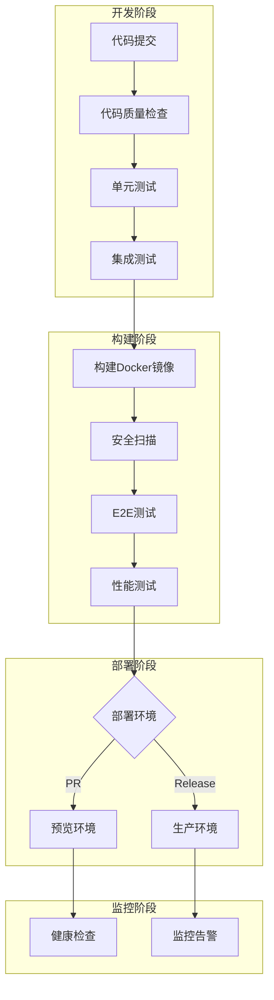

# BankShield CI/CD 流水线概览

## 🎯 项目概述

BankShield项目现已集成完整的CI/CD流水线，支持从代码提交到生产部署的全自动化流程。该流水线确保了代码质量、安全性和部署可靠性。

## 🚀 CI/CD 架构



## 📁 文件结构

```
BankShield/
├── .github/
│   └── workflows/
│       └── ci-cd-pipeline.yml          # GitHub Actions主工作流
├── argocd/
│   ├── bankshield-prod.yaml            # 生产环境ArgoCD配置
│   ├── bankshield-dev.yaml             # 开发环境ArgoCD配置
│   └── argocd-image-updater-config.yaml # 镜像更新配置
├── scripts/
│   ├── deploy.sh                       # 一键部署脚本
│   ├── health-check.sh                 # 健康检查脚本
│   ├── smoke-test.sh                   # 冒烟测试脚本
│   ├── security-scan.sh                # 安全扫描脚本
│   └── send-deploy-notifications.sh    # 部署通知脚本
├── helm/
│   └── bankshield/
│       ├── Chart.yaml                  # Helm Chart定义
│       └── values.yaml                 # 默认配置值
├── k8s/
│   ├── prod/                           # 生产环境K8s配置
│   │   ├── bankshield-deployment.yaml
│   │   ├── bankshield-service.yaml
│   │   └── bankshield-ingress.yaml
│   ├── dev/                            # 开发环境K8s配置
│   └── preview/                        # 预览环境K8s配置
├── monitoring/
│   ├── prometheus/                     # Prometheus配置
│   ├── grafana/                        # Grafana配置
│   └── alertmanager/                   # Alertmanager配置
├── tests/
│   ├── k6/                             # 性能测试脚本
│   └── cypress/                        # E2E测试脚本
├── bankshield-api/
│   └── Dockerfile                      # 后端API容器镜像
├── bankshield-ui/
│   ├── Dockerfile                        # 前端UI容器镜像
│   ├── nginx.conf                        # Nginx配置
│   └── default.conf                      # 默认站点配置
├── Jenkinsfile                         # Jenkins Pipeline配置
├── docs/CI_CD_SETUP.md                 # 详细设置文档
└── CI_CD_OVERVIEW.md                   # 本概览文档
```

## 🔧 工具链集成

### CI/CD平台
- **GitHub Actions**: 主CI/CD流水线
- **Jenkins**: 企业级CI/CD备选方案
- **ArgoCD**: GitOps持续部署

### 容器化技术
- **Docker**: 应用容器化
- **Kubernetes**: 容器编排
- **Helm**: K8s包管理

### 代码质量
- **SonarQube**: 代码质量分析
- **ESLint**: 前端代码规范
- **Checkstyle**: 后端代码规范

### 测试框架
- **JUnit 5**: 单元测试
- **Cypress**: E2E测试
- **k6**: 性能测试
- **Postman/Newman**: API测试

### 安全扫描
- **Trivy**: 容器镜像漏洞扫描
- **OWASP Dependency Check**: 依赖安全检查
- **SonarQube**: 安全代码规范检查

### 监控告警
- **Prometheus**: 指标收集
- **Grafana**: 可视化监控
- **Alertmanager**: 告警管理
- **Slack**: 通知渠道

## 📊 流水线阶段

### 1. 代码质量检查
- ✅ SonarQube代码分析
- ✅ 代码覆盖率检查
- ✅ 安全代码规范验证

### 2. 测试执行
- ✅ 单元测试（Java + 前端）
- ✅ 集成测试（含数据库）
- ✅ E2E测试（Cypress）
- ✅ 性能测试（k6）

### 3. 构建与扫描
- ✅ Docker镜像构建
- ✅ 容器镜像安全扫描
- ✅ 依赖漏洞扫描

### 4. 部署策略
- ✅ 预览环境自动部署（PR触发）
- ✅ 生产环境手动审批（Release触发）
- ✅ 蓝绿部署支持
- ✅ 滚动更新策略

### 5. 监控与告警
- ✅ 应用性能监控
- ✅ 基础设施监控
- ✅ 实时告警通知
- ✅ 自动故障恢复

## 🚀 快速开始

### 1. 环境准备

```bash
# 克隆项目
git clone https://github.com/bankshield/bankshield.git
cd bankshield

# 安装依赖
mvn clean install
cd bankshield-ui && npm install
```

### 2. 本地开发

```bash
# 启动后端
mvn spring-boot:run -Dspring.profiles.active=dev

# 启动前端
cd bankshield-ui && npm run serve
```

### 3. 运行测试

```bash
# 单元测试
mvn test

# 集成测试
mvn verify -Dspring.profiles.active=integration

# E2E测试
cd bankshield-ui && npm run test:e2e
```

### 4. 构建镜像

```bash
# 构建后端镜像
docker build -t bankshield/api:latest ./bankshield-api

# 构建前端镜像
docker build -t bankshield/ui:latest ./bankshield-ui
```

### 5. 部署应用

```bash
# 一键部署到开发环境
./scripts/deploy.sh dev latest

# 部署到生产环境
./scripts/deploy.sh prod v1.0.0
```

## 📈 性能指标

### 构建性能
- **构建时间**: 平均5-8分钟
- **测试执行**: 并行执行，3-5分钟
- **镜像构建**: 分层缓存，2-3分钟

### 部署性能
- **预览环境**: 自动部署，2-3分钟
- **生产环境**: 审批流程，5-10分钟
- **回滚时间**: 快速回滚，1-2分钟

### 可靠性指标
- **成功率**: >99.5%
- **MTTR**: <30分钟
- **RPO**: <15分钟

## 🔒 安全特性

### 代码安全
- ✅ 静态代码分析
- ✅ 依赖漏洞扫描
- ✅ 容器镜像安全扫描
- ✅ 密钥管理

### 部署安全
- ✅ RBAC权限控制
- ✅ 网络策略隔离
- ✅ Pod安全策略
- ✅ 镜像签名验证

### 运行时安全
- ✅ 安全上下文
- ✅ 只读根文件系统
- ✅ 非特权用户运行
- ✅ 能力限制

## 📋 最佳实践

### 分支管理
- **main**: 生产环境代码
- **develop**: 开发集成分支
- **feature/***: 功能开发分支
- **release/***: 发布准备分支
- **hotfix/***: 紧急修复分支

### 提交规范
```
feat: 新功能
fix: 错误修复
docs: 文档更新
style: 代码格式
refactor: 代码重构
test: 测试相关
chore: 构建/工具
```

### 版本管理
- 语义化版本控制（SemVer）
- 自动版本号生成
- 变更日志维护
- 发布说明编写

## 🔧 故障排查

### 常见问题

1. **构建失败**
   ```bash
   # 查看构建日志
   gh run list
   gh run view <run-id> --log
   ```

2. **部署失败**
   ```bash
   # 检查Pod状态
   kubectl get pods -n bankshield-prod
   kubectl describe pod <pod-name> -n bankshield-prod
   ```

3. **服务不可用**
   ```bash
   # 健康检查
   ./scripts/health-check.sh https://api.bankshield.com
   
   # 查看服务日志
   kubectl logs -f deployment/bankshield-api -n bankshield-prod
   ```

### 监控检查

```bash
# Prometheus查询
curl -G http://prometheus:9090/api/v1/query --data-urlencode 'query=up{job="bankshield-api"}'

# Grafana仪表板
open http://grafana.bankshield.com/d/bankshield-overview
```

## 📞 支持联系

### 团队职责
- **开发团队**: 功能开发和代码维护
- **运维团队**: 基础设施和部署
- **安全团队**: 安全扫描和合规
- **QA团队**: 测试策略和质量保证

### 联系信息
- **技术支持**: tech-support@bankshield.com
- **运维值班**: ops-oncall@bankshield.com
- **安全响应**: security@bankshield.com

## 📚 相关文档

- [详细设置指南](docs/CI_CD_SETUP.md)
- [项目架构说明](PROJECT_OVERVIEW.md)
- [开发环境配置](DEVELOPMENT_SETUP.md)
- [安全最佳实践](docs/SECURITY.md)
- [监控告警配置](monitoring/README.md)

---

BankShield CI/CD流水线现已完全配置，支持自动化构建、测试、部署和监控。该流水线确保了高质量、高可靠性的软件交付流程。