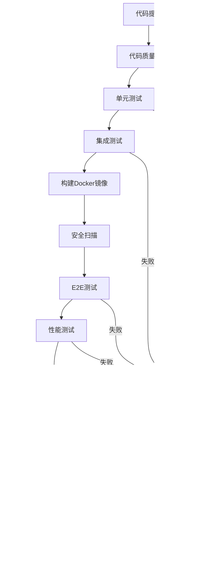

# BankShield CI/CD 设置指南

本文档描述了BankShield项目的完整CI/CD流水线设置，包括GitHub Actions、Jenkins、ArgoCD和容器化部署。

## 📋 目录

1. [GitHub Actions CI/CD](#github-actions-cicd)
2. [Jenkins Pipeline](#jenkins-pipeline)
3. [ArgoCD GitOps](#argocd-gitops)
4. [容器化部署](#容器化部署)
5. [监控和告警](#监控和告警)
6. [安全扫描](#安全扫描)
7. [测试策略](#测试策略)
8. [部署流程](#部署流程)

## GitHub Actions CI/CD

### 工作流概述

GitHub Actions工作流定义在 `.github/workflows/ci-cd-pipeline.yml` 中，包含以下阶段：

1. **代码质量检查** - SonarQube分析
2. **单元测试** - Java和前端测试
3. **集成测试** - 完整集成测试
4. **构建** - Docker镜像构建
5. **安全扫描** - Trivy和OWASP依赖检查
6. **E2E测试** - Cypress端到端测试
7. **性能测试** - k6性能测试
8. **部署** - 预览环境和生产环境部署

### 环境配置

#### 必需的环境变量

在GitHub仓库设置中添加以下Secrets：

```bash
# SonarQube配置
SONAR_TOKEN=your-sonarqube-token

# 容器注册表
GITHUB_TOKEN=your-github-token

# Kubernetes配置
KUBE_CONFIG_PREVIEW=your-preview-kube-config
KUBE_CONFIG_PROD=your-production-kube-config

# 通知配置
SLACK_WEBHOOK=your-slack-webhook-url

# 代码覆盖率
CODECOV_TOKEN=your-codecov-token

# 性能测试
K6_CLOUD_TOKEN=your-k6-cloud-token
```

#### 分支策略

- **main**: 生产环境部署
- **develop**: 开发环境部署
- **release/***: 发布分支
- **feature/***: 功能分支

### 触发条件

- **推送**: 推送到main、develop、release/*分支
- **PR**: 对main、develop分支的PR
- **发布**: 创建GitHub Release时

## Jenkins Pipeline

### Jenkinsfile配置

Jenkins Pipeline定义在 `Jenkinsfile` 中，包含以下阶段：

1. **检出** - 代码检出
2. **代码质量检查** - SonarQube和依赖检查
3. **测试** - 单元测试和前端测试
4. **构建** - 后端和前端构建
5. **Docker镜像** - 镜像构建和推送
6. **E2E测试** - Cypress测试
7. **部署** - Kubernetes部署
8. **验证** - 健康检查

### Jenkins配置

#### 必需插件

- Pipeline
- Docker Pipeline
- Kubernetes
- SonarQube Scanner
- OWASP Dependency-Check
- Slack Notification

#### 工具配置

在Jenkins全局工具配置中添加：

- Maven 3.8
- JDK 1.8
- Node.js 16

#### 凭据配置

在Jenkins凭据管理器中添加：

```bash
# Docker注册表凭据
ID: docker-hub-credentials
类型: Username with password

# Kubernetes配置
ID: kube-config-prod
类型: Secret file

# SonarQube令牌
ID: sonarqube-token
类型: Secret text

# Slack集成
ID: slack-webhook
类型: Secret text
```

## ArgoCD GitOps

### ArgoCD应用配置

#### 生产环境应用

```yaml
# argocd/bankshield-prod.yaml
apiVersion: argoproj.io/v1alpha1
kind: Application
metadata:
  name: bankshield-prod
  namespace: argocd
spec:
  project: bankshield
  source:
    repoURL: https://github.com/bankshield/bankshield-k8s
    targetRevision: HEAD
    path: prod
  destination:
    server: https://kubernetes.default.svc
    namespace: bankshield-prod
  syncPolicy:
    automated:
      prune: true
      selfHeal: true
```

#### 开发环境应用

```yaml
# argocd/bankshield-dev.yaml
apiVersion: argoproj.io/v1alpha1
kind: Application
metadata:
  name: bankshield-dev
  namespace: argocd
spec:
  project: bankshield
  source:
    repoURL: https://github.com/bankshield/bankshield-k8s
    targetRevision: HEAD
    path: dev
  destination:
    server: https://kubernetes.default.svc
    namespace: bankshield-dev
  syncPolicy:
    automated:
      prune: true
      selfHeal: true
```

### ArgoCD Image Updater

配置自动镜像更新：

```yaml
apiVersion: v1
kind: ConfigMap
metadata:
  name: argocd-image-updater-config
  namespace: argocd
data:
  registries.conf: |
    registries:
    - name: Harbor
      api_url: https://harbor.bankshield.com
      credentials: secret:argocd/harbor-credentials#creds
```

## 容器化部署

### Docker镜像

#### 后端API镜像

```dockerfile
# bankshield-api/Dockerfile
FROM openjdk:8-jre-slim

# 创建应用用户
RUN groupadd -r bankshield && useradd -r -g bankshield bankshield

WORKDIR /app
COPY target/bankshield-api-*.jar app.jar
COPY src/main/resources/application*.yml config/

# 健康检查
HEALTHCHECK --interval=30s --timeout=10s --start-period=60s --retries=3 \
  CMD curl -f http://localhost:8080/api/health || exit 1

EXPOSE 8080
USER bankshield

ENTRYPOINT ["sh", "-c", "java $JAVA_OPTS -Dspring.profiles.active=prod -jar app.jar"]
```

#### 前端UI镜像

```dockerfile
# bankshield-ui/Dockerfile
FROM node:16-alpine as build

WORKDIR /app
COPY package*.json ./
RUN npm ci --only=production
COPY . .
RUN npm run build

FROM nginx:alpine
COPY nginx.conf /etc/nginx/nginx.conf
COPY default.conf /etc/nginx/conf.d/default.conf
COPY --from=build /app/dist /usr/share/nginx/html

# 健康检查
HEALTHCHECK --interval=30s --timeout=3s --start-period=5s --retries=3 \
  CMD curl -f http://localhost:80/ || exit 1

EXPOSE 80
CMD ["nginx", "-g", "daemon off;"]
```

### Kubernetes部署

#### 生产环境部署

```yaml
# k8s/prod/bankshield-deployment.yaml
apiVersion: apps/v1
kind: Deployment
metadata:
  name: bankshield-api
  namespace: bankshield-prod
spec:
  replicas: 3
  selector:
    matchLabels:
      app: bankshield-api
  template:
    metadata:
      labels:
        app: bankshield-api
    spec:
      containers:
      - name: bankshield-api
        image: harbor.bankshield.com/bankshield/api:latest
        ports:
        - containerPort: 8080
        env:
        - name: SPRING_PROFILES_ACTIVE
          value: "prod"
        resources:
          requests:
            cpu: 500m
            memory: 1Gi
          limits:
            cpu: 2000m
            memory: 4Gi
        livenessProbe:
          httpGet:
            path: /api/health
            port: 8080
          initialDelaySeconds: 60
          periodSeconds: 30
        readinessProbe:
          httpGet:
            path: /api/ready
            port: 8080
          initialDelaySeconds: 30
          periodSeconds: 10
```

### Helm Chart

#### Chart配置

```yaml
# helm/bankshield/Chart.yaml
apiVersion: v2
name: bankshield
description: BankShield Data Security Management System
type: application
version: 1.0.0
appVersion: "1.0.0"
dependencies:
  - name: mysql
    version: 9.4.7
    repository: https://charts.bitnami.com/bitnami
  - name: redis
    version: 17.11.3
    repository: https://charts.bitnami.com/bitnami
```

## 监控和告警

### Prometheus配置

```yaml
# monitoring/prometheus/prometheus-config.yaml
global:
  scrape_interval: 15s
  evaluation_interval: 15s

rule_files:
  - '/etc/prometheus/rules/*.yml'

alerting:
  alertmanagers:
    - static_configs:
        - targets:
          - alertmanager:9093

scrape_configs:
  - job_name: 'bankshield-api'
    kubernetes_sd_configs:
      - role: pod
        namespaces:
          names: ['bankshield-prod']
    relabel_configs:
      - source_labels: [__meta_kubernetes_pod_annotation_prometheus_io_scrape]
        action: keep
        regex: true
```

### 告警规则

```yaml
groups:
  - name: bankshield.rules
    rules:
      - alert: BankShieldAPIDown
        expr: up{job="bankshield-api"} == 0
        for: 1m
        labels:
          severity: critical
        annotations:
          summary: "BankShield API服务不可用"
          description: "BankShield API服务已停止运行超过1分钟"

      - alert: BankshieldAPIHighResponseTime
        expr: histogram_quantile(0.95, rate(http_request_duration_seconds_bucket{job="bankshield-api"}[5m])) > 2
        for: 5m
        labels:
          severity: warning
        annotations:
          summary: "BankShield API响应时间过长"
          description: "BankShield API 95%响应时间超过2秒"
```

### Alertmanager配置

```yaml
# monitoring/alertmanager/alertmanager-config.yaml
global:
  resolve_timeout: 5m
  slack_api_url: 'YOUR_SLACK_WEBHOOK_URL'

route:
  group_by: ['alertname', 'cluster', 'service']
  group_wait: 10s
  group_interval: 10s
  repeat_interval: 12h
  receiver: 'default'
  routes:
  - match:
      severity: critical
    receiver: 'critical'

receivers:
- name: 'default'
  slack_configs:
  - send_resolved: true
    channel: '#alerts'
    title: 'BankShield Alert'
    text: '{{ range .Alerts }}{{ .Annotations.summary }}\n{{ .Annotations.description }}{{ end }}'
```

## 安全扫描

### Trivy镜像扫描

```yaml
- name: Run Trivy vulnerability scanner
  uses: aquasecurity/trivy-action@master
  with:
    image-ref: '${{ env.REGISTRY }}/${{ env.IMAGE_NAME }}:latest'
    format: 'sarif'
    output: 'trivy-results.sarif'
    severity: 'CRITICAL,HIGH'
    exit-code: '1'
```

### OWASP依赖检查

```yaml
- name: Run OWASP Dependency Check
  uses: dependency-check/Dependency-Check_Action@main
  with:
    project: 'bankshield'
    path: '.'
    format: 'ALL'
    out: 'dependency-check-report'
```

### 安全扫描脚本

```bash
#!/bin/bash
# security-scan.sh

echo "🔒 开始安全扫描..."

# OWASP Dependency Check
mvn dependency-check:check \
  -Ddependency-check.failBuildOnCVSS=7 \
  -Ddependency-check.suppressionFile=security/suppressions.xml

# 生成报告
mvn dependency-check:aggregate \
  -Ddependency-check.reportFormat=ALL \
  -Ddependency-check.reportOutputDirectory=target/security

echo "📊 扫描完成，报告：target/security/"
```

## 测试策略

### 单元测试

```bash
# Java单元测试
mvn clean test -Dspring.profiles.active=test

# 前端单元测试
cd bankshield-ui
npm run test:unit -- --coverage
```

### 集成测试

```bash
# 集成测试
mvn clean verify -Dspring.profiles.active=integration
```

### E2E测试

```bash
# Cypress E2E测试
cd bankshield-ui
npm run serve &
npx cypress run
```

### 性能测试

```bash
# k6性能测试
k6 run tests/k6/performance-test.js
```

## 部署流程

### 一键部署脚本

```bash
#!/bin/bash
# deploy.sh

set -e

ENV=${1:-dev}
NAMESPACE="bankshield-${ENV}"
REGISTRY="harbor.bankshield.com"
IMAGE_TAG=${2:-latest}

echo "🚀 开始部署BankShield到 ${ENV} 环境..."

# 1. 检查环境变量
if [ -z "$KUBECONFIG" ]; then
    echo "❌ 未设置 KUBECONFIG 环境变量"
    exit 1
fi

# 2. 创建命名空间
kubectl create namespace ${NAMESPACE} --dry-run=client -o yaml | kubectl apply -f -

# 3. 部署数据库
helm upgrade --install mysql ./helm/mysql \
  --namespace ${NAMESPACE} \
  --values values/mysql-${ENV}.yaml

# 4. 部署应用
helm upgrade --install bankshield ./helm/bankshield \
  --namespace ${NAMESPACE} \
  --set image.tag=${IMAGE_TAG} \
  --values values/bankshield-${ENV}.yaml \
  --wait \
  --timeout 600s

# 5. 健康检查
./scripts/health-check.sh https://api-${ENV}.bankshield.com
./scripts/smoke-test.sh ${ENV}

echo "✅ 部署完成！"
```

### 部署流程图



## 🔧 参考工具链

- **CI/CD**: GitHub Actions, Jenkins, ArgoCD
- **容器化**: Docker, Kubernetes, Helm
- **测试**: JUnit5, Cypress, k6, JMeter
- **安全**: Trivy, SonarQube, OWASP Dependency Check
- **监控**: Prometheus, Grafana, AlertManager
- **通知**: Slack, Email, Webhook

## 📞 支持和维护

### 日常维护

1. **监控检查**: 每日检查Prometheus告警
2. **日志审查**: 定期审查应用日志
3. **性能监控**: 监控应用性能指标
4. **安全扫描**: 定期运行安全扫描

### 故障排查

1. **查看日志**: `kubectl logs -f deployment/bankshield-api`
2. **检查事件**: `kubectl get events --sort-by=.metadata.creationTimestamp`
3. **资源使用**: `kubectl top pods`
4. **网络连通性**: `kubectl exec -it pod-name -- curl http://service:port`

### 联系支持

- **开发团队**: dev-team@bankshield.com
- **运维团队**: ops-team@bankshield.com
- **安全团队**: security-team@bankshield.com

---

该CI/CD流水线确保了BankShield项目的高质量、安全性和可靠性，支持多环境部署和自动化测试。