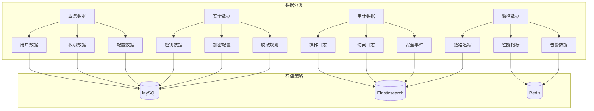
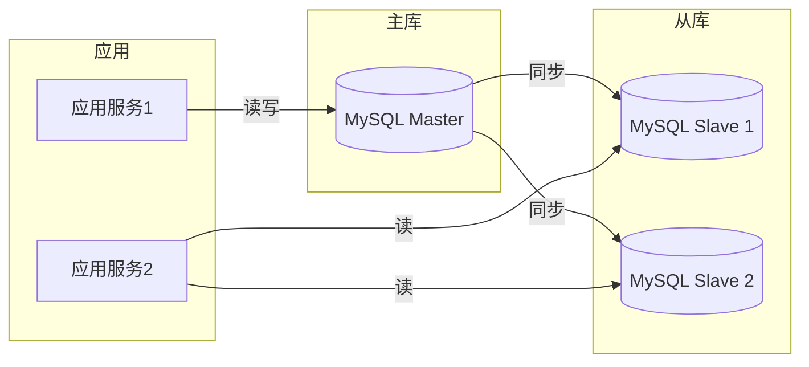
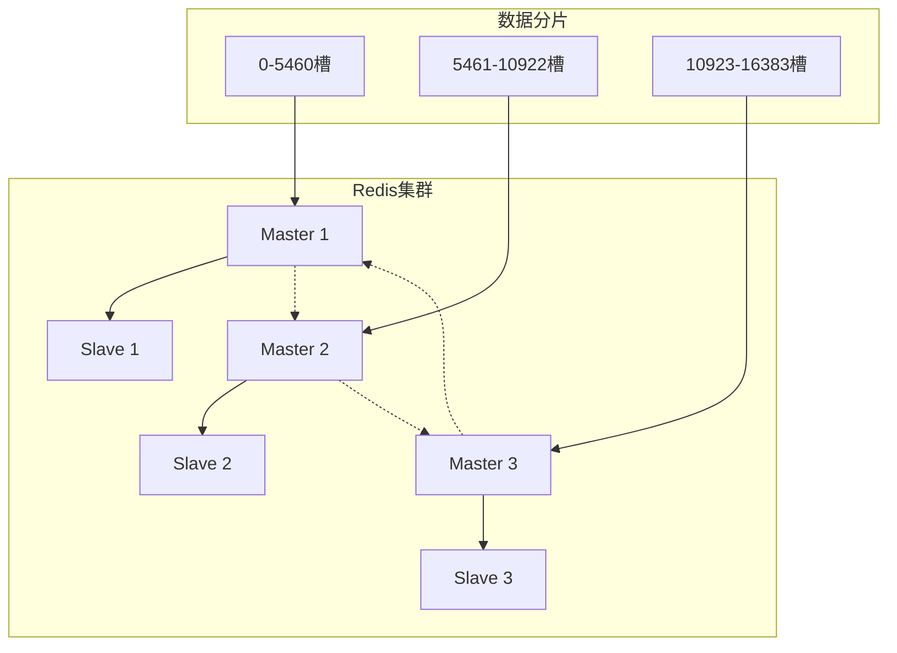
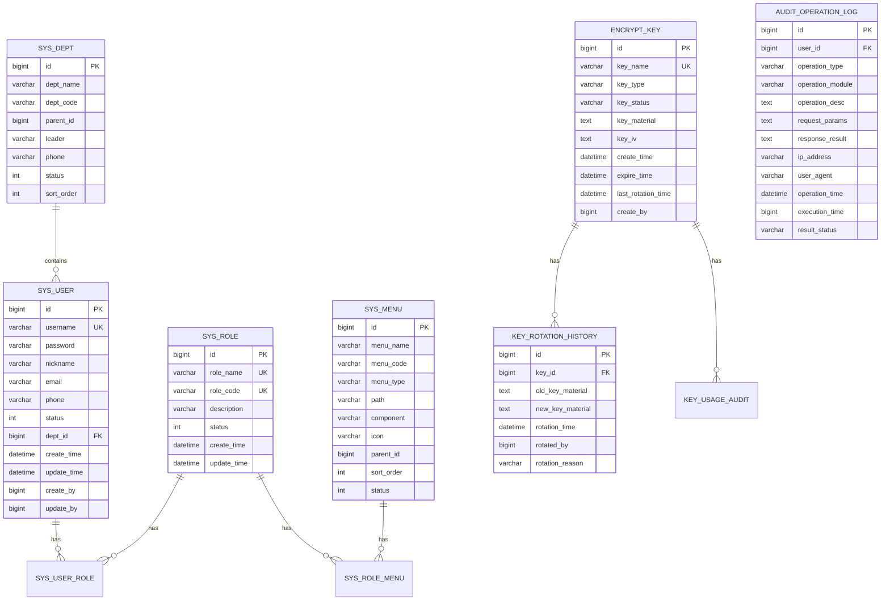
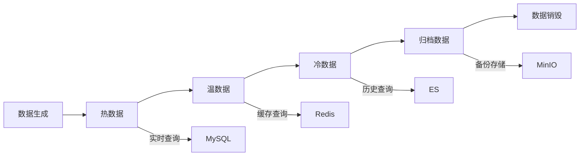
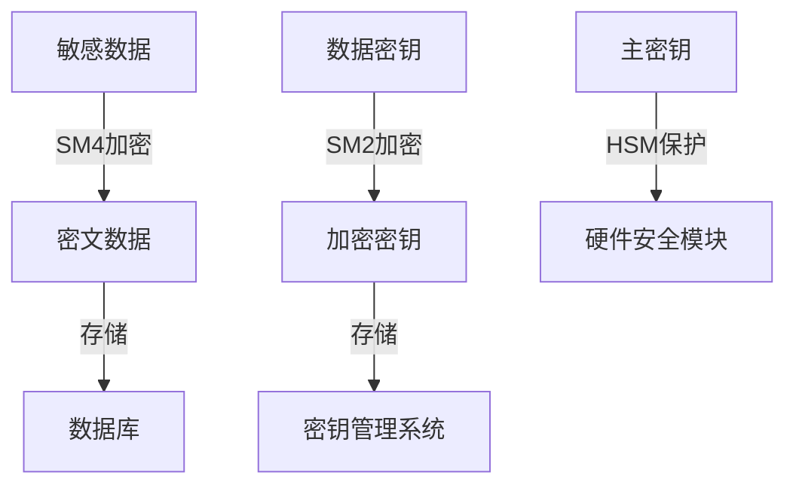
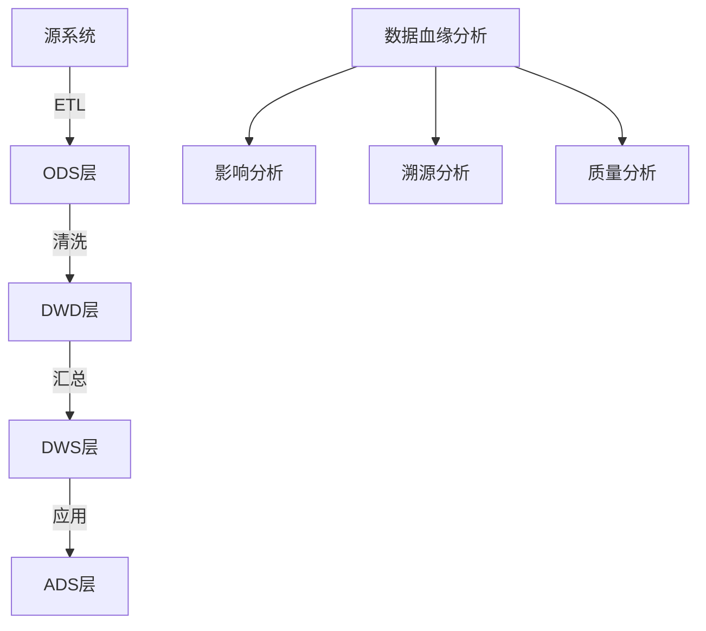

# 数据架构文档

**项目名称**: BankShield 银行数据安全管理系统  
**版本**: v1.0.0  
**最后更新**: 2025-12-24  
**作者**: BankShield数据架构团队  

## 1. 数据库选型策略

### 1.1 数据库类型与用途

| 数据库类型 | 版本 | 主要用途 | 选择原因 | 数据规模 |
|-----------|------|----------|----------|----------|
| **MySQL** | 8.0 | 核心业务数据 | ACID事务支持，金融级可靠性 | 10GB-1TB |
| **Redis** | 6.0 | 缓存、限流、Session | 高性能读写，丰富的数据结构 | 1GB-10GB |
| **Elasticsearch** | 7.17 | 审计日志检索 | 全文搜索，分布式架构 | 100GB-10TB |
| **MinIO** | 最新 | 文件存储 | 对象存储，S3兼容 | 100GB-1PB |

### 1.2 数据分类与存储策略



## 2. 数据库架构设计

### 2.1 MySQL架构

#### 2.1.1 主从复制架构


#### 2.1.2 分库分表策略

**按业务模块拆分：**
- `sys_` 前缀：系统管理相关表（用户、角色、权限）
- `encrypt_` 前缀：密钥管理相关表
- `audit_` 前缀：审计日志相关表
- `monitor_` 前缀：监控告警相关表

**按数据量拆分：**
- **水平分表**：`audit_operation_log` 按时间分表，每月一张
- **垂直分表**：将大字段分离到单独表，如密钥材料存储
- **分区表**：按时间分区存储历史数据

### 2.2 Redis架构

#### 2.2.1 集群模式


#### 2.2.2 数据类型使用

| 数据类型 | 用途 | TTL设置 | 示例 |
|---------|------|---------|------|
| String | Session存储 | 30分钟 | `session:user:123456` |
| Hash | 用户权限缓存 | 1小时 | `user:perms:123456` |
| List | 审计日志队列 | 7天 | `audit:queue` |
| Set | 黑名单IP | 永久 | `blacklist:ip` |
| ZSet | 限流计数器 | 1分钟 | `rate_limit:api:user` |

### 2.3 Elasticsearch架构

#### 2.3.1 索引设计策略

**按时间创建索引：**
```
audit-2025.12
audit-2025.11
audit-2025.10
```

**索引模板配置：**
```json
{
  "index_patterns": ["audit-*"],
  "settings": {
    "number_of_shards": 3,
    "number_of_replicas": 1,
    "refresh_interval": "30s"
  },
  "mappings": {
    "properties": {
      "@timestamp": {"type": "date"},
      "user_id": {"type": "keyword"},
      "operation": {"type": "keyword"},
      "resource": {"type": "keyword"},
      "result": {"type": "keyword"},
      "ip": {"type": "ip"},
      "user_agent": {"type": "text"}
    }
  }
}
```

## 3. 数据模型设计

### 3.1 核心ER图



### 3.2 表结构设计规范

#### 3.2.1 命名规范
- **表名**: 小写字母，下划线分隔，模块前缀
- **字段名**: 小写字母，下划线分隔
- **主键**: `id` bigint类型，自增
- **外键**: `xxx_id` 格式
- **时间字段**: `create_time`, `update_time`
- **状态字段**: `status` 0-禁用，1-启用

#### 3.2.2 字段类型规范

| 数据类型 | 使用场景 | 示例 |
|---------|----------|------|
| bigint | 主键ID、外键ID | `id`, `user_id` |
| varchar(50) | 编码、简短名称 | `username`, `role_code` |
| varchar(100) | 名称、标题 | `menu_name`, `dept_name` |
| varchar(255) | 描述、路径 | `description`, `path` |
| text | 大文本内容 | `key_material`, `request_params` |
| datetime | 时间戳 | `create_time`, `update_time` |
| int | 状态、排序 | `status`, `sort_order` |
| tinyint | 布尔值 | `is_deleted`, `is_enabled` |

### 3.3 数据字典设计

#### 3.3.1 系统状态字典
```sql
-- 用户状态
0 - 禁用
1 - 启用
2 - 锁定

-- 密钥状态
0 - 待激活
1 - 启用
2 - 已轮换
3 - 已吊销
4 - 已销毁

-- 操作结果状态
0 - 成功
1 - 失败
2 - 部分成功
3 - 异常
```

## 4. 数据存储策略

### 4.1 数据生命周期管理



### 4.2 分层存储策略

| 数据层级 | 存储介质 | 保留时间 | 访问延迟 | 存储成本 |
|---------|----------|----------|----------|----------|
| **热数据** | MySQL内存 | 7天 | <10ms | 高 |
| **温数据** | MySQL磁盘 | 3个月 | <100ms | 中 |
| **冷数据** | Elasticsearch | 6个月 | <1s | 低 |
| **归档数据** | MinIO对象存储 | 7年 | >1s | 极低 |

### 4.3 数据备份策略

#### 4.3.1 MySQL备份
- **全量备份**: 每天凌晨2点，保留7天
- **增量备份**: 每4小时一次，保留3天
- **binlog备份**: 实时备份，保留30天

#### 4.3.2 Redis备份
- **RDB快照**: 每6小时一次，保留3天
- **AOF日志**: 实时追加，保留7天

#### 4.3.3 Elasticsearch备份
- **快照备份**: 每天凌晨3点，保留30天
- **索引备份**: 按时间创建新索引，永久保留

## 5. 数据安全策略

### 5.1 数据加密策略

#### 5.1.1 传输加密
- **协议**: TLS 1.3
- **算法**: ECDHE-RSA-AES256-GCM-SHA384
- **证书**: 国密双证书（SM2 + RSA）

#### 5.1.2 存储加密


#### 5.1.3 字段级加密

| 敏感字段 | 加密算法 | 密钥轮换 | 备注 |
|---------|----------|----------|------|
| 用户密码 | BCrypt | 不需要 | 单向哈希 |
| 身份证号 | SM4 | 每季度 | 对称加密 |
| 银行卡号 | SM4 | 每季度 | 对称加密 |
| 手机号 | SM4 | 每季度 | 对称加密 |
| 密钥材料 | SM4 | 每月 | 双重加密 |

### 5.2 数据脱敏策略

#### 5.2.1 脱敏规则配置
```json
{
  "rules": [
    {
      "field": "id_card",
      "pattern": "(?<=\\d{6})\\d{8}(?=\\d{4})",
      "replacement": "********",
      "condition": "role != 'ADMIN'"
    },
    {
      "field": "phone",
      "pattern": "(?<=\\d{3})\\d{4}(?=\\d{4})",
      "replacement": "****",
      "condition": "true"
    }
  ]
}
```

#### 5.2.2 脱敏场景
- **查询脱敏**: 根据用户权限动态脱敏
- **导出脱敏**: 数据导出时自动脱敏
- **接口脱敏**: API响应数据自动脱敏
- **日志脱敏**: 日志记录时自动脱敏

## 6. 数据访问层设计

### 6.1 ORM框架配置

#### 6.1.1 MyBatis-Plus配置
```yaml
mybatis-plus:
  configuration:
    map-underscore-to-camel-case: true
    cache-enabled: true
    lazy-loading-enabled: true
  global-config:
    db-config:
      id-type: ASSIGN_ID
      logic-delete-field: isDeleted
      logic-delete-value: 1
      logic-not-delete-value: 0
```

#### 6.1.2 分页插件配置
```java
@Configuration
public class MyBatisPlusConfig {
    
    @Bean
    public MybatisPlusInterceptor mybatisPlusInterceptor() {
        MybatisPlusInterceptor interceptor = new MybatisPlusInterceptor();
        interceptor.addInnerInterceptor(new PaginationInnerInterceptor(DbType.MYSQL));
        return interceptor;
    }
}
```

### 6.2 数据源配置

#### 6.2.1 主从数据源
```yaml
spring:
  datasource:
    master:
      url: jdbc:mysql://master:3306/bankshield?useSSL=true
      username: ${DB_USERNAME}
      password: ${DB_PASSWORD}
    slave:
      url: jdbc:mysql://slave:3306/bankshield?useSSL=true
      username: ${DB_USERNAME}
      password: ${DB_PASSWORD}
```

#### 6.2.2 读写分离
```java
@Aspect
@Component
public class DataSourceAspect {
    
    @Before("@annotation(com.bankshield.common.annotation.Master)")
    public void setMasterDataSource() {
        DataSourceContextHolder.setDataSource("master");
    }
    
    @Before("@annotation(com.bankshield.common.annotation.Slave)")
    public void setSlaveDataSource() {
        DataSourceContextHolder.setDataSource("slave");
    }
}
```

## 7. 性能优化策略

### 7.1 数据库优化

#### 7.1.1 索引优化
```sql
-- 用户查询索引
CREATE INDEX idx_sys_user_username ON sys_user(username);
CREATE INDEX idx_sys_user_status ON sys_user(status);
CREATE INDEX idx_sys_user_dept ON sys_user(dept_id);

-- 审计查询索引
CREATE INDEX idx_audit_time ON audit_operation_log(operation_time);
CREATE INDEX idx_audit_user ON audit_operation_log(user_id);
CREATE INDEX idx_audit_module ON audit_operation_log(operation_module);
```

#### 7.1.2 查询优化
- **慢查询优化**: 使用EXPLAIN分析执行计划
- **分页优化**: 使用游标分页替代OFFSET
- **连接优化**: 减少表连接，使用冗余字段
- **缓存优化**: 合理使用Redis缓存

### 7.2 缓存策略

#### 7.2.1 缓存架构


#### 7.2.2 缓存更新策略
- **Cache Aside**: 应用负责缓存维护
- **Write Through**: 同步写入缓存和数据库
- **Write Behind**: 异步写入数据库

## 8. 数据治理

### 8.1 数据质量管理

#### 8.1.1 数据完整性
- **主键约束**: 保证数据唯一性
- **外键约束**: 保证数据关联性
- **非空约束**: 保证数据完整性
- **检查约束**: 保证数据有效性

#### 8.1.2 数据准确性
- **数据校验**: 前端+后端双重校验
- **数据清洗**: 定期清理无效数据
- **数据标准化**: 统一数据格式
- **数据验证**: 业务规则验证

### 8.2 元数据管理

#### 8.2.1 数据字典
- **业务元数据**: 表结构、字段说明
- **技术元数据**: 存储格式、访问方式
- **管理元数据**: 责任人、更新频率
- **安全元数据**: 敏感级别、加密方式

#### 8.2.2 数据血缘


## 9. 附录

### 9.1 术语表

| 术语 | 说明 |
|------|------|
| ACID | 原子性、一致性、隔离性、持久性 |
| OLTP | 联机事务处理 |
| OLAP | 联机分析处理 |
| QPS | 每秒查询率 |
| TPS | 每秒事务数 |
| TTL | 生存时间 |
| HSM | 硬件安全模块 |

### 9.2 参考资料

1. 《数据库系统概念》（第7版）
2. 《高性能MySQL》（第4版）
3. 《Redis设计与实现》
4. 《Elasticsearch权威指南》
5. 《数据密集型应用系统设计》

### 9.3 文档版本历史

| 版本 | 日期 | 作者 | 变更说明 |
|------|------|------|----------|
| v1.0.0 | 2025-12-24 | 数据架构团队 | 初始版本创建 |

---

**文档审核**: 
- [ ] 数据架构师审核
- [ ] DBA审核  
- [ ] 安全专家审核
- [ ] 性能专家审核

**最后更新**: 2025-12-24  
**更新人员**: BankShield数据架构团队