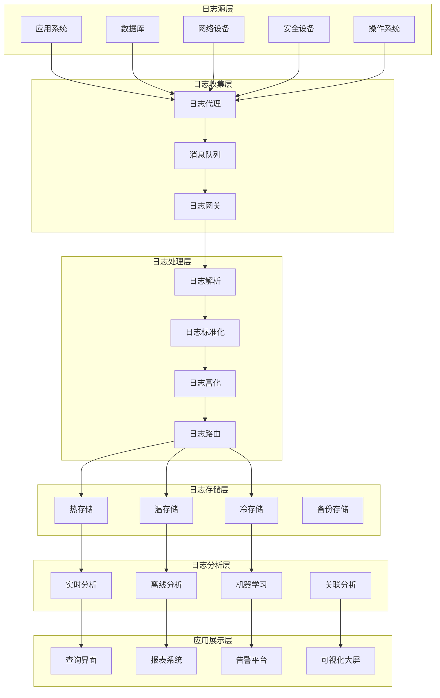
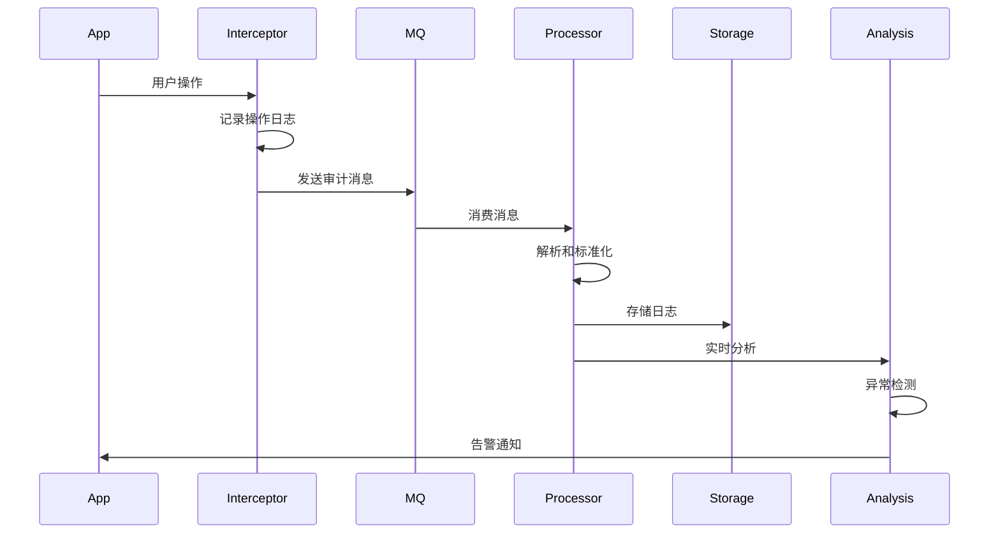
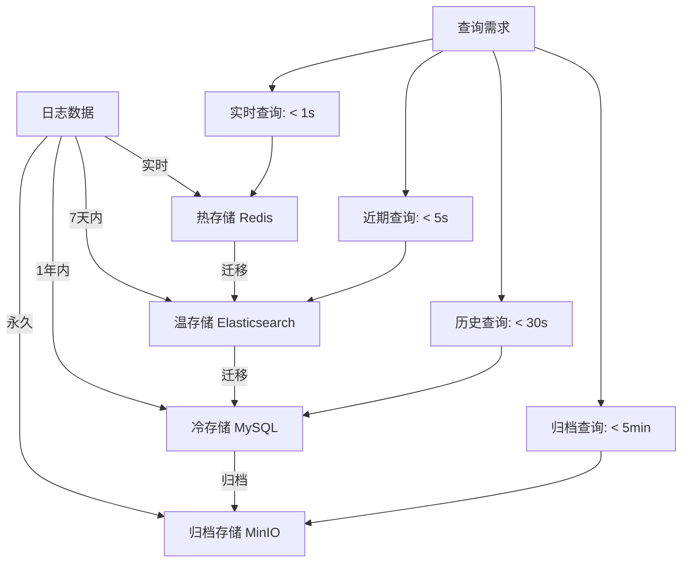

# 审计日志服务详细设计

**文档编号**: DD-ALS-001  
**版本**: v1.0.0  
**最后更新**: 2025-12-24  
**作者**: BankShield安全架构团队  

## 1. 概述

### 1.1 设计目标

审计日志服务（Audit Log Service, ALS）是BankShield系统的核心安全组件，负责收集、存储、分析和展示系统的所有安全相关事件。该服务需要满足以下目标：

- **完整性**: 确保所有关键操作都被记录，无遗漏
- **不可篡改**: 审计日志一旦生成，不能被修改或删除
- **可追溯性**: 支持多维度查询和关联分析
- **高性能**: 支持高并发写入和实时查询
- **合规性**: 满足金融行业审计和监管要求

### 1.2 功能范围

| 功能模块 | 说明 | 优先级 |
|---------|------|--------|
| **日志收集** | 多源日志统一收集 | P0 |
| **日志存储** | 分层存储策略 | P0 |
| **日志分析** | 实时和离线分析 | P0 |
| **日志查询** | 多维度日志检索 | P0 |
| **报表生成** | 自动化审计报表 | P1 |
| **告警通知** | 异常行为告警 | P0 |
| **数据可视化** | 审计数据大屏 | P1 |
| **合规报告** | 监管报告生成 | P1 |

## 2. 架构设计

### 2.1 总体架构



### 2.2 组件交互图



## 3. 日志收集设计

### 3.1 日志分类

#### 3.1.1 操作审计日志
```java
@Entity
@Table(name = "audit_operation_log")
public class OperationAuditLog {
    
    @Id
    private String logId;
    
    @Column(name = "user_id", nullable = false)
    private String userId;
    
    @Column(name = "username", nullable = false)
    private String username;
    
    @Column(name = "operation_type", nullable = false)
    @Enumerated(EnumType.STRING)
    private OperationType operationType;
    
    @Column(name = "operation_module", nullable = false)
    private String operationModule;
    
    @Column(name = "operation_desc")
    private String operationDescription;
    
    @Column(name = "resource_type")
    private String resourceType;
    
    @Column(name = "resource_id")
    private String resourceId;
    
    @Column(name = "request_params", columnDefinition = "TEXT")
    private String requestParams;
    
    @Column(name = "response_result", columnDefinition = "TEXT")
    private String responseResult;
    
    @Column(name = "operation_result", nullable = false)
    @Enumerated(EnumType.STRING)
    private OperationResult operationResult;
    
    @Column(name = "error_message")
    private String errorMessage;
    
    @Column(name = "execution_time")
    private Long executionTime;
    
    @Column(name = "ip_address", nullable = false)
    private String ipAddress;
    
    @Column(name = "user_agent")
    private String userAgent;
    
    @Column(name = "session_id")
    private String sessionId;
    
    @Column(name = "trace_id")
    private String traceId;
    
    @Column(name = "operation_time", nullable = false)
    private Instant operationTime;
    
    @Column(name = "created_at", nullable = false)
    private Instant createdAt;
}
```

#### 3.1.2 数据访问审计日志
```java
@Entity
@Table(name = "audit_data_access_log")
public class DataAccessAuditLog {
    
    @Id
    private String logId;
    
    @Column(name = "user_id", nullable = false)
    private String userId;
    
    @Column(name = "database_name", nullable = false)
    private String databaseName;
    
    @Column(name = "table_name", nullable = false)
    private String tableName;
    
    @Column(name = "operation_type", nullable = false)
    @Enumerated(EnumType.STRING)
    private DataOperationType operationType;
    
    @Column(name = "sql_query", columnDefinition = "TEXT")
    private String sqlQuery;
    
    @Column(name = "affected_rows")
    private Long affectedRows;
    
    @Column(name = "accessed_columns", columnDefinition = "TEXT")
    private String accessedColumns;
    
    @Column(name = "sensitive_data_accessed", nullable = false)
    private Boolean sensitiveDataAccessed;
    
    @Column(name = "data_classification")
    @Enumerated(EnumType.STRING)
    private DataClassification dataClassification;
    
    @Column(name = "access_result", nullable = false)
    @Enumerated(EnumType.STRING)
    private AccessResult accessResult;
    
    @Column(name = "access_time", nullable = false)
    private Instant accessTime;
    
    @Column(name = "execution_time")
    private Long executionTime;
}
```

### 3.2 日志收集器

#### 3.2.1 统一日志拦截器
```java
@Aspect
@Component
@Slf4j
public class AuditLogInterceptor {
    
    @Autowired
    private AuditLogService auditLogService;
    
    @Around("@annotation(AuditLog) && @annotation(auditLog)")
    public Object around(ProceedingJoinPoint joinPoint, AuditLog auditLog) throws Throwable {
        
        StopWatch stopWatch = new StopWatch();
        stopWatch.start();
        
        LogContext context = LogContext.builder()
                .userId(getCurrentUserId())
                .username(getCurrentUsername())
                .operationType(auditLog.type())
                .operationModule(auditLog.module())
                .operationDescription(auditLog.description())
                .requestParams(getRequestParams(joinPoint))
                .ipAddress(getClientIp())
                .userAgent(getUserAgent())
                .sessionId(getSessionId())
                .traceId(getTraceId())
                .operationTime(Instant.now())
                .build();
        
        try {
            Object result = joinPoint.proceed();
            
            stopWatch.stop();
            context.setExecutionTime(stopWatch.getTotalTimeMillis());
            context.setResponseResult(JsonUtils.toJson(result));
            context.setOperationResult(OperationResult.SUCCESS);
            
            return result;
            
        } catch (Exception e) {
            stopWatch.stop();
            context.setExecutionTime(stopWatch.getTotalTimeMillis());
            context.setOperationResult(OperationResult.FAILURE);
            context.setErrorMessage(e.getMessage());
            throw e;
            
        } finally {
            // 异步发送审计日志
            auditLogService.asyncLogOperation(context);
        }
    }
    
    private String getRequestParams(ProceedingJoinPoint joinPoint) {
        Object[] args = joinPoint.getArgs();
        if (args == null || args.length == 0) {
            return null;
        }
        
        // 过滤敏感参数
        List<Object> filteredArgs = Arrays.stream(args)
                .filter(arg -> !(arg instanceof HttpServletRequest))
                .filter(arg -> !(arg instanceof HttpServletResponse))
                .map(this::filterSensitiveData)
                .collect(Collectors.toList());
        
        return JsonUtils.toJson(filteredArgs);
    }
    
    private Object filterSensitiveData(Object arg) {
        if (arg == null) {
            return null;
        }
        
        // 使用Jackson过滤器移除敏感字段
        SimpleFilterProvider filters = new SimpleFilterProvider();
        filters.addFilter("sensitiveDataFilter", 
                SimpleBeanPropertyFilter.serializeAllExcept("password", "idCard", "phone"));
        
        ObjectMapper mapper = new ObjectMapper();
        mapper.setFilterProvider(filters);
        
        try {
            String json = mapper.writeValueAsString(arg);
            return mapper.readValue(json, Object.class);
        } catch (Exception e) {
            log.warn("Failed to filter sensitive data", e);
            return "[Filtered]";
        }
    }
}
```

#### 3.2.2 异步日志发送
```java
@Service
@Slf4j
public class AuditLogService {
    
    @Autowired
    private RabbitTemplate rabbitTemplate;
    
    @Autowired
    private ObjectMapper objectMapper;
    
    @Value("${audit.log.queue.name:audit.log.queue}")
    private String auditLogQueue;
    
    /**
     * 异步记录操作日志
     */
    @Async("auditLogExecutor")
    public void asyncLogOperation(LogContext context) {
        try {
            // 1. 构建审计日志
            OperationAuditLog auditLog = buildOperationAuditLog(context);
            
            // 2. 发送到消息队列
            sendToQueue(auditLog);
            
            // 3. 记录本地日志（备份）
            logLocalBackup(auditLog);
            
        } catch (Exception e) {
            log.error("Failed to send audit log to queue", e);
            // 降级处理：直接写入本地文件
            writeToLocalFile(context);
        }
    }
    
    private OperationAuditLog buildOperationAuditLog(LogContext context) {
        return OperationAuditLog.builder()
                .logId(generateLogId())
                .userId(context.getUserId())
                .username(context.getUsername())
                .operationType(context.getOperationType())
                .operationModule(context.getOperationModule())
                .operationDescription(context.getOperationDescription())
                .requestParams(context.getRequestParams())
                .responseResult(context.getResponseResult())
                .operationResult(context.getOperationResult())
                .errorMessage(context.getErrorMessage())
                .executionTime(context.getExecutionTime())
                .ipAddress(context.getIpAddress())
                .userAgent(context.getUserAgent())
                .sessionId(context.getSessionId())
                .traceId(context.getTraceId())
                .operationTime(context.getOperationTime())
                .createdAt(Instant.now())
                .build();
    }
    
    private void sendToQueue(OperationAuditLog auditLog) {
        try {
            String message = objectMapper.writeValueAsString(auditLog);
            rabbitTemplate.convertAndSend(auditLogQueue, message);
            log.debug("Audit log sent to queue: {}", auditLog.getLogId());
        } catch (JsonProcessingException e) {
            throw new AuditLogException("Failed to serialize audit log", e);
        }
    }
    
    private String generateLogId() {
        return "AUDIT_" + System.currentTimeMillis() + "_" + RandomStringUtils.randomAlphanumeric(8);
    }
}
```

### 3.3 日志标准化

#### 3.3.1 日志格式标准
```json
{
  "version": "1.0",
  "timestamp": "2025-12-24T15:30:00.000Z",
  "log_id": "AUDIT_20251224153000_ABC123",
  "source": {
    "system": "bankshield-api",
    "module": "user-management",
    "instance": "api-server-01",
    "ip": "192.168.1.100"
  },
  "user": {
    "user_id": "12345",
    "username": "zhangsan",
    "roles": ["ADMIN"],
    "department": "IT",
    "session_id": "sess_abc123"
  },
  "operation": {
    "type": "UPDATE",
    "resource": "user",
    "resource_id": "67890",
    "action": "update_user_profile",
    "module": "用户管理",
    "description": "更新用户基本信息"
  },
  "request": {
    "method": "POST",
    "url": "/api/users/67890",
    "parameters": {
      "name": "张三",
      "email": "zhangsan@example.com"
    },
    "headers": {
      "user-agent": "Mozilla/5.0...",
      "x-forwarded-for": "192.168.1.50"
    }
  },
  "response": {
    "status": "SUCCESS",
    "code": 200,
    "message": "用户更新成功",
    "data": {
      "user_id": "67890",
      "updated_at": "2025-12-24T15:30:00.000Z"
    }
  },
  "performance": {
    "execution_time": 150,
    "db_queries": 3,
    "memory_usage": "256MB"
  },
  "security": {
    "risk_level": "LOW",
    "sensitive_data": false,
    "encryption_used": true
  }
}
```

## 4. 日志存储设计

### 4.1 分层存储策略

#### 4.1.1 存储层次


#### 4.1.2 热存储（Redis）
```java
@Service
public class HotLogStorage {
    
    @Autowired
    private RedisTemplate<String, String> redisTemplate;
    
    private static final String HOT_LOG_KEY = "audit:log:hot:";
    private static final Duration HOT_LOG_TTL = Duration.ofHours(1);
    
    /**
     * 存储实时日志到Redis
     */
    public void storeHotLog(AuditLog log) {
        try {
            String key = HOT_LOG_KEY + log.getLogId();
            String value = objectMapper.writeValueAsString(log);
            
            redisTemplate.opsForValue().set(key, value, HOT_LOG_TTL);
            
            // 同时添加到时间索引
            String timeIndexKey = "audit:log:timeindex:" + 
                    log.getCreatedAt().truncatedTo(ChronoUnit.HOURS);
            redisTemplate.opsForZSet().add(timeIndexKey, log.getLogId(), 
                    log.getCreatedAt().toEpochMilli());
            
            // 设置索引过期时间
            redisTemplate.expire(timeIndexKey, HOT_LOG_TTL);
            
        } catch (Exception e) {
            log.error("Failed to store hot log", e);
            throw new HotStorageException("Hot log storage failed", e);
        }
    }
    
    /**
     * 查询最近的热日志
     */
    public List<AuditLog> getRecentLogs(int count) {
        try {
            String pattern = HOT_LOG_KEY + "*";
            Set<String> keys = redisTemplate.keys(pattern);
            
            if (keys == null || keys.isEmpty()) {
                return Collections.emptyList();
            }
            
            // 按时间排序，取最近的
            List<String> recentKeys = keys.stream()
                    .sorted(Comparator.reverseOrder())
                    .limit(count)
                    .collect(Collectors.toList());
            
            List<AuditLog> logs = new ArrayList<>();
            for (String key : recentKeys) {
                String value = redisTemplate.opsForValue().get(key);
                if (value != null) {
                    AuditLog log = objectMapper.readValue(value, AuditLog.class);
                    logs.add(log);
                }
            }
            
            return logs;
            
        } catch (Exception e) {
            log.error("Failed to get recent hot logs", e);
            return Collections.emptyList();
        }
    }
}
```

#### 4.1.3 温存储（Elasticsearch）
```java
@Service
public class WarmLogStorage {
    
    @Autowired
    private ElasticsearchRestTemplate elasticsearchTemplate;
    
    /**
     * 批量存储日志到Elasticsearch
     */
    public void bulkStoreLogs(List<AuditLog> logs) {
        try {
            BulkRequest bulkRequest = new BulkRequest();
            
            for (AuditLog log : logs) {
                IndexRequest indexRequest = new IndexRequest("audit-logs")
                        .id(log.getLogId())
                        .source(objectMapper.writeValueAsString(log), XContentType.JSON);
                
                bulkRequest.add(indexRequest);
            }
            
            BulkResponse response = elasticsearchTemplate.getClient().bulk(bulkRequest, RequestOptions.DEFAULT);
            
            if (response.hasFailures()) {
                log.error("Bulk indexing failed: {}", response.buildFailureMessage());
                throw new WarmStorageException("Bulk indexing failed");
            }
            
            log.info("Successfully indexed {} logs", logs.size());
            
        } catch (Exception e) {
            log.error("Failed to bulk store logs to Elasticsearch", e);
            throw new WarmStorageException("Warm storage failed", e);
        }
    }
    
    /**
     * 查询日志
     */
    public SearchResult<AuditLog> searchLogs(LogSearchCriteria criteria) {
        try {
            BoolQueryBuilder queryBuilder = QueryBuilders.boolQuery();
            
            // 时间范围
            if (criteria.getStartTime() != null && criteria.getEndTime() != null) {
                queryBuilder.filter(
                    QueryBuilders.rangeQuery("createdAt")
                        .from(criteria.getStartTime())
                        .to(criteria.getEndTime())
                );
            }
            
            // 用户ID
            if (criteria.getUserId() != null) {
                queryBuilder.filter(QueryBuilders.termQuery("userId", criteria.getUserId()));
            }
            
            // 操作类型
            if (criteria.getOperationType() != null) {
                queryBuilder.filter(QueryBuilders.termQuery("operationType", criteria.getOperationType()));
            }
            
            // 构建搜索请求
            SearchSourceBuilder searchSourceBuilder = new SearchSourceBuilder()
                    .query(queryBuilder)
                    .from(criteria.getOffset())
                    .size(criteria.getLimit())
                    .sort("createdAt", SortOrder.DESC);
            
            SearchRequest searchRequest = new SearchRequest("audit-logs")
                    .source(searchSourceBuilder);
            
            SearchResponse response = elasticsearchTemplate.getClient().search(searchRequest, RequestOptions.DEFAULT);
            
            // 解析结果
            List<AuditLog> logs = new ArrayList<>();
            for (SearchHit hit : response.getHits()) {
                AuditLog log = objectMapper.readValue(hit.getSourceAsString(), AuditLog.class);
                logs.add(log);
            }
            
            return SearchResult.<AuditLog>builder()
                    .items(logs)
                    .total(response.getHits().getTotalHits().value)
                    .build();
                    
        } catch (Exception e) {
            log.error("Failed to search logs", e);
            throw new WarmStorageException("Log search failed", e);
        }
    }
}
```

### 4.2 数据压缩和归档

#### 4.2.1 日志压缩策略
```java
@Service
public class LogCompressionService {
    
    /**
     * 压缩历史日志数据
     */
    public void compressOldLogs(LocalDate date) {
        try {
            // 查询指定日期的日志
            List<AuditLog> logs = warmLogStorage.getLogsByDate(date);
            
            if (logs.isEmpty()) {
                log.info("No logs found for date: {}", date);
                return;
            }
            
            // 压缩日志数据
            byte[] compressedData = compressData(logs);
            
            // 存储到冷存储
            String objectName = String.format("audit-logs/%s/compressed.gz", date);
            minioService.putObject("audit-archive", objectName, compressedData);
            
            // 验证压缩数据
            verifyCompressedData(date, compressedData);
            
            // 删除温存储中的原始数据
            warmLogStorage.deleteLogsByDate(date);
            
            log.info("Successfully compressed {} logs for date: {}", logs.size(), date);
            
        } catch (Exception e) {
            log.error("Failed to compress logs for date: " + date, e);
            throw new CompressionException("Log compression failed", e);
        }
    }
    
    private byte[] compressData(List<AuditLog> logs) throws IOException {
        ByteArrayOutputStream baos = new ByteArrayOutputStream();
        GZIPOutputStream gzipOut = new GZIPOutputStream(baos);
        
        try (ObjectOutputStream oos = new ObjectOutputStream(gzipOut)) {
            oos.writeObject(logs);
        }
        
        return baos.toByteArray();
    }
    
    private void verifyCompressedData(LocalDate date, byte[] compressedData) throws IOException {
        // 解压缩验证
        ByteArrayInputStream bais = new ByteArrayInputStream(compressedData);
        GZIPInputStream gzipIn = new GZIPInputStream(bais);
        
        try (ObjectInputStream ois = new ObjectInputStream(gzipIn)) {
            @SuppressWarnings("unchecked")
            List<AuditLog> decompressedLogs = (List<AuditLog>) ois.readObject();
            
            log.info("Verification successful: {} logs decompressed", decompressedLogs.size());
        } catch (ClassNotFoundException e) {
            throw new IOException("Failed to deserialize compressed data", e);
        }
    }
}
```

## 5. 日志分析设计

### 5.1 实时分析引擎

#### 5.1.1 异常检测算法
```java
@Service
public class RealtimeAnalysisEngine {
    
    @Autowired
    private RuleEngine ruleEngine;
    
    @Autowired
    private MLModelService mlModelService;
    
    @Autowired
    private AlertService alertService;
    
    /**
     * 实时分析日志
     */
    public void analyzeLog(AuditLog log) {
        try {
            // 1. 规则引擎检测
            List<RuleMatch> ruleMatches = ruleEngine.evaluate(log);
            
            // 2. 机器学习模型检测
            List<Anomaly> anomalies = mlModelService.detectAnomalies(log);
            
            // 3. 统计异常检测
            List<StatisticalAnomaly> statAnomalies = detectStatisticalAnomalies(log);
            
            // 4. 综合风险评估
            RiskAssessment risk = calculateRisk(log, ruleMatches, anomalies, statAnomalies);
            
            // 5. 生成告警
            if (risk.getRiskLevel() != RiskLevel.LOW) {
                generateAlert(log, risk);
            }
            
            // 6. 记录分析结果
            recordAnalysisResult(log, risk);
            
        } catch (Exception e) {
            log.error("Failed to analyze log: " + log.getLogId(), e);
        }
    }
    
    private List<StatisticalAnomaly> detectStatisticalAnomalies(AuditLog log) {
        List<StatisticalAnomaly> anomalies = new ArrayList<>();
        
        // 登录频率异常
        if (isLoginFrequencyAnomaly(log)) {
            anomalies.add(new StatisticalAnomaly("LOGIN_FREQUENCY_ANOMALY", 
                    "Login frequency exceeds normal pattern"));
        }
        
        // 时间异常
        if (isTimeAnomaly(log)) {
            anomalies.add(new StatisticalAnomaly("TIME_ANOMALY", 
                    "Operation outside normal business hours"));
        }
        
        // IP地址异常
        if (isIpAnomaly(log)) {
            anomalies.add(new StatisticalAnomaly("IP_ANOMALY", 
                    "Operation from unusual IP address"));
        }
        
        return anomalies;
    }
    
    private boolean isLoginFrequencyAnomaly(AuditLog log) {
        if (!OperationType.LOGIN.equals(log.getOperationType())) {
            return false;
        }
        
        // 检查最近1小时内的登录次数
        Instant oneHourAgo = Instant.now().minus(Duration.ofHours(1));
        long loginCount = auditLogService.countLoginsByUserSince(log.getUserId(), oneHourAgo);
        
        // 超过10次登录视为异常
        return loginCount > 10;
    }
    
    private boolean isTimeAnomaly(AuditLog log) {
        LocalTime operationTime = LocalTime.ofInstant(log.getOperationTime(), ZoneId.systemDefault());
        
        // 非工作时间（22:00-06:00）的操作视为异常
        return operationTime.isAfter(LocalTime.of(22, 0)) || 
               operationTime.isBefore(LocalTime.of(6, 0));
    }
    
    private boolean isIpAnomaly(AuditLog log) {
        String currentIp = log.getIpAddress();
        
        // 获取用户的历史IP地址
        Set<String> historicalIps = auditLogService.getUserHistoricalIps(log.getUserId());
        
        // 如果是新IP地址，视为异常
        return !historicalIps.contains(currentIp);
    }
    
    private RiskAssessment calculateRisk(AuditLog log, List<RuleMatch> ruleMatches, 
                                       List<Anomaly> anomalies, List<StatisticalAnomaly> statAnomalies) {
        int riskScore = 0;
        
        // 规则匹配风险评分
        for (RuleMatch match : ruleMatches) {
            riskScore += match.getSeverity().getScore();
        }
        
        // 机器学习异常风险评分
        for (Anomaly anomaly : anomalies) {
            riskScore += (int) (anomaly.getScore() * 100);
        }
        
        // 统计异常风险评分
        for (StatisticalAnomaly anomaly : statAnomalies) {
            riskScore += 50; // 每个统计异常50分
        }
        
        // 确定风险等级
        RiskLevel riskLevel;
        if (riskScore >= 200) {
            riskLevel = RiskLevel.CRITICAL;
        } else if (riskScore >= 100) {
            riskLevel = RiskLevel.HIGH;
        } else if (riskScore >= 50) {
            riskLevel = RiskLevel.MEDIUM;
        } else {
            riskLevel = RiskLevel.LOW;
        }
        
        return RiskAssessment.builder()
                .riskLevel(riskLevel)
                .riskScore(riskScore)
                .ruleMatches(ruleMatches)
                .anomalies(anomalies)
                .statisticalAnomalies(statAnomalies)
                .build();
    }
    
    private void generateAlert(AuditLog log, RiskAssessment risk) {
        Alert alert = Alert.builder()
                .alertId(generateAlertId())
                .alertType(AlertType.SECURITY_ANOMALY)
                .severity(risk.getRiskLevel())
                .title("Security anomaly detected")
                .description(buildAlertDescription(log, risk))
                .sourceLogId(log.getLogId())
                .userId(log.getUserId())
                .createdAt(Instant.now())
                .build();
        
        alertService.sendAlert(alert);
    }
}
```

### 5.2 规则引擎

#### 5.2.1 规则定义
```java
@Entity
@Table(name = "audit_rule")
public class AuditRule {
    
    @Id
    private String ruleId;
    
    @Column(name = "rule_name", nullable = false)
    private String ruleName;
    
    @Column(name = "rule_type", nullable = false)
    @Enumerated(EnumType.STRING)
    private RuleType ruleType;
    
    @Column(name = "rule_condition", columnDefinition = "TEXT", nullable = false)
    private String ruleCondition;
    
    @Column(name = "severity", nullable = false)
    @Enumerated(EnumType.STRING)
    private RuleSeverity severity;
    
    @Column(name = "is_enabled", nullable = false)
    private Boolean isEnabled;
    
    @Column(name = "created_at", nullable = false)
    private Instant createdAt;
    
    @Column(name = "description")
    private String description;
}
```

#### 5.2.2 规则示例
```json
{
  "rule_id": "RULE_001",
  "rule_name": "多次登录失败检测",
  "rule_type": "FREQUENCY",
  "rule_condition": {
    "event_type": "LOGIN_FAILURE",
    "time_window": "PT5M",
    "threshold": 5,
    "user_scope": "SAME_USER"
  },
  "severity": "HIGH",
  "is_enabled": true,
  "description": "同一用户在5分钟内登录失败超过5次"
}
```

### 5.3 机器学习模型

#### 5.3.1 用户行为基线模型
```java
@Service
public class UserBehaviorBaselineService {
    
    /**
     * 构建用户行为基线
     */
    public UserBehaviorBaseline buildBaseline(String userId) {
        // 获取用户历史行为数据
        List<AuditLog> historicalLogs = auditLogService.getUserHistoricalLogs(userId, 
                Instant.now().minus(Duration.ofDays(30)));
        
        // 分析登录模式
        LoginPattern loginPattern = analyzeLoginPattern(historicalLogs);
        
        // 分析操作习惯
        OperationPattern operationPattern = analyzeOperationPattern(historicalLogs);
        
        // 分析时间分布
        TimeDistribution timeDistribution = analyzeTimeDistribution(historicalLogs);
        
        // 分析IP使用模式
        IpPattern ipPattern = analyzeIpPattern(historicalLogs);
        
        return UserBehaviorBaseline.builder()
                .userId(userId)
                .loginPattern(loginPattern)
                .operationPattern(operationPattern)
                .timeDistribution(timeDistribution)
                .ipPattern(ipPattern)
                .baselineDate(Instant.now())
                .build();
    }
    
    private LoginPattern analyzeLoginPattern(List<AuditLog> logs) {
        List<AuditLog> loginLogs = logs.stream()
                .filter(log -> OperationType.LOGIN.equals(log.getOperationType()))
                .collect(Collectors.toList());
        
        // 计算平均登录时间间隔
        List<Long> intervals = new ArrayList<>();
        for (int i = 1; i < loginLogs.size(); i++) {
            long interval = Duration.between(loginLogs.get(i-1).getOperationTime(),
                                           loginLogs.get(i).getOperationTime()).toHours();
            intervals.add(interval);
        }
        
        double avgInterval = intervals.stream()
                .mapToLong(Long::longValue)
                .average()
                .orElse(24.0); // 默认24小时
        
        // 计算登录时间分布
        Map<Integer, Long> hourlyDistribution = loginLogs.stream()
                .collect(Collectors.groupingBy(
                        log -> LocalTime.ofInstant(log.getOperationTime(), ZoneId.systemDefault()).getHour(),
                        Collectors.counting()
                ));
        
        return LoginPattern.builder()
                .averageIntervalHours(avgInterval)
                .hourlyDistribution(hourlyDistribution)
                .totalLogins(loginLogs.size())
                .build();
    }
}
```

## 6. 查询与报表

### 6.1 多维度查询

#### 6.1.1 查询接口设计
```java
@RestController
@RequestMapping("/api/audit")
@Validated
public class AuditLogController {
    
    @Autowired
    private AuditLogQueryService queryService;
    
    /**
     * 通用日志查询
     */
    @GetMapping("/logs")
    public ApiResult<PageResult<AuditLogDTO>> searchLogs(@Valid LogSearchRequest request) {
        try {
            LogSearchCriteria criteria = buildSearchCriteria(request);
            PageResult<AuditLog> result = queryService.searchLogs(criteria);
            
            // 转换为DTO
            List<AuditLogDTO> dtoList = result.getItems().stream()
                    .map(this::convertToDTO)
                    .collect(Collectors.toList());
            
            return ApiResult.success(PageResult.<AuditLogDTO>builder()
                    .items(dtoList)
                    .total(result.getTotal())
                    .page(request.getPage())
                    .size(request.getSize())
                    .build());
                    
        } catch (Exception e) {
            log.error("Failed to search audit logs", e);
            return ApiResult.error("查询失败: " + e.getMessage());
        }
    }
    
    /**
     * 用户行为分析
     */
    @GetMapping("/user-behavior/{userId}")
    public ApiResult<UserBehaviorAnalysis> analyzeUserBehavior(
            @PathVariable String userId,
            @RequestParam @DateTimeFormat(iso = DateTimeFormat.ISO.DATE_TIME) Instant startTime,
            @RequestParam @DateTimeFormat(iso = DateTimeFormat.ISO.DATE_TIME) Instant endTime) {
        
        try {
            UserBehaviorAnalysis analysis = queryService.analyzeUserBehavior(userId, startTime, endTime);
            return ApiResult.success(analysis);
        } catch (Exception e) {
            log.error("Failed to analyze user behavior: " + userId, e);
            return ApiResult.error("分析失败: " + e.getMessage());
        }
    }
    
    /**
     * 安全事件统计
     */
    @GetMapping("/security-stats")
    public ApiResult<SecurityStatistics> getSecurityStatistics(
            @RequestParam @DateTimeFormat(iso = DateTimeFormat.ISO.DATE_TIME) Instant startTime,
            @RequestParam @DateTimeFormat(iso = DateTimeFormat.ISO.DATE_TIME) Instant endTime) {
        
        try {
            SecurityStatistics stats = queryService.getSecurityStatistics(startTime, endTime);
            return ApiResult.success(stats);
        } catch (Exception e) {
            log.error("Failed to get security statistics", e);
            return ApiResult.error("统计失败: " + e.getMessage());
        }
    }
}
```

#### 6.1.2 查询条件构建
```java
public class LogSearchCriteria {
    
    private Instant startTime;
    private Instant endTime;
    private String userId;
    private Set<String> userIds;
    private OperationType operationType;
    private Set<OperationType> operationTypes;
    private String operationModule;
    private String ipAddress;
    private String resourceType;
    private String resourceId;
    private OperationResult operationResult;
    private RiskLevel riskLevel;
    private Boolean sensitiveDataAccessed;
    
    // 分页参数
    private int offset;
    private int limit;
    
    // 排序参数
    private String sortField;
    private SortDirection sortDirection;
    
    // 聚合参数
    private Set<String> groupByFields;
    private Set<String> aggregationFunctions;
}
```

### 6.2 自动化报表

#### 6.2.1 报表模板设计
```java
@Entity
@Table(name = "audit_report_template")
public class AuditReportTemplate {
    
    @Id
    private String templateId;
    
    @Column(name = "template_name", nullable = false)
    private String templateName;
    
    @Column(name = "report_type", nullable = false)
    @Enumerated(EnumType.STRING)
    private ReportType reportType;
    
    @Column(name = "frequency", nullable = false)
    @Enumerated(EnumType.STRING)
    private ReportFrequency frequency;
    
    @Column(name = "query_template", columnDefinition = "TEXT", nullable = false)
    private String queryTemplate;
    
    @Column(name = "chart_config", columnDefinition = "TEXT")
    private String chartConfig;
    
    @Column(name = "recipient_emails", columnDefinition = "TEXT")
    private String recipientEmails;
    
    @Column(name = "is_enabled", nullable = false)
    private Boolean isEnabled;
    
    @Column(name = "created_at", nullable = false)
    private Instant createdAt;
}
```

#### 6.2.2 报表生成服务
```java
@Service
@Slf4j
public class AuditReportService {
    
    @Autowired
    private AuditReportTemplateRepository templateRepository;
    
    @Autowired
    private AuditLogQueryService queryService;
    
    @Autowired
    private ReportGenerator reportGenerator;
    
    @Autowired
    private EmailService emailService;
    
    /**
     * 生成定期审计报表
     */
    @Scheduled(cron = "0 0 1 * * ?") // 每天凌晨1点执行
    public void generateScheduledReports() {
        log.info("Starting scheduled report generation");
        
        try {
            // 获取启用的报表模板
            List<AuditReportTemplate> templates = templateRepository.findByIsEnabled(true);
            
            for (AuditReportTemplate template : templates) {
                try {
                    generateReport(template);
                } catch (Exception e) {
                    log.error("Failed to generate report for template: " + template.getTemplateId(), e);
                }
            }
            
        } catch (Exception e) {
            log.error("Scheduled report generation failed", e);
        }
    }
    
    private void generateReport(AuditReportTemplate template) {
        log.info("Generating report for template: {}", template.getTemplateName());
        
        // 1. 确定时间范围
        TimeRange timeRange = calculateTimeRange(template.getFrequency());
        
        // 2. 执行查询
        ReportData data = executeQuery(template.getQueryTemplate(), timeRange);
        
        // 3. 生成图表
        List<Chart> charts = generateCharts(data, template.getChartConfig());
        
        // 4. 生成PDF报表
        byte[] pdfReport = reportGenerator.generatePdfReport(template, data, charts);
        
        // 5. 发送邮件
        sendReportEmail(template, pdfReport, timeRange);
        
        log.info("Report generated successfully: {}", template.getTemplateName());
    }
    
    private ReportData executeQuery(String queryTemplate, TimeRange timeRange) {
        try {
            // 替换查询模板中的时间参数
            String query = queryTemplate
                    .replace("${startTime}", timeRange.getStart().toString())
                    .replace("${endTime}", timeRange.getEnd().toString());
            
            // 执行查询
            return queryService.executeReportQuery(query);
            
        } catch (Exception e) {
            throw new ReportGenerationException("Failed to execute report query", e);
        }
    }
    
    private List<Chart> generateCharts(ReportData data, String chartConfig) {
        try {
            ChartConfig config = objectMapper.readValue(chartConfig, ChartConfig.class);
            List<Chart> charts = new ArrayList<>();
            
            for (ChartDefinition chartDef : config.getCharts()) {
                Chart chart = chartGenerator.generateChart(data, chartDef);
                charts.add(chart);
            }
            
            return charts;
            
        } catch (Exception e) {
            log.error("Failed to generate charts", e);
            return Collections.emptyList();
        }
    }
}
```

## 7. 性能优化

### 7.1 写入性能优化

#### 7.1.1 批量写入
```java
@Service
@Slf4j
public class BatchLogWriter {
    
    private final BlockingQueue<AuditLog> logQueue = new LinkedBlockingQueue<>(10000);
    private final AtomicBoolean running = new AtomicBoolean(true);
    private final AtomicInteger batchSize = new AtomicInteger(0);
    private final List<AuditLog> currentBatch = new ArrayList<>();
    
    @Autowired
    private WarmLogStorage warmLogStorage;
    
    @PostConstruct
    public void init() {
        // 启动批处理线程
        Executors.newSingleThreadExecutor().submit(this::batchProcess);
        
        // 启动定时刷新线程
        Executors.newSingleThreadScheduledExecutor().scheduleAtFixedRate(
                this::flushBatch, 5, 5, TimeUnit.SECONDS);
    }
    
    /**
     * 添加日志到批处理队列
     */
    public void addLog(AuditLog log) {
        try {
            if (!logQueue.offer(log, 100, TimeUnit.MILLISECONDS)) {
                log.warn("Log queue is full, dropping log: {}", log.getLogId());
            }
        } catch (InterruptedException e) {
            Thread.currentThread().interrupt();
            log.error("Failed to add log to queue", e);
        }
    }
    
    private void batchProcess() {
        while (running.get()) {
            try {
                AuditLog log = logQueue.poll(1, TimeUnit.SECONDS);
                
                if (log != null) {
                    synchronized (currentBatch) {
                        currentBatch.add(log);
                        batchSize.incrementAndGet();
                        
                        // 达到批处理大小，立即处理
                        if (batchSize.get() >= 100) {
                            flushBatch();
                        }
                    }
                }
                
            } catch (InterruptedException e) {
                Thread.currentThread().interrupt();
                break;
            } catch (Exception e) {
                log.error("Error in batch processing", e);
            }
        }
    }
    
    private void flushBatch() {
        synchronized (currentBatch) {
            if (currentBatch.isEmpty()) {
                return;
            }
            
            try {
                log.info("Flushing batch of {} logs", currentBatch.size());
                
                // 批量存储到Elasticsearch
                warmLogStorage.bulkStoreLogs(new ArrayList<>(currentBatch));
                
                // 清空当前批次
                currentBatch.clear();
                batchSize.set(0);
                
                log.info("Batch flush completed successfully");
                
            } catch (Exception e) {
                log.error("Failed to flush batch", e);
                // 重试机制
                retryBatch(currentBatch);
            }
        }
    }
    
    private void retryBatch(List<AuditLog> batch) {
        int maxRetries = 3;
        int retryCount = 0;
        
        while (retryCount < maxRetries) {
            try {
                Thread.sleep(1000 * (retryCount + 1)); // 指数退避
                warmLogStorage.bulkStoreLogs(batch);
                log.info("Batch retry successful on attempt {}", retryCount + 1);
                return;
            } catch (Exception e) {
                retryCount++;
                log.warn("Batch retry attempt {} failed", retryCount, e);
            }
        }
        
        // 最终失败，写入失败日志
        log.error("Batch failed after {} retries, writing to failure log", maxRetries);
        writeFailureLog(batch);
    }
    
    private void writeFailureLog(List<AuditLog> batch) {
        try {
            String failureLogFile = String.format("audit_failure_%s.log", 
                    LocalDateTime.now().format(DateTimeFormatter.ofPattern("yyyyMMdd_HHmmss")));
            
            try (FileWriter writer = new FileWriter(failureLogFile, true)) {
                for (AuditLog log : batch) {
                    writer.write(objectMapper.writeValueAsString(log));
                    writer.write("\\n");
                }
            }
        } catch (IOException e) {
            log.error("Failed to write failure log", e);
        }
    }
}
```

#### 7.1.2 异步处理
```java
@Configuration
@EnableAsync
public class AsyncConfig {
    
    @Bean("auditLogExecutor")
    public Executor auditLogExecutor() {
        ThreadPoolTaskExecutor executor = new ThreadPoolTaskExecutor();
        executor.setCorePoolSize(10);
        executor.setMaxPoolSize(20);
        executor.setQueueCapacity(1000);
        executor.setThreadNamePrefix("AuditLog-");
        executor.setRejectedExecutionHandler(new ThreadPoolExecutor.CallerRunsPolicy());
        executor.initialize();
        return executor;
    }
}
```

### 7.2 查询性能优化

#### 7.2.1 索引优化
```sql
-- 时间索引
CREATE INDEX idx_audit_log_time ON audit_operation_log(operation_time);

-- 用户索引
CREATE INDEX idx_audit_log_user ON audit_operation_log(user_id, operation_time);

-- 操作类型索引
CREATE INDEX idx_audit_log_operation ON audit_operation_log(operation_type, operation_time);

-- IP地址索引
CREATE INDEX idx_audit_log_ip ON audit_operation_log(ip_address, operation_time);

-- 复合索引
CREATE INDEX idx_audit_log_composite ON audit_operation_log(user_id, operation_type, operation_time);

-- 分区表（按时间分区）
CREATE TABLE audit_operation_log_202512 PARTITION OF audit_operation_log
    FOR VALUES FROM ('2025-12-01') TO ('2026-01-01');
```

#### 7.2.2 缓存策略
```java
@Service
public class AuditLogCacheService {
    
    @Autowired
    private RedisTemplate<String, String> redisTemplate;
    
    /**
     * 缓存热门查询结果
     */
    public void cacheQueryResult(String cacheKey, SearchResult<AuditLog> result, Duration ttl) {
        try {
            String value = objectMapper.writeValueAsString(result);
            redisTemplate.opsForValue().set(cacheKey, value, ttl);
        } catch (JsonProcessingException e) {
            log.error("Failed to cache query result", e);
        }
    }
    
    /**
     * 获取缓存的查询结果
     */
    public SearchResult<AuditLog> getCachedResult(String cacheKey) {
        try {
            String value = redisTemplate.opsForValue().get(cacheKey);
            if (value != null) {
                return objectMapper.readValue(value, 
                        new TypeReference<SearchResult<AuditLog>>() {});
            }
        } catch (Exception e) {
            log.error("Failed to get cached result", e);
        }
        return null;
    }
    
    /**
     * 生成查询缓存键
     */
    public String generateCacheKey(LogSearchCriteria criteria) {
        StringBuilder keyBuilder = new StringBuilder("audit:query:");
        
        keyBuilder.append("st:").append(criteria.getStartTime()).append(":");
        keyBuilder.append("et:").append(criteria.getEndTime()).append(":");
        keyBuilder.append("uid:").append(criteria.getUserId()).append(":");
        keyBuilder.append("ot:").append(criteria.getOperationType()).append(":");
        keyBuilder.append("mod:").append(criteria.getOperationModule()).append(":");
        keyBuilder.append("p:").append(criteria.getOffset()).append(":");
        keyBuilder.append("s:").append(criteria.getLimit());
        
        return keyBuilder.toString();
    }
}
```

## 8. 安全与合规

### 8.1 日志完整性保护

#### 8.1.1 数字签名
```java
@Service
public class LogIntegrityService {
    
    @Autowired
    private NationalCryptoService cryptoService;
    
    /**
     * 为日志生成数字签名
     */
    public LogSignature signLog(AuditLog log) {
        try {
            // 计算日志哈希
            String logHash = calculateLogHash(log);
            
            // 使用私钥签名
            CryptoResult signature = cryptoService.signWithSM2(logHash, getPrivateKey());
            
            if (signature.success) {
                return LogSignature.builder()
                        .logId(log.getLogId())
                        .hashValue(logHash)
                        .signature(signature.data!)
                        .algorithm("SM3withSM2")
                        .timestamp(Instant.now())
                        .build();
            } else {
                throw new LogSigningException("Failed to sign log: " + signature.error);
            }
            
        } catch (Exception e) {
            throw new LogSigningException("Log signing failed", e);
        }
    }
    
    /**
     * 验证日志签名
     */
    public boolean verifyLogSignature(AuditLog log, LogSignature signature) {
        try {
            // 重新计算日志哈希
            String calculatedHash = calculateLogHash(log);
            
            // 验证哈希值是否匹配
            if (!calculatedHash.equals(signature.getHashValue())) {
                log.warn("Log hash mismatch for log: {}", log.getLogId());
                return false;
            }
            
            // 验证签名
            return cryptoService.verifySignature(
                    calculatedHash, 
                    signature.getSignature(), 
                    getPublicKey()
            );
            
        } catch (Exception e) {
            log.error("Failed to verify log signature", e);
            return false;
        }
    }
    
    private String calculateLogHash(AuditLog log) {
        // 构建日志的规范表示
        String canonicalLog = buildCanonicalLogString(log);
        
        // 使用SM3计算哈希
        return cryptoService.hashWithSM3(canonicalLog);
    }
    
    private String buildCanonicalLogString(AuditLog log) {
        // 按固定格式构建日志字符串，确保一致性
        return String.format("%s|%s|%s|%s|%s|%s|%s",
                log.getLogId(),
                log.getUserId(),
                log.getOperationType(),
                log.getOperationTime(),
                log.getIpAddress(),
                log.getRequestParams(),
                log.getOperationResult()
        );
    }
}
```

#### 8.1.2 日志链式验证
```java
@Service
public class LogChainVerificationService {
    
    /**
     * 验证日志链的完整性
     */
    public ChainVerificationResult verifyLogChain(LocalDate date) {
        try {
            // 获取指定日期的所有日志签名
            List<LogSignature> signatures = logSignatureRepository.findByDate(date);
            
            // 按时间排序
            signatures.sort(Comparator.comparing(LogSignature::getTimestamp));
            
            boolean chainValid = true;
            List<String> invalidLogIds = new ArrayList<>();
            
            // 验证链式结构
            for (int i = 1; i < signatures.size(); i++) {
                LogSignature current = signatures.get(i);
                LogSignature previous = signatures.get(i - 1);
                
                // 验证当前签名是否包含前一个签名的哈希
                if (!verifyChainLink(current, previous)) {
                    chainValid = false;
                    invalidLogIds.add(current.getLogId());
                }
            }
            
            return ChainVerificationResult.builder()
                    .date(date)
                    .chainValid(chainValid)
                    .totalLogs(signatures.size())
                    .invalidLogs(invalidLogIds)
                    .build();
                    
        } catch (Exception e) {
            log.error("Failed to verify log chain for date: " + date, e);
            return ChainVerificationResult.builder()
                    .date(date)
                    .chainValid(false)
                    .error(e.getMessage())
                    .build();
        }
    }
    
    private boolean verifyChainLink(LogSignature current, LogSignature previous) {
        try {
            // 构建链式验证数据
            String chainData = current.getHashValue() + "|" + previous.getSignature();
            String expectedChainHash = cryptoService.hashWithSM3(chainData);
            
            // 验证链式哈希是否包含在当前签名中
            return current.getChainHash() != null && 
                   current.getChainHash().equals(expectedChainHash);
                   
        } catch (Exception e) {
            log.error("Failed to verify chain link", e);
            return false;
        }
    }
}
```

### 8.2 隐私保护

#### 8.2.1 敏感数据脱敏
```java
@Component
public class LogDataMaskingService {
    
    private static final Map<String, Pattern> SENSITIVE_PATTERNS = Map.of(
        "idCard", Pattern.compile("(?<=\\d{6})\\d{8}(?=\\d{4})"),
        "phone", Pattern.compile("(?<=\\d{3})\\d{4}(?=\\d{4})"),
        "email", Pattern.compile("(?<=.)[^@](?=[^@]*?@)"),
        "bankCard", Pattern.compile("(?<=\\d{4})\\d{8}(?=\\d{4})"),
        "password", Pattern.compile(".*"),
        "cvv", Pattern.compile("\\d{3,4}"),
        "expiry", Pattern.compile("\\d{2}/\\d{2}")
    );
    
    /**
     * 脱敏日志中的敏感数据
     */
    public AuditLog maskSensitiveData(AuditLog log) {
        try {
            // 脱敏请求参数
            if (log.getRequestParams() != null) {
                String maskedParams = maskJsonData(log.getRequestParams());
                log.setRequestParams(maskedParams);
            }
            
            // 脱敏响应结果
            if (log.getResponseResult() != null) {
                String maskedResult = maskJsonData(log.getResponseResult());
                log.setResponseResult(maskedResult);
            }
            
            // 脱敏错误信息
            if (log.getErrorMessage() != null) {
                String maskedError = maskTextData(log.getErrorMessage());
                log.setErrorMessage(maskedError);
            }
            
            // 标记已脱敏
            log.setMasked(true);
            
            return log;
            
        } catch (Exception e) {
            log.error("Failed to mask sensitive data in log: " + log.getLogId(), e);
            return log;
        }
    }
    
    private String maskJsonData(String jsonData) {
        try {
            JsonNode rootNode = objectMapper.readTree(jsonData);
            maskJsonNode(rootNode);
            return objectMapper.writeValueAsString(rootNode);
        } catch (Exception e) {
            log.warn("Failed to mask JSON data, returning masked placeholder", e);
            return "[MASKED_JSON_DATA]";
        }
    }
    
    private void maskJsonNode(JsonNode node) {
        if (node.isObject()) {
            ObjectNode objectNode = (ObjectNode) node;
            Iterator<Map.Entry<String, JsonNode>> fields = objectNode.fields();
            
            while (fields.hasNext()) {
                Map.Entry<String, JsonNode> field = fields.next();
                String fieldName = field.getKey();
                JsonNode fieldValue = field.getValue();
                
                // 检查字段名是否包含敏感关键词
                if (isSensitiveField(fieldName)) {
                    if (fieldValue.isTextual()) {
                        String maskedValue = maskFieldValue(fieldName, fieldValue.asText());
                        objectNode.put(fieldName, maskedValue);
                    }
                } else if (fieldValue.isObject() || fieldValue.isArray()) {
                    maskJsonNode(fieldValue);
                }
            }
        } else if (node.isArray()) {
            ArrayNode arrayNode = (ArrayNode) node;
            for (JsonNode element : arrayNode) {
                maskJsonNode(element);
            }
        }
    }
    
    private String maskFieldValue(String fieldName, String value) {
        Pattern pattern = SENSITIVE_PATTERNS.get(fieldName.toLowerCase());
        if (pattern != null) {
            return pattern.matcher(value).replaceAll("*");
        }
        return value;
    }
    
    private boolean isSensitiveField(String fieldName) {
        String lowerFieldName = fieldName.toLowerCase();
        return SENSITIVE_PATTERNS.containsKey(lowerFieldName) ||
               lowerFieldName.contains("password") ||
               lowerFieldName.contains("secret") ||
               lowerFieldName.contains("token");
    }
}
```

### 8.3 合规性要求

#### 8.3.1 日志保留策略
```java
@Service
public class LogRetentionService {
    
    /**
     * 执行日志保留策略
     */
    @Scheduled(cron = "0 0 2 * * ?") // 每天凌晨2点执行
    public void executeRetentionPolicy() {
        log.info("Starting log retention policy execution");
        
        try {
            // 热存储 - 保留1小时
            cleanHotStorage();
            
            // 温存储 - 保留7天
            archiveWarmStorage();
            
            // 冷存储 - 保留1年
            archiveColdStorage();
            
            // 归档存储 - 永久保留，但压缩旧数据
            compressOldArchives();
            
            log.info("Log retention policy execution completed");
            
        } catch (Exception e) {
            log.error("Failed to execute retention policy", e);
        }
    }
    
    private void cleanHotStorage() {
        Instant cutoffTime = Instant.now().minus(Duration.ofHours(1));
        
        // 删除1小时前的热存储日志
        hotLogStorage.deleteLogsBefore(cutoffTime);
        
        log.info("Cleaned hot storage logs before: {}", cutoffTime);
    }
    
    private void archiveWarmStorage() {
        LocalDate cutoffDate = LocalDate.now().minusDays(7);
        
        // 压缩7天前的温存储日志到冷存储
        List<AuditLog> oldLogs = warmLogStorage.getLogsBefore(cutoffDate);
        
        if (!oldLogs.isEmpty()) {
            // 批量压缩和归档
            coldLogStorage.archiveLogs(oldLogs);
            
            // 删除温存储中的原始数据
            warmLogStorage.deleteLogsBefore(cutoffDate);
        }
        
        log.info("Archived {} warm storage logs to cold storage", oldLogs.size());
    }
    
    private void archiveColdStorage() {
        LocalDate cutoffDate = LocalDate.now().minusYears(1);
        
        // 压缩1年前的冷存储日志到归档存储
        List<AuditLog> oldLogs = coldLogStorage.getLogsBefore(cutoffDate);
        
        if (!oldLogs.isEmpty()) {
            // 压缩归档
            archiveLogStorage.compressAndArchive(oldLogs);
            
            // 删除冷存储中的原始数据
            coldLogStorage.deleteLogsBefore(cutoffDate);
        }
        
        log.info("Archived {} cold storage logs to archive storage", oldLogs.size());
    }
}
```

#### 8.3.2 监管报告生成
```java
@Service
public class RegulatoryReportService {
    
    /**
     * 生成等保合规报告
     */
    public ComplianceReport generateComplianceReport(ComplianceReportRequest request) {
        try {
            // 1. 收集合规相关数据
            ComplianceData data = collectComplianceData(request);
            
            // 2. 分析合规性指标
            ComplianceAnalysis analysis = analyzeCompliance(data);
            
            // 3. 生成报告内容
            ReportContent content = generateReportContent(data, analysis);
            
            // 4. 数字签名
            byte[] signedReport = signReport(content);
            
            return ComplianceReport.builder()
                    .reportId(generateReportId())
                    .reportType(request.getReportType())
                    .period(request.getPeriod())
                    .content(content)
                    .signedData(signedReport)
                    .generatedAt(Instant.now())
                    .build();
                    
        } catch (Exception e) {
            throw new ComplianceReportException("Failed to generate compliance report", e);
        }
    }
    
    private ComplianceData collectComplianceData(ComplianceReportRequest request) {
        // 收集各类合规数据
        return ComplianceData.builder()
                .accessControlLogs(collectAccessControlLogs(request.getPeriod()))
                .dataProtectionLogs(collectDataProtectionLogs(request.getPeriod()))
                .securityEventLogs(collectSecurityEventLogs(request.getPeriod()))
                .auditTrailLogs(collectAuditTrailLogs(request.getPeriod()))
                .incidentLogs(collectIncidentLogs(request.getPeriod()))
                .build();
    }
    
    private ComplianceAnalysis analyzeCompliance(ComplianceData data) {
        // 分析各项合规指标
        return ComplianceAnalysis.builder()
                .accessControlCompliance(analyzeAccessControlCompliance(data.getAccessControlLogs()))
                .dataProtectionCompliance(analyzeDataProtectionCompliance(data.getDataProtectionLogs()))
                .securityEventCompliance(analyzeSecurityEventCompliance(data.getSecurityEventLogs()))
                .auditTrailCompleteness(analyzeAuditTrailCompleteness(data.getAuditTrailLogs()))
                .incidentResponseCompliance(analyzeIncidentResponseCompliance(data.getIncidentLogs()))
                .overallCompliance(calculateOverallCompliance(data))
                .build();
    }
}
```

## 9. 附录

### 9.1 术语表

| 术语 | 说明 |
|------|------|
| **审计日志** | 记录系统操作和安全事件的日志 |
| **SIEM** | Security Information and Event Management |
| **UEBA** | User and Entity Behavior Analytics |
| **SOAR** | Security Orchestration, Automation and Response |
| **NIST** | National Institute of Standards and Technology |
| **等保** | 网络安全等级保护 |
| **PCI DSS** | Payment Card Industry Data Security Standard |

### 9.2 相关标准

1. 《GB/T 22239-2019 信息安全技术 网络安全等级保护基本要求》
2. 《GB/T 25070-2019 信息安全技术 网络安全等级保护安全设计技术要求》
3. 《JR/T 0071-2012 金融行业信息系统信息安全等级保护实施指引》
4. NIST SP 800-92: Guide to Computer Security Log Management
5. ISO/IEC 27001:2022 信息安全管理体系

### 9.3 性能基准

| 指标 | 基准值 | 备注 |
|------|--------|------|
| 日志写入延迟 | < 100ms | 99分位 |
| 日志查询延迟 | < 1s | 热数据 |
| 批量处理能力 | > 10000条/秒 | 峰值 |
| 存储压缩比 | > 10:1 | 归档数据 |
| 异常检测准确率 | > 95% | 训练后 |

### 9.4 版本历史

| 版本 | 日期 | 作者 | 变更说明 |
|------|------|------|----------|
| v1.0.0 | 2025-12-24 | 安全架构团队 | 初始版本创建 |

---

**文档审核**: 
- [ ] 安全架构师审核
- [ ] 数据架构师审核
- [ ] 合规专家审核
- [ ] 性能专家审核

**最后更新**: 2025-12-24  
**更新人员**: BankShield安全架构团队