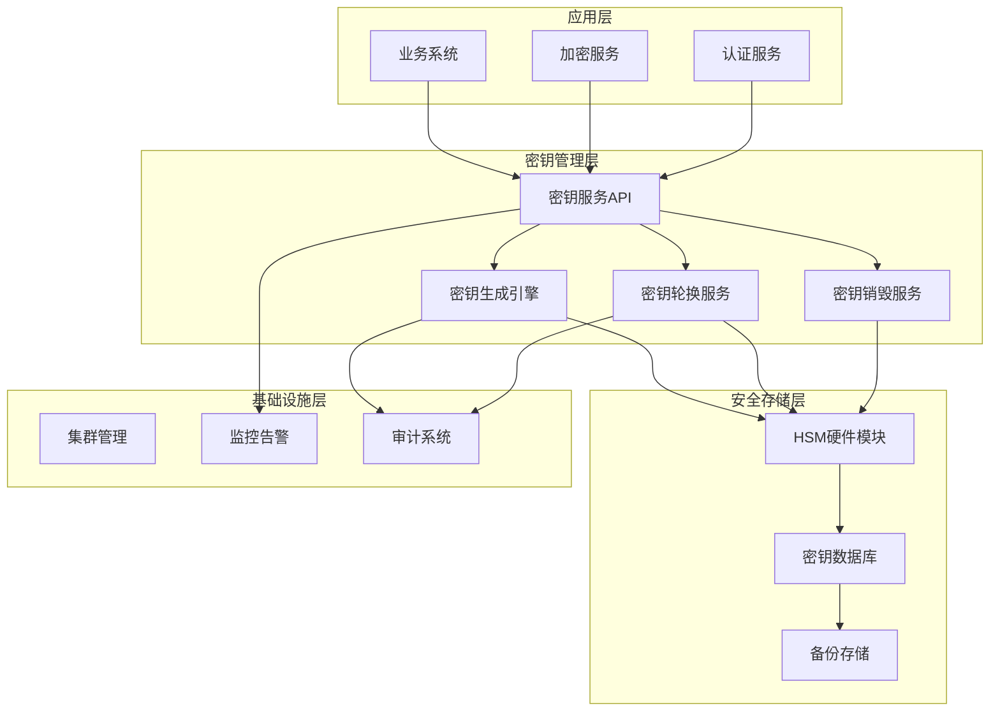
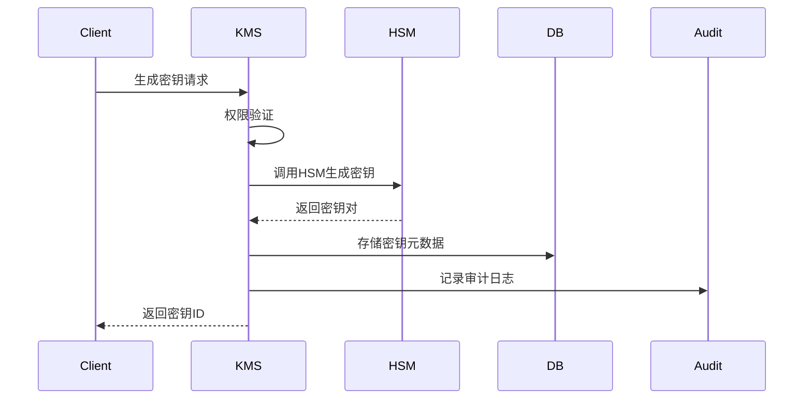
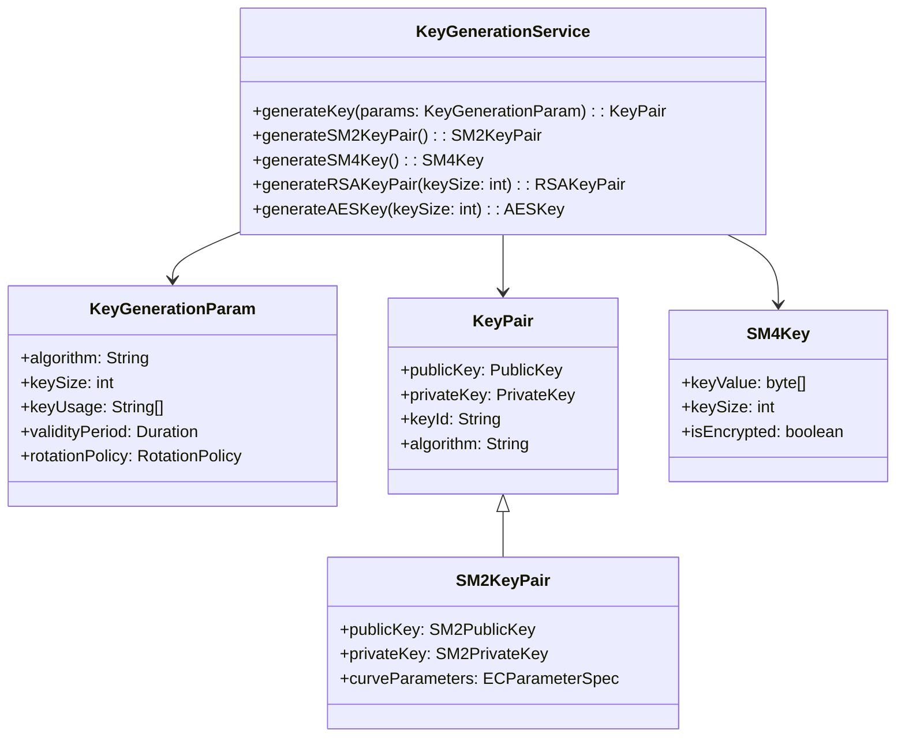
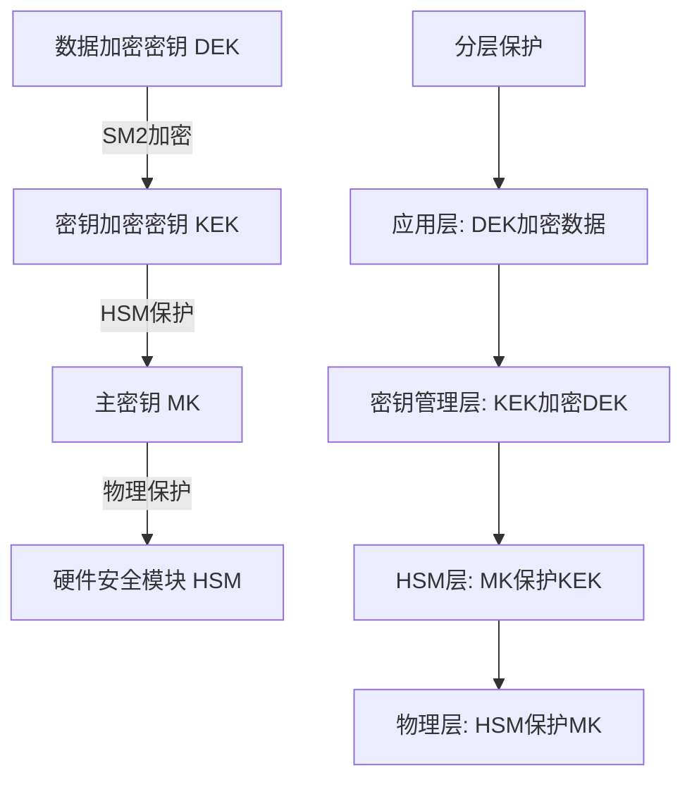
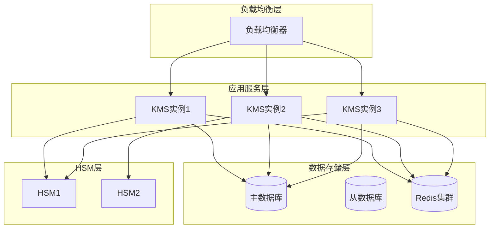

# 密钥管理服务详细设计

**文档编号**: DD-KMS-001  
**版本**: v1.0.0  
**最后更新**: 2025-12-24  
**作者**: BankShield安全架构团队  

## 1. 概述

### 1.1 设计目标

密钥管理服务（Key Management Service, KMS）是BankShield系统的核心安全组件，负责管理整个系统的加密密钥生命周期。该服务需要满足以下目标：

- **安全性**: 密钥材料必须得到最高级别的保护
- **可用性**: 支持高并发密钥操作，保证99.9%可用性
- **合规性**: 符合《密码法》和金融行业相关标准
- **可扩展性**: 支持密钥类型扩展和算法升级

### 1.2 功能范围

| 功能模块 | 说明 | 优先级 |
|---------|------|--------|
| **密钥生成** | 支持多种算法密钥生成 | P0 |
| **密钥存储** | 安全存储密钥材料 | P0 |
| **密钥轮换** | 自动化密钥更新 | P0 |
| **密钥分发** | 安全的密钥分发机制 | P0 |
| **密钥归档** | 历史密钥管理 | P1 |
| **密钥销毁** | 安全密钥销毁 | P0 |
| **审计日志** | 完整的密钥操作审计 | P0 |
| **访问控制** | 细粒度权限控制 | P0 |

## 2. 架构设计

### 2.1 总体架构



### 2.2 组件交互图



## 3. 核心功能设计

### 3.1 密钥生成服务

#### 3.1.1 类图设计


#### 3.1.2 密钥生成算法
```java
@Service
@Slf4j
public class KeyGenerationService {
    
    @Autowired
    private HsmService hsmService;
    
    @Autowired
    private KeyMetadataRepository keyMetadataRepository;
    
    @Autowired
    private AuditService auditService;
    
    /**
     * 生成密钥对
     */
    public KeyGenerationResult generateKey(KeyGenerationParam param) {
        log.info("Generating key pair: algorithm={}, keySize={}", 
                param.getAlgorithm(), param.getKeySize());
        
        try {
            // 1. 验证参数
            validateGenerationParam(param);
            
            // 2. 生成密钥ID
            String keyId = generateKeyId(param);
            
            // 3. 调用HSM生成密钥
            KeyPair keyPair = generateKeyPairInHsm(param, keyId);
            
            // 4. 存储密钥元数据
            KeyMetadata metadata = buildKeyMetadata(keyId, param, keyPair);
            keyMetadataRepository.save(metadata);
            
            // 5. 记录审计日志
            auditService.logKeyGeneration(keyId, param);
            
            return KeyGenerationResult.success(keyId, metadata);
            
        } catch (Exception e) {
            log.error("Key generation failed", e);
            auditService.logKeyGenerationFailure(param, e);
            throw new KeyGenerationException("Failed to generate key", e);
        }
    }
    
    /**
     * 生成国密SM2密钥对
     */
    public SM2KeyPair generateSM2KeyPair() {
        try {
            // 使用HSM生成SM2密钥对
            SM2KeyPair keyPair = hsmService.generateSM2KeyPair();
            
            // 验证密钥有效性
            validateSM2KeyPair(keyPair);
            
            return keyPair;
            
        } catch (HsmException e) {
            throw new KeyGenerationException("SM2 key generation failed in HSM", e);
        }
    }
    
    /**
     * 生成国密SM4密钥
     */
    public SM4Key generateSM4Key() {
        try {
            // 生成128位随机密钥
            byte[] keyValue = hsmService.generateRandomBytes(16);
            
            // 使用主密钥加密
            byte[] encryptedKey = hsmService.encryptWithMasterKey(keyValue);
            
            return SM4Key.builder()
                    .keyValue(encryptedKey)
                    .keySize(128)
                    .isEncrypted(true)
                    .build();
                    
        } catch (HsmException e) {
            throw new KeyGenerationException("SM4 key generation failed", e);
        }
    }
    
    private void validateGenerationParam(KeyGenerationParam param) {
        if (param.getAlgorithm() == null || param.getAlgorithm().isEmpty()) {
            throw new IllegalArgumentException("Algorithm cannot be empty");
        }
        
        if (param.getKeySize() <= 0) {
            throw new IllegalArgumentException("Key size must be positive");
        }
        
        // 验证算法和密钥长度匹配
        validateAlgorithmKeySize(param.getAlgorithm(), param.getKeySize());
    }
    
    private String generateKeyId(KeyGenerationParam param) {
        String prefix = getAlgorithmPrefix(param.getAlgorithm());
        String timestamp = String.valueOf(System.currentTimeMillis());
        String random = RandomStringUtils.randomAlphanumeric(8);
        return prefix + timestamp + random;
    }
    
    private KeyPair generateKeyPairInHsm(KeyGenerationParam param, String keyId) {
        switch (param.getAlgorithm().toUpperCase()) {
            case "SM2":
                return generateSM2KeyPair();
            case "RSA":
                return hsmService.generateRSAKeyPair(param.getKeySize());
            case "EC":
                return hsmService.generateECKeyPair(param.getKeySize());
            default:
                throw new UnsupportedAlgorithmException(param.getAlgorithm());
        }
    }
    
    private KeyMetadata buildKeyMetadata(String keyId, KeyGenerationParam param, KeyPair keyPair) {
        return KeyMetadata.builder()
                .keyId(keyId)
                .algorithm(param.getAlgorithm())
                .keySize(param.getKeySize())
                .keyUsage(param.getKeyUsage())
                .keyStatus(KeyStatus.ACTIVE)
                .createdAt(Instant.now())
                .validityPeriod(param.getValidityPeriod())
                .rotationPolicy(param.getRotationPolicy())
                .publicKeyFingerprint(calculateFingerprint(keyPair.getPublic()))
                .build();
    }
}
```

### 3.2 密钥存储设计

#### 3.2.1 分层密钥架构


#### 3.2.2 密钥存储模型
```java
@Entity
@Table(name = "encrypt_key")
public class EncryptKey {
    
    @Id
    private String keyId;
    
    @Column(name = "algorithm", nullable = false)
    @Enumerated(EnumType.STRING)
    private KeyAlgorithm algorithm;
    
    @Column(name = "key_size")
    private Integer keySize;
    
    @Column(name = "key_status", nullable = false)
    @Enumerated(EnumType.STRING)
    private KeyStatus status;
    
    @Column(name = "key_usage")
    private String keyUsage;
    
    @Column(name = "created_at", nullable = false)
    private Instant createdAt;
    
    @Column(name = "expire_at")
    private Instant expireAt;
    
    @Column(name = "last_rotation_at")
    private Instant lastRotationAt;
    
    @Column(name = "rotation_interval")
    private Duration rotationInterval;
    
    @Column(name = "public_key_fingerprint", length = 64)
    private String publicKeyFingerprint;
    
    @Column(name = "created_by", nullable = false)
    private String createdBy;
    
    @Column(name = "description")
    private String description;
    
    @OneToMany(mappedBy = "encryptKey", cascade = CascadeType.ALL, fetch = FetchType.LAZY)
    private List<KeyRotationHistory> rotationHistory;
    
    @OneToMany(mappedBy = "encryptKey", cascade = CascadeType.ALL, fetch = FetchType.LAZY)
    private List<KeyUsageAudit> usageAudits;
}
```

#### 3.2.3 密钥材料存储
```java
@Service
public class KeyMaterialService {
    
    @Autowired
    private HsmService hsmService;
    
    @Autowired
    private KeyMaterialRepository repository;
    
    /**
     * 安全存储密钥材料
     * 密钥材料从不以明文形式存储在数据库中
     */
    public void storeKeyMaterial(String keyId, byte[] keyMaterial, KeyAlgorithm algorithm) {
        try {
            // 1. 使用HSM加密密钥材料
            byte[] encryptedMaterial = hsmService.encryptWithMasterKey(keyMaterial);
            
            // 2. 生成密钥校验值
            String keyCheckValue = calculateKeyCheckValue(keyMaterial);
            
            // 3. 存储加密后的密钥材料
            KeyMaterialEntity entity = KeyMaterialEntity.builder()
                    .keyId(keyId)
                    .encryptedKeyMaterial(encryptedMaterial)
                    .algorithm(algorithm)
                    .keyCheckValue(keyCheckValue)
                    .createdAt(Instant.now())
                    .build();
                    
            repository.save(entity);
            
            // 4. 安全擦除内存中的明文密钥
            secureErase(keyMaterial);
            
        } catch (Exception e) {
            throw new KeyStorageException("Failed to store key material", e);
        }
    }
    
    /**
     * 检索密钥材料
     * 密钥材料在使用后立即从内存中清除
     */
    public byte[] retrieveKeyMaterial(String keyId) {
        try {
            KeyMaterialEntity entity = repository.findById(keyId)
                    .orElseThrow(() -> new KeyNotFoundException(keyId));
            
            // 使用HSM解密
            byte[] decryptedMaterial = hsmService.decryptWithMasterKey(entity.getEncryptedKeyMaterial());
            
            // 验证密钥完整性
            String calculatedCheckValue = calculateKeyCheckValue(decryptedMaterial);
            if (!calculatedCheckValue.equals(entity.getKeyCheckValue())) {
                throw new KeyIntegrityException("Key check value mismatch");
            }
            
            return decryptedMaterial;
            
        } catch (Exception e) {
            throw new KeyRetrievalException("Failed to retrieve key material", e);
        }
    }
    
    private String calculateKeyCheckValue(byte[] keyMaterial) {
        // 使用SM3哈希算法计算密钥校验值
        SM3Digest digest = new SM3Digest();
        digest.update(keyMaterial, 0, Math.min(keyMaterial.length, 16));
        byte[] hash = new byte[digest.getDigestSize()];
        digest.doFinal(hash, 0);
        return Hex.toHexString(hash).substring(0, 8);
    }
    
    private void secureErase(byte[] data) {
        if (data != null) {
            Arrays.fill(data, (byte) 0);
        }
    }
}
```

### 3.3 密钥轮换服务

#### 3.3.1 轮换策略设计
```java
@Entity
@Table(name = "key_rotation_policy")
public class KeyRotationPolicy {
    
    @Id
    private String policyId;
    
    @Column(name = "policy_name", nullable = false)
    private String policyName;
    
    @Column(name = "rotation_type", nullable = false)
    @Enumerated(EnumType.STRING)
    private RotationType rotationType;
    
    @Column(name = "rotation_interval")
    private Duration rotationInterval;
    
    @Column(name = "max_age")
    private Duration maxAge;
    
    @Column(name = "notification_before")
    private Duration notificationBefore;
    
    @Column(name = "is_enabled", nullable = false)
    private Boolean isEnabled;
    
    @Column(name = "created_at", nullable = false)
    private Instant createdAt;
    
    @Column(name = "description")
    private String description;
}
```

#### 3.3.2 自动轮换实现
```java
@Service
@Slf4j
public class KeyRotationService {
    
    @Autowired
    private KeyGenerationService keyGenerationService;
    
    @Autowired
    private KeyMetadataRepository keyMetadataRepository;
    
    @Autowired
    private KeyMaterialService keyMaterialService;
    
    @Autowired
    private NotificationService notificationService;
    
    /**
     * 执行密钥轮换
     */
    @Transactional
    public KeyRotationResult rotateKey(String keyId, RotationReason reason) {
        log.info("Starting key rotation: keyId={}, reason={}", keyId, reason);
        
        try {
            // 1. 获取当前密钥信息
            KeyMetadata currentKey = keyMetadataRepository.findById(keyId)
                    .orElseThrow(() -> new KeyNotFoundException(keyId));
            
            // 2. 验证是否可以轮换
            validateRotationEligibility(currentKey, reason);
            
            // 3. 生成新密钥
            KeyGenerationParam generationParam = buildGenerationParam(currentKey);
            KeyGenerationResult newKeyResult = keyGenerationService.generateKey(generationParam);
            
            // 4. 更新密钥状态
            updateKeyStatus(currentKey, KeyStatus.ROTATED);
            
            // 5. 记录轮换历史
            recordRotationHistory(currentKey, newKeyResult.getKeyId(), reason);
            
            // 6. 通知相关系统
            notifyKeyRotation(currentKey, newKeyResult.getKeyId());
            
            return KeyRotationResult.success(currentKey.getKeyId(), newKeyResult.getKeyId());
            
        } catch (Exception e) {
            log.error("Key rotation failed for key: " + keyId, e);
            throw new KeyRotationException("Key rotation failed", e);
        }
    }
    
    /**
     * 定时检查需要轮换的密钥
     */
    @Scheduled(cron = "0 0 2 * * ?") // 每天凌晨2点执行
    public void checkKeysForRotation() {
        log.info("Starting scheduled key rotation check");
        
        try {
            // 查询需要轮换的密钥
            List<KeyMetadata> keysForRotation = findKeysForRotation();
            log.info("Found {} keys for rotation", keysForRotation.size());
            
            for (KeyMetadata key : keysForRotation) {
                try {
                    rotateKey(key.getKeyId(), RotationReason.SCHEDULED);
                } catch (Exception e) {
                    log.error("Failed to rotate key: " + key.getKeyId(), e);
                    // 继续处理其他密钥，不中断整体流程
                }
            }
            
        } catch (Exception e) {
            log.error("Scheduled key rotation check failed", e);
        }
    }
    
    private List<KeyMetadata> findKeysForRotation() {
        Instant now = Instant.now();
        
        // 查询符合条件的密钥
        return keyMetadataRepository.findKeysForRotation(
                KeyStatus.ACTIVE,
                now,
                now.plus(Duration.ofDays(7)) // 提前7天通知
        );
    }
    
    private void validateRotationEligibility(KeyMetadata key, RotationReason reason) {
        // 检查密钥状态
        if (key.getStatus() != KeyStatus.ACTIVE) {
            throw new IllegalStateException("Key is not active: " + key.getStatus());
        }
        
        // 检查轮换间隔
        if (reason == RotationReason.MANUAL && key.getLastRotationAt() != null) {
            Duration timeSinceLastRotation = Duration.between(key.getLastRotationAt(), Instant.now());
            if (timeSinceLastRotation.compareTo(Duration.ofHours(1)) < 0) {
                throw new IllegalStateException("Key was rotated recently");
            }
        }
    }
    
    private KeyGenerationParam buildGenerationParam(KeyMetadata currentKey) {
        return KeyGenerationParam.builder()
                .algorithm(currentKey.getAlgorithm().name())
                .keySize(currentKey.getKeySize())
                .keyUsage(currentKey.getKeyUsage())
                .validityPeriod(currentKey.getValidityPeriod())
                .rotationPolicy(currentKey.getRotationPolicy())
                .build();
    }
    
    private void recordRotationHistory(KeyMetadata oldKey, String newKeyId, RotationReason reason) {
        KeyRotationHistory history = KeyRotationHistory.builder()
                .oldKeyId(oldKey.getKeyId())
                .newKeyId(newKeyId)
                .rotationTime(Instant.now())
                .rotationReason(reason)
                .rotatedBy(SecurityContextHolder.getContext().getAuthentication().getName())
                .build();
                
        keyRotationHistoryRepository.save(history);
    }
}
```

### 3.4 密钥销毁服务

#### 3.4.1 安全销毁流程
```java
@Service
@Slf4j
public class KeyDestructionService {
    
    @Autowired
    private KeyMetadataRepository keyMetadataRepository;
    
    @Autowired
    private KeyMaterialService keyMaterialService;
    
    @Autowired
    private HsmService hsmService;
    
    @Autowired
    private AuditService auditService;
    
    /**
     * 安全销毁密钥
     * 遵循NIST SP 800-88标准
     */
    @Transactional
    public KeyDestructionResult destroyKey(String keyId, DestructionReason reason) {
        log.info("Destroying key: keyId={}, reason={}", keyId, reason);
        
        try {
            // 1. 验证销毁权限
            validateDestructionPermission(keyId);
            
            // 2. 获取密钥信息
            KeyMetadata keyMetadata = keyMetadataRepository.findById(keyId)
                    .orElseThrow(() -> new KeyNotFoundException(keyId));
            
            // 3. 检查密钥是否可以销毁
            validateDestructionEligibility(keyMetadata, reason);
            
            // 4. 执行销毁
            performDestruction(keyMetadata, reason);
            
            // 5. 更新密钥状态
            updateKeyStatus(keyMetadata, KeyStatus.DESTROYED);
            
            // 6. 记录审计日志
            auditService.logKeyDestruction(keyId, reason);
            
            return KeyDestructionResult.success(keyId);
            
        } catch (Exception e) {
            log.error("Key destruction failed for key: " + keyId, e);
            auditService.logKeyDestructionFailure(keyId, reason, e);
            throw new KeyDestructionException("Key destruction failed", e);
        }
    }
    
    private void performDestruction(KeyMetadata keyMetadata, DestructionReason reason) {
        // 1. 销毁HSM中的密钥材料
        if (reason == DestructionReason.COMPROMISE) {
            // 密钥泄露需要立即销毁
            hsmService.destroyKey(keyMetadata.getKeyId());
        }
        
        // 2. 销毁数据库中的密钥材料
        keyMaterialService.destroyKeyMaterial(keyMetadata.getKeyId());
        
        // 3. 清理备份
        backupService.removeKeyBackup(keyMetadata.getKeyId());
        
        // 4. 通知相关系统
        notifyKeyDestruction(keyMetadata.getKeyId(), reason);
    }
}
```

## 4. 安全设计

### 4.1 访问控制

#### 4.1.1 权限矩阵
```java
@Component
public class KeyAccessControlService {
    
    private static final Map<String, Set<String>> KEY_PERMISSIONS = Map.of(
        "SYSTEM_ADMIN", Set.of("KEY_CREATE", "KEY_READ", "KEY_UPDATE", "KEY_DELETE", "KEY_ROTATE"),
        "SECURITY_ADMIN", Set.of("KEY_CREATE", "KEY_READ", "KEY_UPDATE", "KEY_ROTATE"),
        "AUDIT_ADMIN", Set.of("KEY_READ"),
        "APPLICATION", Set.of("KEY_USE")
    );
    
    public boolean checkPermission(String userId, String operation, String keyId) {
        // 获取用户角色
        Set<String> userRoles = getUserRoles(userId);
        
        // 检查角色权限
        for (String role : userRoles) {
            Set<String> permissions = KEY_PERMISSIONS.get(role);
            if (permissions != null && permissions.contains(operation)) {
                return true;
            }
        }
        
        return false;
    }
    
    private Set<String> getUserRoles(String userId) {
        // 从用户服务获取用户角色
        return userService.getUserRoles(userId);
    }
}
```

### 4.2 审计日志

#### 4.2.1 审计事件类型
```java
public enum KeyAuditEvent {
    KEY_GENERATED,
    KEY_ROTATED,
    KEY_DESTROYED,
    KEY_USED,
    KEY_EXPORTED,
    KEY_IMPORTED,
    KEY_BACKUP_CREATED,
    KEY_BACKUP_RESTORED,
    KEY_COMPROMISE_DETECTED
}
```

#### 4.2.2 审计日志格式
```json
{
  "timestamp": "2025-12-24T15:30:00.000Z",
  "event_type": "KEY_GENERATED",
  "key_id": "SM2_20251224153000_ABC123",
  "user_id": "admin_001",
  "user_ip": "192.168.1.100",
  "operation_result": "SUCCESS",
  "details": {
    "algorithm": "SM2",
    "key_size": 256,
    "usage": ["SIGN", "VERIFY"],
    "validity_period": "P365D"
  },
  "trace_id": "trace_123456",
  "session_id": "session_789012"
}
```

## 5. 性能设计

### 5.1 性能指标

| 指标 | 目标值 | 测量方法 |
|------|--------|----------|
| 密钥生成延迟 | < 500ms | 99分位响应时间 |
| 密钥检索延迟 | < 50ms | 99分位响应时间 |
| 密钥轮换吞吐量 | > 1000/小时 | 峰值处理能力 |
| 并发密钥操作 | > 1000 | 并发连接数 |

### 5.2 性能优化策略

#### 5.2.1 缓存机制
```java
@Configuration
@EnableCaching
public class KeyCacheConfig {
    
    @Bean
    public CacheManager cacheManager() {
        return new ConcurrentMapCacheManager("keyMetadata", "keyMaterial");
    }
    
    @Cacheable(value = "keyMetadata", key = "#keyId")
    public KeyMetadata getKeyMetadata(String keyId) {
        return keyMetadataRepository.findById(keyId)
                .orElseThrow(() -> new KeyNotFoundException(keyId));
    }
    
    @CacheEvict(value = "keyMetadata", key = "#keyId")
    public void evictKeyMetadata(String keyId) {
        // 清除缓存
    }
}
```

#### 5.2.2 连接池优化
```yaml
# HSM连接池配置
hsm:
  connection:
    pool:
      max-size: 20
      min-idle: 5
      max-wait-millis: 5000
      test-on-borrow: true
      test-while-idle: true
      time-between-eviction-runs-millis: 30000
```

## 6. 监控与告警

### 6.1 监控指标

```java
@Component
public class KeyMetrics {
    
    private final Counter keyGenerationCounter = Counter.builder("key_generation_total")
            .description("Total number of keys generated")
            .register(Metrics.globalRegistry);
    
    private final Timer keyGenerationTimer = Timer.builder("key_generation_duration")
            .description("Key generation duration")
            .register(Metrics.globalRegistry);
    
    private final Gauge activeKeysGauge = Gauge.builder("key_active_count")
            .description("Number of active keys")
            .register(Metrics.globalRegistry);
    
    public void recordKeyGeneration() {
        keyGenerationCounter.increment();
    }
    
    public void recordKeyGenerationTime(Duration duration) {
        keyGenerationTimer.record(duration);
    }
    
    public void updateActiveKeysCount(long count) {
        activeKeysGauge.set(count);
    }
}
```

### 6.2 告警规则

| 告警名称 | 触发条件 | 告警级别 | 处理措施 |
|---------|----------|----------|----------|
| 密钥生成失败率 | 失败率 > 5% | 高 | 检查HSM状态 |
| 密钥轮换延迟 | 延迟 > 24小时 | 中 | 检查轮换服务 |
| HSM连接异常 | 连接中断 > 5分钟 | 严重 | 检查网络连接 |
| 密钥数量异常 | 密钥数量突增/突降 | 中 | 检查业务系统 |

## 7. 部署架构

### 7.1 高可用部署



### 7.2 灾备方案

#### 7.2.1 数据备份策略
- **实时备份**: 主从数据库复制
- **定期备份**: 每日全量备份
- **异地备份**: 跨地域备份存储
- **密钥备份**: HSM密钥备份到安全介质

#### 7.2.2 故障恢复
```java
@Service
public class KeyDisasterRecoveryService {
    
    /**
     * 从备份恢复密钥
     */
    public RecoveryResult recoverFromBackup(String backupId) {
        try {
            // 1. 验证备份完整性
            BackupMetadata backup = validateBackup(backupId);
            
            // 2. 解密备份数据
            byte[] decryptedBackup = decryptBackup(backup);
            
            // 3. 恢复密钥到HSM
            List<String> recoveredKeys = restoreKeysToHsm(decryptedBackup);
            
            // 4. 验证恢复结果
            validateRecovery(recoveredKeys);
            
            return RecoveryResult.success(recoveredKeys);
            
        } catch (Exception e) {
            log.error("Key recovery failed", e);
            return RecoveryResult.failure(e.getMessage());
        }
    }
}
```

## 8. 合规性要求

### 8.1 密码法合规

#### 8.1.1 商用密码使用要求
- 使用国家密码管理局认证的密码产品
- 建立密码安全管理制度
- 定期进行密码应用安全性评估

#### 8.1.2 密钥管理要求
- 密钥生成使用硬件随机数
- 密钥存储使用硬件保护
- 密钥传输使用加密通道
- 密钥销毁彻底不可恢复

### 8.2 金融行业要求

#### 8.2.1 JR/T 0071标准
- 密钥生命周期管理
- 密钥分级保护
- 密钥备份恢复
- 密钥审计追踪

#### 8.2.2 等保2.0要求
- 密码技术应用
- 密钥安全管理
- 密码产品使用
- 密码服务管理

## 9. 附录

### 9.1 术语表

| 术语 | 说明 |
|------|------|
| **KMS** | Key Management System，密钥管理系统 |
| **HSM** | Hardware Security Module，硬件安全模块 |
| **DEK** | Data Encryption Key，数据加密密钥 |
| **KEK** | Key Encryption Key，密钥加密密钥 |
| **MK** | Master Key，主密钥 |
| **KCV** | Key Check Value，密钥校验值 |

### 9.2 相关标准

1. 《GM/T 0003-2012 SM2椭圆曲线公钥密码算法》
2. 《GM/T 0004-2012 SM3密码杂凑算法》
3. 《GM/T 0002-2012 SM4分组密码算法》
4. 《GM/T 0054-2018 信息系统密码应用基本要求》
5. 《JR/T 0071-2012 金融行业信息系统信息安全等级保护实施指引》

### 9.3 参考资料

1. NIST SP 800-57: Recommendation for Key Management
2. NIST SP 800-88: Guidelines for Media Sanitization
3. PKCS#11: Cryptographic Token Interface Standard
4. 《密码学原理与实践》
5. 《密钥管理技术》

### 9.4 版本历史

| 版本 | 日期 | 作者 | 变更说明 |
|------|------|------|----------|
| v1.0.0 | 2025-12-24 | 安全架构团队 | 初始版本创建 |

---

**文档审核**: 
- [ ] 安全架构师审核
- [ ] 技术负责人审核
- [ ] 产品经理审核
- [ ] 合规专家审核

**最后更新**: 2025-12-24  
**更新人员**: BankShield安全架构团队