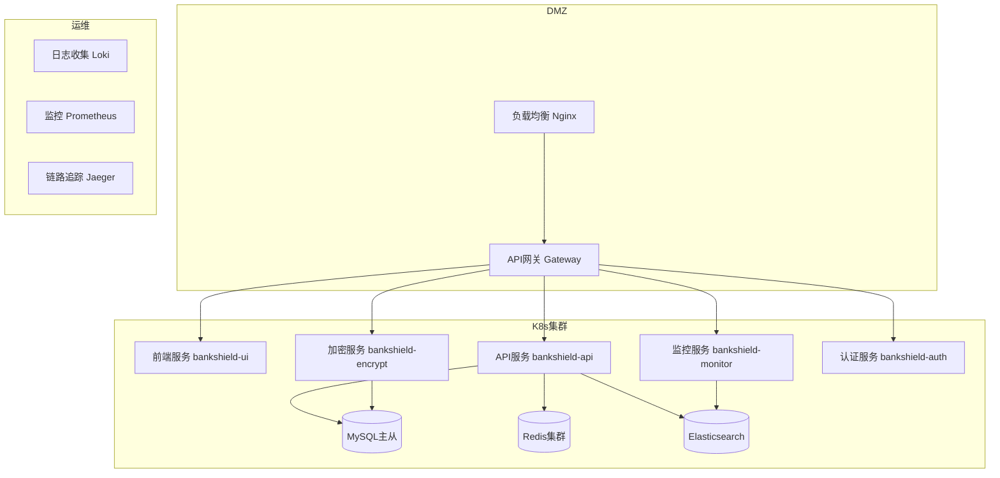
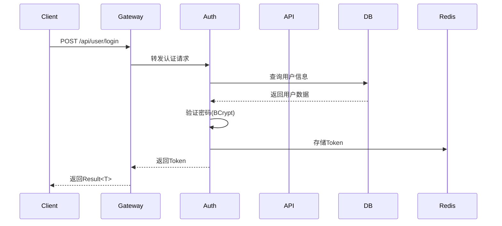

# 系统架构设计文档（SAD）

**项目名称**: BankShield 银行数据安全管理系统  
**版本**: v1.0.0  
**最后更新**: 2025-12-24  
**作者**: BankShield架构团队  

## 1. 技术选型

### 1.1 后端技术栈

| 技术组件 | 版本 | 用途 | 选择原因 |
|---------|------|------|----------|
| **Java** | 8 | 开发语言 | 成熟稳定，企业级应用首选 |
| **Spring Boot** | 2.7.18 | 主框架 | 简化配置，快速开发，生态丰富 |
| **Spring Cloud** | 2021.0.8 | 微服务 | 完整的微服务解决方案 |
| **Spring Cloud Gateway** | 3.1.4 | API网关 | 响应式编程，性能优异，支持国密 |
| **MyBatis-Plus** | 3.5.2 | 持久层 | 灵活的SQL控制，性能优化 |
| **MySQL** | 8.0 | 关系型数据库 | ACID事务支持，金融级可靠性 |
| **Redis** | 6.0 | 缓存+限流+Session | 高性能读写，丰富的数据结构 |
| **Elasticsearch** | 7.17 | 日志检索 | 全文搜索，分布式架构 |
| **Quartz** | 2.3 | 定时任务 | 可靠的任务调度，集群支持 |
| **BouncyCastle** | 1.77 | 国密算法 | 完整的国密算法实现 |
| **JWT** | 0.11.5 | 认证 | 无状态认证，支持水平扩展 |
| **Maven** | 3.8 | 构建工具 | 标准化构建，依赖管理 |

### 1.2 前端技术栈

| 技术组件 | 版本 | 用途 | 选择原因 |
|---------|------|------|----------|
| **Vue.js** | 3.4.5 | 渐进式框架 | 易学易用，性能优异 |
| **TypeScript** | 5.0.2 | 类型安全 | 编译时错误检查，更好的IDE支持 |
| **Element Plus** | 2.4.4 | UI组件库 | 丰富的组件，企业级设计 |
| **Pinia** | 2.1.7 | 状态管理 | Vue官方推荐，类型安全 |
| **Vue Router** | 4.2.5 | 路由管理 | 官方路由，支持懒加载 |
| **Axios** | 1.6.2 | HTTP客户端 | 功能完整，拦截器支持 |
| **ECharts** | 5.4.3 | 可视化图表 | 丰富的图表类型，大数据支持 |
| **Vite** | 5.0.12 | 构建工具 | 快速的开发服务器，优化的构建 |
| **Less** | 4.2.0 | CSS预处理 | 变量和函数支持，更好的维护性 |

### 1.3 DevOps工具链

| 工具 | 版本 | 用途 | 选择原因 |
|-----|------|------|----------|
| **Docker** | 24.0 | 容器化 | 标准化部署，环境一致性 |
| **Docker Compose** | 2.20 | 本地编排 | 简化本地开发环境搭建 |
| **Kubernetes** | 1.28 | 生产编排 | 企业级容器编排，自动扩缩容 |
| **Jenkins** | 2.414 | CI/CD | 成熟的CI/CD平台，插件丰富 |
| **GitLab CI** | - | 持续集成 | 与代码仓库集成，可视化流水线 |
| **SonarQube** | 9.9 | 代码质量 | 静态代码分析，技术债务管理 |
| **Nexus** | 3.58 | 私服仓库 | 依赖管理，构建加速 |

## 2. 部署拓扑图

## 3. 组件交互图

## 4. 架构原则

### 4.1 设计原则

- **高内聚低耦合**: 每个服务职责单一，服务间通过API解耦
- **无状态设计**: 服务无状态，支持水平扩展
- **容错设计**: 服务隔离，故障不扩散
- **数据一致性**: 最终一致性，重要业务使用分布式事务
- **安全优先**: 安全设计贯穿整个架构

### 4.2 技术原则

- **开源优先**: 优先选择成熟的开源技术
- **标准化**: 遵循行业标准和最佳实践
- **可观测性**: 完善的监控、日志、链路追踪
- **自动化**: 自动化测试、部署、运维
- **云原生**: 支持容器化和云环境部署

## 5. 质量属性

### 5.1 性能指标

| 指标 | 目标值 | 测量方法 |
|------|--------|----------|
| API响应时间 | < 100ms | 99分位响应时间 |
| 并发用户数 | 1000+ | JMeter压测 |
| 吞吐量 | 5000+ TPS | 峰值处理能力 |
| 加密性能 | > 100MB/s | SM4加密速度 |

### 5.2 可用性指标

| 指标 | 目标值 | 实现方式 |
|------|--------|----------|
| 系统可用性 | 99.9% | 集群部署 + 健康检查 |
| 服务恢复时间 | < 5分钟 | 自动重启 + 服务降级 |
| 数据备份 | 实时 | 主从复制 + 定期备份 |
| 灾难恢复 | < 30分钟 | 异地多活架构 |

### 5.3 安全指标

| 指标 | 目标值 | 实现方式 |
|------|--------|----------|
| 数据加密率 | 100% | 敏感数据全加密 |
| 认证成功率 | 99.99% | 多因素认证 |
| 安全漏洞 | 0高危 | 定期安全扫描 |
| 审计覆盖率 | 100% | 全链路审计 |

## 6. 架构演进规划

### 6.1 第一阶段（v1.0）- 当前
- ✅ 基础微服务架构
- ✅ 国密算法支持
- ✅ RBAC权限管理
- ✅ 基础审计功能

### 6.2 第二阶段（v1.1）- 近期规划
- 🔄 支持更多国密算法
- 🔄 数据水印功能
- 🔄 数据血缘分析
- 🔄 外部身份认证集成

### 6.3 第三阶段（v1.2）- 中期规划
- 📋 多方安全计算
- 📋 同态加密支持
- 📋 零知识证明
- 📋 区块链存证

### 6.4 第四阶段（v2.0）- 长期规划
- 📋 完整数据中台能力
- 📋 AI驱动的安全威胁检测
- 📋 自动化合规检查
- 📋 多云部署支持

## 7. 风险评估与应对

### 7.1 技术风险

| 风险 | 影响 | 概率 | 应对措施 |
|------|------|------|----------|
| 国密算法性能问题 | 高 | 中 | 算法优化 + 硬件加速 |
| 微服务复杂度 | 中 | 高 | 服务治理 + 自动化运维 |
| 数据一致性 | 高 | 中 | 分布式事务 + 补偿机制 |

### 7.2 业务风险

| 风险 | 影响 | 概率 | 应对措施 |
|------|------|------|----------|
| 合规要求变化 | 高 | 中 | 模块化设计 + 快速响应 |
| 性能需求增长 | 中 | 高 | 水平扩展 + 性能优化 |
| 安全威胁演进 | 高 | 中 | 安全架构演进 + 持续更新 |

## 8. 附录

### 8.1 术语表

| 术语 | 全称 | 说明 |
|------|------|------|
| SAD | Software Architecture Document | 软件架构设计文档 |
| RBAC | Role-Based Access Control | 基于角色的访问控制 |
| JWT | JSON Web Token | JSON网络令牌 |
| KMS | Key Management System | 密钥管理系统 |
| HSM | Hardware Security Module | 硬件安全模块 |
| SM2 | ShangMi 2 | 国密非对称加密算法 |
| SM3 | ShangMi 3 | 国密哈希算法 |
| SM4 | ShangMi 4 | 国密对称加密算法 |

### 8.2 参考资料

1. 《信息安全技术 网络安全等级保护基本要求》(GB/T 22239-2019)
2. 《中华人民共和国密码法》(2020年)
3. 《金融行业信息系统信息安全等级保护实施指引》(JR/T 0071-2012)
4. OWASP Top 10 Security Risks (2021)
5. NIST Cybersecurity Framework (2023)

### 8.3 文档版本历史

| 版本 | 日期 | 作者 | 变更说明 |
|------|------|------|----------|
| v1.0.0 | 2025-12-24 | 架构团队 | 初始版本创建 |

---

**文档审核**: 
- [ ] 架构师审核
- [ ] 技术负责人审核  
- [ ] 产品经理审核
- [ ] 安全专家审核

**最后更新**: 2025-12-24  
**更新人员**: BankShield架构团队