# 安全架构设计文档

**项目名称**: BankShield 银行数据安全管理系统  
**版本**: v1.0.0  
**最后更新**: 2025-12-24  
**作者**: BankShield安全架构团队  
**密级**: 机密  

## 1. 安全架构概览

### 1.1 安全架构原则

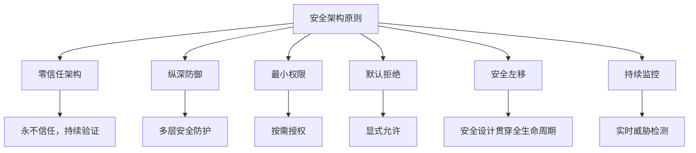

### 1.2 安全架构层次

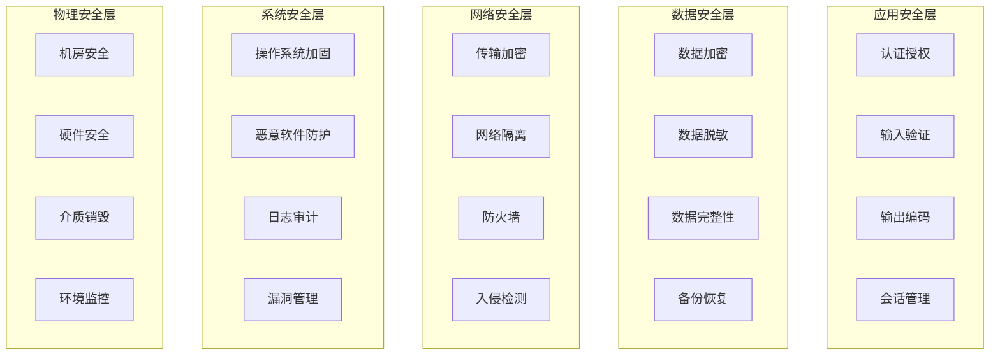

## 2. 威胁模型分析（STRIDE）

### 2.1 欺骗（Spoofing）

#### 威胁场景
- **身份伪造**: 攻击者伪造用户身份登录系统
- **会话劫持**: 窃取用户会话令牌
- **API伪造**: 伪造API请求来源

#### 防护措施
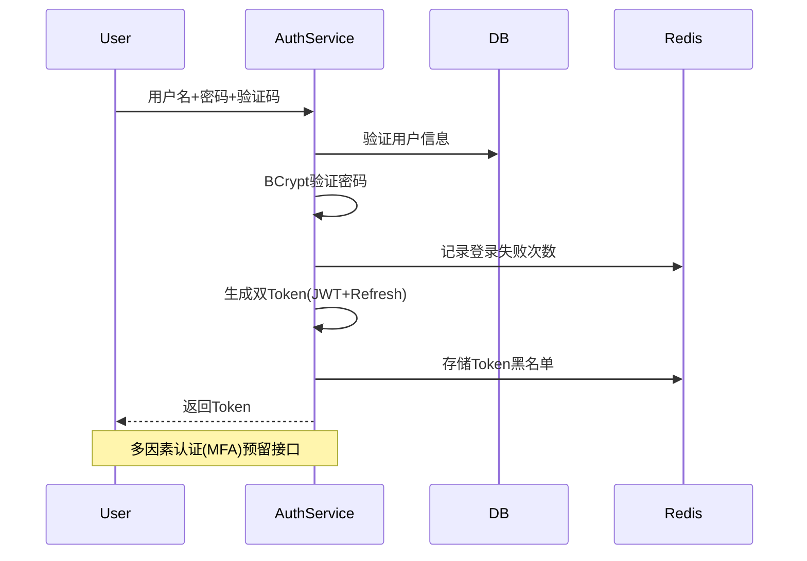

#### 安全控制
- **强密码策略**: 长度≥8，包含大小写、数字、特殊字符
- **账户锁定**: 连续5次失败锁定30分钟
- **双因素认证**: 支持短信、邮箱、TOTP（预留）
- **设备指纹**: 记录设备信息，异常设备告警

### 2.2 篡改（Tampering）

#### 威胁场景
- **数据篡改**: 修改请求参数注入恶意数据
- **SQL注入**: 通过输入字段注入SQL代码
- **XSS攻击**: 在输入中嵌入恶意脚本

#### 防护措施
```java
@RestController
public class UserController {
    
    @PostMapping("/api/user")
    public Result addUser(@Valid @RequestBody UserDTO userDTO) {
        // 1. 参数校验
        ValidationUtil.validate(userDTO);
        
        // 2. SQL注入防护 - MyBatis参数化查询
        userService.addUser(userDTO);
        
        // 3. XSS防护 - 输出编码
        return Result.success(EscapeUtil.escapeHtml(userDTO));
    }
}
```

#### 安全控制
- **输入验证**: 前端+后端双重验证，白名单机制
- **参数化查询**: 使用MyBatis防止SQL注入
- **输出编码**: HTML、JS、SQL、XML上下文编码
- **CSRF防护**: 双重提交Cookie，SameSite属性

### 2.3 抵赖（Repudiation）

#### 威胁场景
- **操作否认**: 用户否认执行过敏感操作
- **数据篡改否认**: 否认修改过关键数据
- **授权否认**: 否认授予过某些权限

#### 防护措施
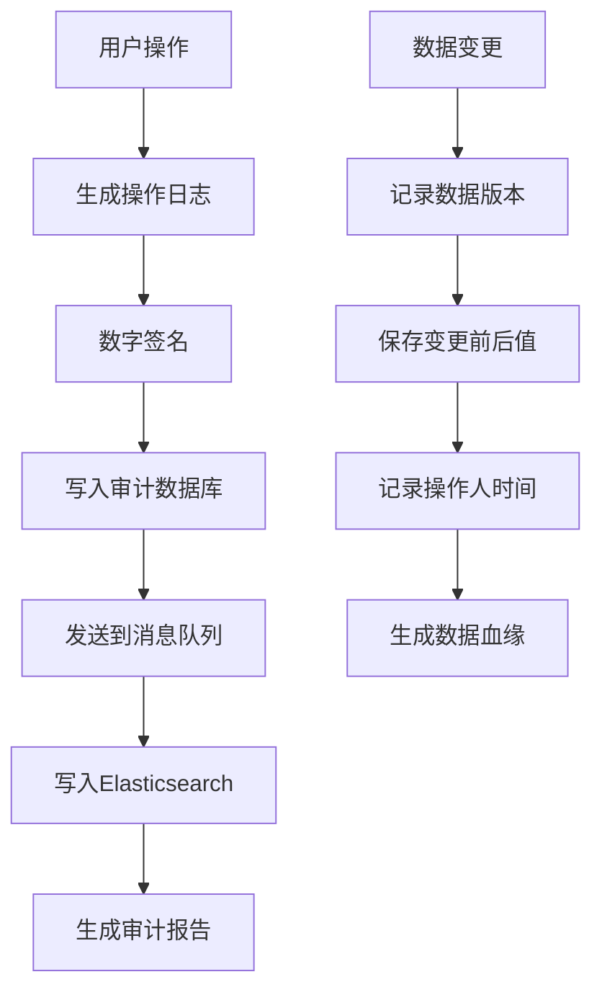

#### 安全控制
- **完整审计日志**: 记录所有用户操作
- **数据版本控制**: 记录数据变更历史
- **数字签名**: 关键操作使用数字签名（预留）
- **时间戳**: 可信时间源，防止时间篡改

### 2.4 信息泄露（Information Disclosure）

#### 威胁场景
- **敏感数据泄露**: 数据库被非法访问
- **接口信息泄露**: API返回敏感信息
- **日志信息泄露**: 日志中包含敏感数据

#### 防护措施
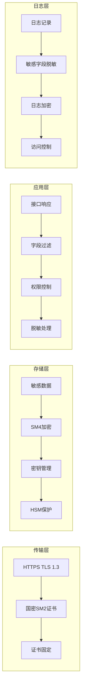

#### 安全控制
- **传输加密**: TLS 1.3 + 国密算法
- **存储加密**: 敏感字段SM4加密存储
- **接口脱敏**: 根据用户权限动态脱敏
- **日志脱敏**: 自动识别并脱敏敏感信息

### 2.5 拒绝服务（DoS）

#### 威胁场景
- **API滥用**: 高频API调用耗尽资源
- **CC攻击**: 模拟正常用户的大量请求
- **资源耗尽**: 大批量数据操作耗尽内存

#### 防护措施
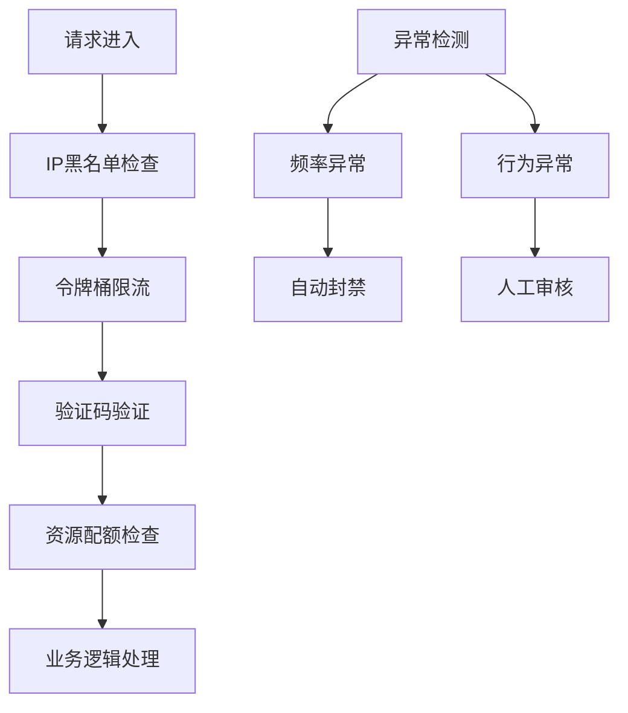

#### 安全控制
- **IP限流**: 基于IP的请求频率限制
- **用户限流**: 基于用户的请求频率限制
- **资源限流**: 接口级别的并发数限制
- **熔断降级**: 系统负载过高时的保护措施

### 2.6 权限提升（Elevation of Privilege）

#### 威胁场景
- **垂直越权**: 普通用户获取管理员权限
- **水平越权**: 用户访问其他用户的数据
- **角色滥用**: 利用角色权限执行未授权操作

#### 防护措施
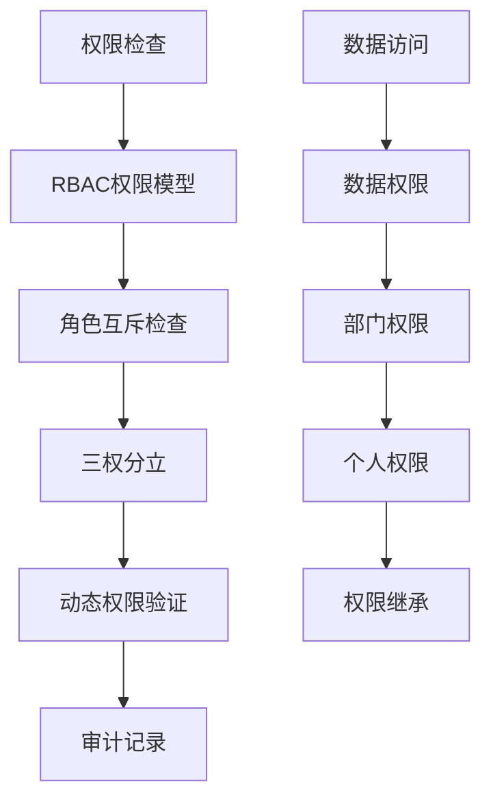

#### 安全控制
- **RBAC模型**: 基于角色的访问控制
- **三权分立**: 系统管理员、安全管理员、审计管理员分离
- **角色互斥**: 关键角色不能同时授予同一用户
- **动态授权**: 基于上下文的动态权限验证

## 3. 安全架构设计

### 3.1 认证架构

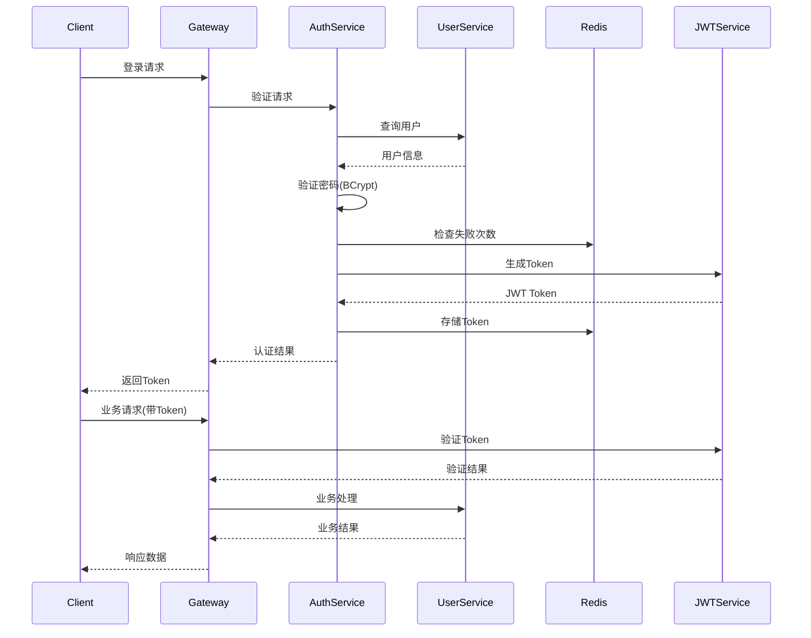

### 3.2 权限架构

#### 3.2.1 RBAC权限模型
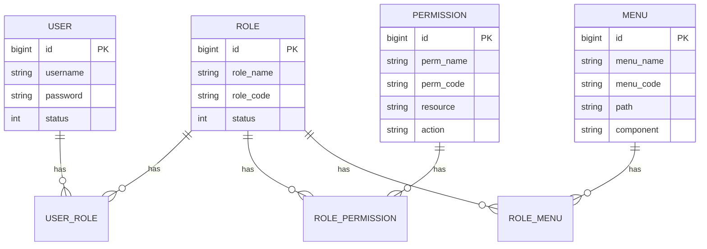

#### 3.2.2 三权分立设计

| 角色类型 | 权限范围 | 职责说明 | 安全约束 |
|---------|----------|----------|----------|
| **系统管理员** | 系统配置、用户管理 | 负责系统日常运维 | 不能管理密钥和审计 |
| **安全管理员** | 密钥管理、加密配置 | 负责数据安全管理 | 不能管理系统和用户 |
| **审计管理员** | 审计日志、合规报告 | 负责安全审计监督 | 只能查看，不能修改 |

#### 3.2.3 角色互斥规则
```java
@Component
public class RoleMutexService {
    
    private static final Map<String, Set<String>> MUTEX_ROLES = Map.of(
        "SYSTEM_ADMIN", Set.of("SECURITY_ADMIN", "AUDIT_ADMIN"),
        "SECURITY_ADMIN", Set.of("SYSTEM_ADMIN", "AUDIT_ADMIN"),
        "AUDIT_ADMIN", Set.of("SYSTEM_ADMIN", "SECURITY_ADMIN")
    );
    
    public boolean checkRoleMutex(Long userId, Set<String> roleCodes) {
        for (String role : roleCodes) {
            Set<String> mutexRoles = MUTEX_ROLES.get(role);
            if (mutexRoles != null && roleCodes.stream().anyMatch(mutexRoles::contains)) {
                throw new SecurityException("角色互斥: " + role);
            }
        }
        return true;
    }
}
```

### 3.3 加密架构

#### 3.3.1 分层加密策略
```mermaid
graph TD
    subgraph 传输层加密
        A1[HTTPS TLS 1.3] --> A2[国密SM2证书]
        A2 --> A3[双向认证]
    end
    
    subgraph 应用层加密
        B1[敏感数据] --> B2[SM4加密]
        B2 --> B3[密钥轮换]
        B3 --> B4[数据脱敏]
    end
    
    subgraph 存储层加密
        C1[数据库] --> C2[TDE透明加密]
        C2 --> C3[列级加密]
        C3 --> C4[密钥管理]
    end
    
    subgraph 密钥管理层
        D1[KMS系统] --> D2[HSM硬件保护]
        D2 --> D3[密钥分层]
        D3 --> D4[密钥轮换]
    end
```

#### 3.3.2 密钥管理架构
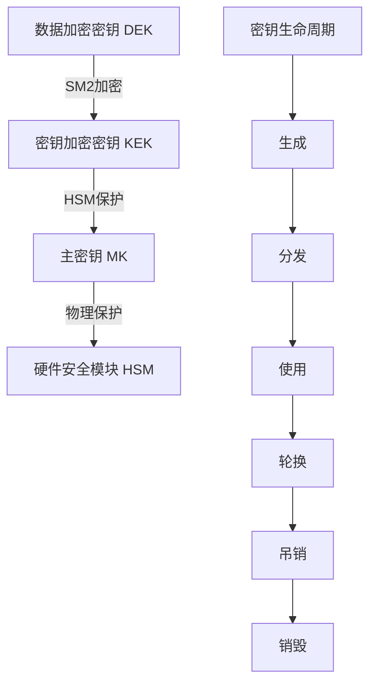

#### 3.3.3 国密算法应用
```java
@Service
public class NationalCryptoService {
    
    // SM2非对称加密
    public byte[] encryptWithSM2(PublicKey publicKey, byte[] data) {
        SM2Engine engine = new SM2Engine();
        engine.init(true, new ParametersWithRandom(publicKey, new SecureRandom()));
        return engine.processBlock(data, 0, data.length);
    }
    
    // SM3哈希算法
    public byte[] hashWithSM3(byte[] data) {
        SM3Digest digest = new SM3Digest();
        digest.update(data, 0, data.length);
        byte[] hash = new byte[digest.getDigestSize()];
        digest.doFinal(hash, 0);
        return hash;
    }
    
    // SM4对称加密
    public byte[] encryptWithSM4(byte[] key, byte[] data) {
        KeyParameter keyParam = new KeyParameter(key);
        SM4Engine engine = new SM4Engine();
        engine.init(true, keyParam);
        
        byte[] output = new byte[data.length];
        engine.processBlock(data, 0, output, 0);
        return output;
    }
}
```

### 3.4 审计架构

#### 3.4.1 审计日志架构
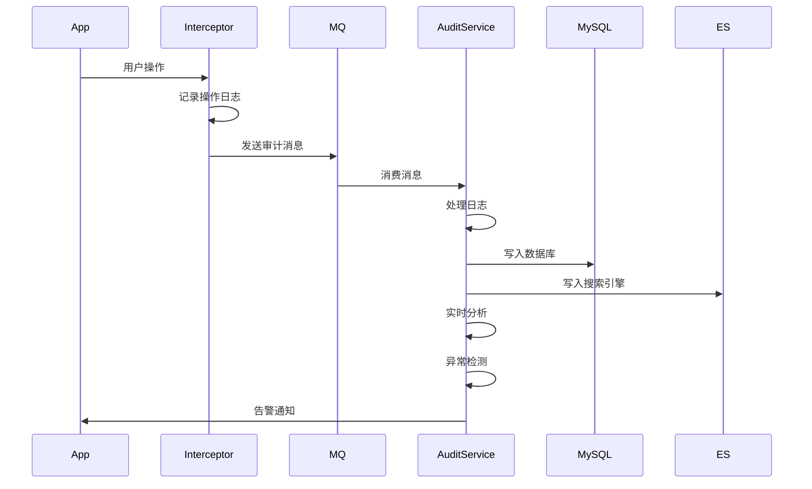

#### 3.4.2 审计内容设计

| 审计类型 | 审计内容 | 存储位置 | 保留期限 |
|---------|----------|----------|----------|
| **登录审计** | 用户登录/登出 | MySQL + ES | 3年 |
| **操作审计** | 增删改查操作 | MySQL + ES | 3年 |
| **数据访问审计** | 敏感数据访问 | MySQL + ES | 7年 |
| **权限变更审计** | 权限授予/回收 | MySQL + ES | 7年 |
| **配置变更审计** | 系统配置修改 | MySQL + ES | 7年 |
| **密钥操作审计** | 密钥生命周期 | MySQL + ES | 永久 |

#### 3.4.3 审计日志格式
```json
{
  "@timestamp": "2025-12-24T15:30:00.000Z",
  "user_id": "123456",
  "user_name": "zhangsan",
  "operation_type": "UPDATE",
  "operation_module": "USER_MANAGE",
  "operation_desc": "修改用户密码",
  "resource_type": "user",
  "resource_id": "789012",
  "request_params": {
    "userId": "789012",
    "newPassword": "***"
  },
  "response_result": {
    "code": 200,
    "message": "success"
  },
  "ip_address": "192.168.1.100",
  "user_agent": "Mozilla/5.0...",
  "execution_time": 150,
  "result_status": "SUCCESS",
  "session_id": "sess_abc123",
  "trace_id": "trace_def456"
}
```

## 4. 网络安全设计

### 4.1 网络架构

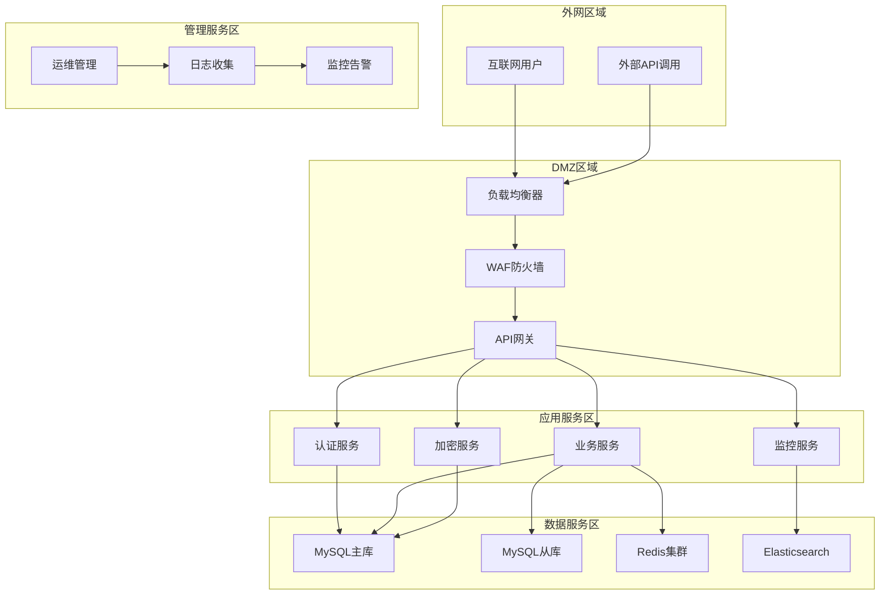

### 4.2 网络隔离策略

#### 4.2.1 安全域划分

| 安全域 | 安全级别 | 访问控制 | 主要组件 |
|--------|----------|----------|----------|
| **外网区域** | 低 | 防火墙过滤 | 用户接入点 |
| **DMZ区域** | 中 | WAF防护+访问控制 | 网关、负载均衡 |
| **应用服务区** | 高 | 微隔离+服务网格 | 业务服务 |
| **数据服务区** | 极高 | 数据库防火墙+审计 | 数据库、缓存 |
| **管理服务区** | 高 | VPN+堡垒机 | 运维管理 |

#### 4.2.2 微隔离实现
```yaml
apiVersion: networking.k8s.io/v1
kind: NetworkPolicy
metadata:
  name: bankshield-network-policy
spec:
  podSelector:
    matchLabels:
      app: bankshield
  policyTypes:
  - Ingress
  - Egress
  ingress:
  - from:
    - namespaceSelector:
        matchLabels:
          name: bankshield
    - podSelector:
        matchLabels:
          app: bankshield-gateway
    ports:
    - protocol: TCP
      port: 8080
  egress:
  - to:
    - namespaceSelector:
        matchLabels:
          name: bankshield
    ports:
    - protocol: TCP
      port: 3306
    - protocol: TCP
      port: 6379
```

### 4.3 防火墙策略

#### 4.3.1 网络防火墙规则
```bash
# 允许HTTPS访问
iptables -A INPUT -p tcp --dport 443 -j ACCEPT

# 允许VPN访问
iptables -A INPUT -p tcp --dport 1194 -j ACCEPT

# 允许内部服务通信
iptables -A INPUT -s 10.0.0.0/8 -j ACCEPT

# 拒绝其他所有访问
iptables -A INPUT -j DROP
```

#### 4.3.2 应用防火墙规则（WAF）
```json
{
  "rules": [
    {
      "name": "SQL注入防护",
      "pattern": "(union|select|insert|update|delete|drop|create|exec|script)",
      "action": "block",
      "severity": "high"
    },
    {
      "name": "XSS防护",
      "pattern": "(<script|javascript:|onerror|onload)",
      "action": "block",
      "severity": "high"
    },
    {
      "name": "路径遍历防护",
      "pattern": "(\\.\\./|\\.\\.\\\\)",
      "action": "block",
      "severity": "medium"
    }
  ]
}
```

## 5. 应用安全设计

### 5.1 安全编码规范

#### 5.1.1 输入验证规范
```java
@RestController
public class UserController {
    
    @PostMapping("/api/user")
    public Result addUser(@Valid @RequestBody UserDTO userDTO) {
        // 1. 白名单验证
        if (!ValidationUtils.isValidUsername(userDTO.getUsername())) {
            throw new ValidationException("用户名格式错误");
        }
        
        // 2. 长度验证
        if (userDTO.getUsername().length() > 50) {
            throw new ValidationException("用户名过长");
        }
        
        // 3. SQL注入防护
        String sanitizedInput = SqlInjectionUtils.sanitize(userDTO.getUsername());
        
        // 4. 业务逻辑处理
        userService.addUser(userDTO);
        
        return Result.success();
    }
}
```

#### 5.1.2 输出编码规范
```java
@Component
public class XssProtectionFilter implements Filter {
    
    @Override
    public void doFilter(ServletRequest request, ServletResponse response, FilterChain chain) 
            throws IOException, ServletException {
        
        HttpServletRequest httpRequest = (HttpServletRequest) request;
        HttpServletResponse httpResponse = (HttpServletResponse) response;
        
        // 设置安全响应头
        httpResponse.setHeader("X-Content-Type-Options", "nosniff");
        httpResponse.setHeader("X-Frame-Options", "DENY");
        httpResponse.setHeader("X-XSS-Protection", "1; mode=block");
        httpResponse.setHeader("Strict-Transport-Security", "max-age=31536000");
        httpResponse.setHeader("Content-Security-Policy", "default-src 'self'");
        
        chain.doFilter(request, response);
    }
}
```

### 5.2 依赖安全管理

#### 5.2.1 依赖漏洞扫描
```xml
<!-- Maven插件配置 -->
<plugin>
    <groupId>org.owasp</groupId>
    <artifactId>dependency-check-maven</artifactId>
    <version>8.4.0</version>
    <configuration>
        <format>ALL</format>
        <failBuildOnCVSS>7</failBuildOnCVSS>
    </configuration>
    <executions>
        <execution>
            <goals>
                <goal>check</goal>
            </goals>
        </execution>
    </executions>
</plugin>
```

#### 5.2.2 安全基线检查
```yaml
# 安全基线配置
checks:
  - name: "密码复杂度"
    description: "密码必须包含大小写字母、数字和特殊字符"
    severity: "high"
    
  - name: "会话超时"
    description: "会话超时时间不能超过30分钟"
    severity: "medium"
    
  - name: "错误处理"
    description: "错误信息不能泄露系统内部信息"
    severity: "high"
    
  - name: "敏感数据存储"
    description: "敏感数据必须加密存储"
    severity: "critical"
```

## 6. 安全运维

### 6.1 安全配置管理

#### 6.1.1 密钥管理
```bash
#!/bin/bash
# 密钥轮换脚本

# 1. 生成新密钥
openssl genrsa -out new_private.key 4096

# 2. 生成新证书
openssl req -new -x509 -key new_private.key -out new_cert.crt -days 365

# 3. 更新应用配置
kubectl create secret tls bankshield-tls \
    --cert=new_cert.crt \
    --key=new_private.key \
    --dry-run=client -o yaml | kubectl apply -f -

# 4. 重启应用服务
kubectl rollout restart deployment/bankshield-app

# 5. 验证新证书
openssl x509 -in new_cert.crt -text -noout
```

#### 6.2.2 安全监控指标

| 监控指标 | 告警阈值 | 告警级别 | 处理措施 |
|---------|----------|----------|----------|
| 登录失败次数 | 5次/5分钟 | 高 | 账户锁定+IP封禁 |
| SQL注入尝试 | 1次 | 严重 | 立即封禁IP |
| 权限提升尝试 | 1次 | 严重 | 立即封禁账户 |
| 异常访问时间 | 非工作时间 | 中 | 发送告警通知 |
| 数据导出量 | >1000条 | 高 | 需要审批 |
| 密钥操作 | 任何操作 | 低 | 记录审计日志 |

### 6.2 应急响应

#### 6.2.1 安全事件分级

| 事件级别 | 定义 | 响应时间 | 处理团队 |
|---------|------|----------|----------|
| **P0-严重** | 数据泄露、系统被攻破 | 15分钟 | 安全应急小组 |
| **P1-高危** | 权限提升、SQL注入 | 30分钟 | 安全运营团队 |
| **P2-中危** | 异常登录、暴力破解 | 1小时 | 运维团队 |
| **P3-低危** | 配置错误、异常访问 | 4小时 | 值班工程师 |

#### 6.2.2 应急响应流程
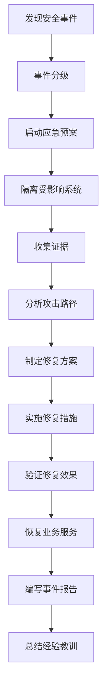

## 7. 合规性要求

### 7.1 法律法规合规

#### 7.1.1 《网络安全法》要求
- **等级保护**: 系统需通过网络安全等级保护测评
- **数据保护**: 采取技术措施防止数据泄露、篡改、丢失
- **安全审计**: 记录网络运行状态、网络安全事件
- **应急预案**: 制定网络安全事件应急预案

#### 7.1.2 《密码法》要求
- **密码应用**: 关键信息基础设施必须使用商用密码
- **密码产品**: 使用国家密码管理部门认证的密码产品
- **密码服务**: 委托密码服务机构应签订保密协议
- **密码安全**: 建立密码安全管理制度和责任制

#### 7.1.3 《数据安全法》要求
- **数据分类**: 对数据进行分类分级保护
- **风险评估**: 定期开展数据处理活动风险评估
- **数据出境**: 重要数据出境需进行安全评估
- **应急处置**: 建立数据安全应急处置机制

### 7.2 行业标准合规

#### 7.2.1 金融行业要求
- **JR/T 0071**: 金融行业信息系统信息安全等级保护实施指引
- **JR/T 0193**: 金融数据安全 数据安全分级指南
- **JR/T 0223**: 金融数据安全 数据生命周期安全规范

#### 7.2.2 等保2.0要求
- **安全物理环境**: 机房安全、设备安全
- **安全通信网络**: 网络架构、通信传输
- **安全区域边界**: 边界防护、访问控制
- **安全计算环境**: 身份鉴别、访问控制
- **安全管理中心**: 系统管理、安全管理
- **安全管理制度**: 制度体系、制度执行

## 8. 附录

### 8.1 安全工具清单

| 工具类型 | 工具名称 | 用途 | 开源/商业 |
|---------|----------|------|-----------|
| **漏洞扫描** | Nessus | 系统漏洞扫描 | 商业 |
| **代码审计** | SonarQube | 代码质量检查 | 开源 |
| **依赖检查** | OWASP Dependency Check | 依赖漏洞扫描 | 开源 |
| **渗透测试** | Metasploit | 安全测试 | 开源 |
| **日志分析** | ELK Stack | 日志收集分析 | 开源 |
| **基线检查** | Lynis | 安全配置检查 | 开源 |
| **网络扫描** | Nmap | 网络发现 | 开源 |

### 8.2 安全基线检查表

#### 8.2.1 操作系统安全基线
- [ ] 系统补丁更新到最新版本
- [ ] 关闭不必要的服务和端口
- [ ] 启用系统防火墙
- [ ] 配置强密码策略
- [ ] 启用审计日志
- [ ] 配置时间同步
- [ ] 安装防病毒软件
- [ ] 配置访问控制

#### 8.2.2 应用安全基线
- [ ] 使用HTTPS传输数据
- [ ] 实现输入验证和输出编码
- [ ] 使用参数化查询防止SQL注入
- [ ] 实现CSRF防护
- [ ] 配置安全响应头
- [ ] 实现会话管理
- [ ] 加密存储敏感数据
- [ ] 实现访问控制

### 8.3 术语表

| 术语 | 全称 | 说明 |
|------|------|------|
| **STRIDE** | Spoofing, Tampering, Repudiation, Information Disclosure, DoS, Elevation of Privilege | 威胁建模方法论 |
| **RBAC** | Role-Based Access Control | 基于角色的访问控制 |
| **MFA** | Multi-Factor Authentication | 多因素认证 |
| **HSM** | Hardware Security Module | 硬件安全模块 |
| **KMS** | Key Management System | 密钥管理系统 |
| **WAF** | Web Application Firewall | Web应用防火墙 |
| **DDoS** | Distributed Denial of Service | 分布式拒绝服务攻击 |
| **XSS** | Cross-Site Scripting | 跨站脚本攻击 |
| **CSRF** | Cross-Site Request Forgery | 跨站请求伪造 |
| **SQLi** | SQL Injection | SQL注入攻击 |

### 8.4 参考资料

1. 《信息安全技术 网络安全等级保护基本要求》(GB/T 22239-2019)
2. 《信息安全技术 网络安全等级保护安全设计技术要求》(GB/T 25070-2019)
3. 《中华人民共和国密码法》(2020年)
4. 《中华人民共和国数据安全法》(2021年)
5. 《中华人民共和国个人信息保护法》(2021年)
6. OWASP Top 10 Security Risks (2021)
7. NIST Cybersecurity Framework (2023)
8. ISO/IEC 27001:2022 信息安全管理体系

### 8.5 文档版本历史

| 版本 | 日期 | 作者 | 变更说明 |
|------|------|------|----------|
| v1.0.0 | 2025-12-24 | 安全架构团队 | 初始版本创建 |

---

**文档审核**: 
- [ ] 安全架构师审核
- [ ] 合规专家审核
- [ ] 技术负责人审核
- [ ] 法务部门审核

**最后更新**: 2025-12-24  
**更新人员**: BankShield安全架构团队