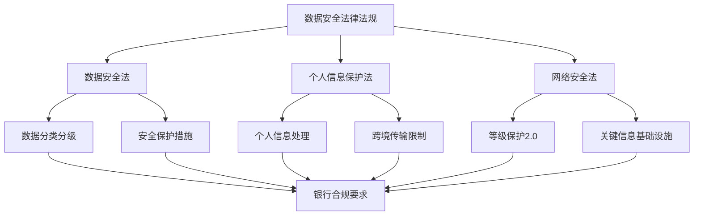
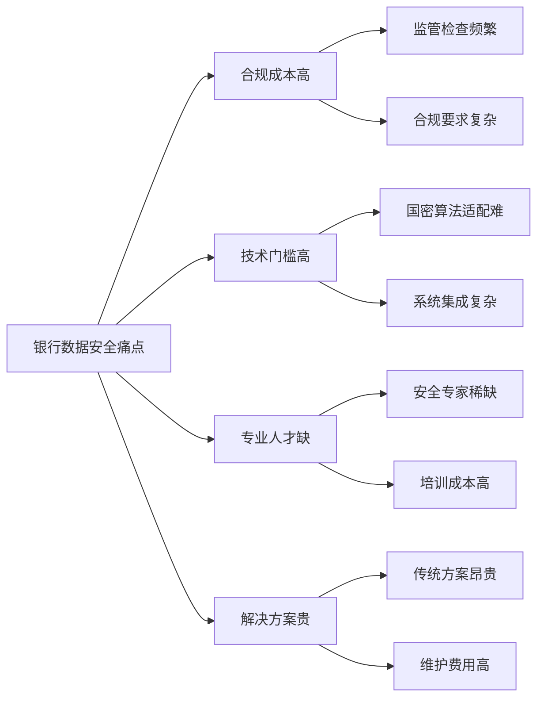
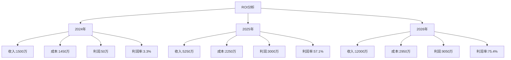
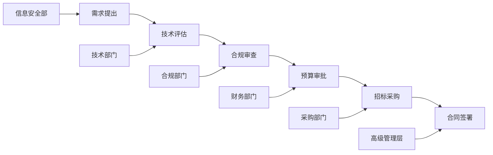
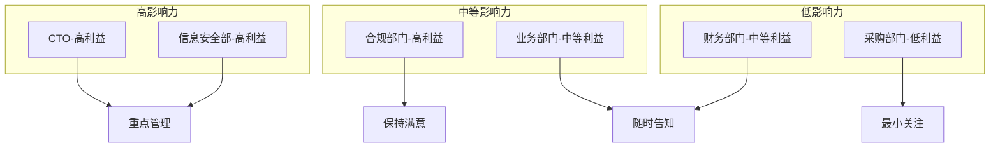

# BankShield 商业需求文档 (BRD)

## 执行摘要

BankShield是专为银行及金融机构设计的数据安全综合解决方案，基于国家密码算法标准（国密SM系列），提供数据分类分级、加密保护、审计监控等核心功能。本产品旨在满足银行行业日益严格的数据安全合规要求，解决中小型银行在数据保护方面的痛点。

### 核心价值主张
- **合规驱动**：符合国家《数据安全法》《个人信息保护法》要求
- **国密标准**：全面支持国家商用密码算法
- **银行定制**：深度适配银行业务场景
- **成本优势**：相比传统方案降低30-50%成本

## 1. 市场机会分析

### 1.1 市场规模与增长趋势

#### 中国银行数据安全市场规模
| 年份 | 市场规模（亿元） | 增长率 | 主要驱动因素 |
|------|----------------|--------|--------------|
| 2022 | 45.6 | - | 《数据安全法》实施 |
| 2023 | 62.3 | 36.6% | 个人信息保护法推进 |
| 2024E | 85.7 | 37.6% | 监管要求趋严 |
| 2025E | 118.2 | 37.9% | 数字化转型加速 |
| 2026E | 163.8 | 38.6% | 合规需求常态化 |

#### 细分市场结构（2024年预测）
- **大型银行**（国有大行、股份行）：45亿元，占比52.5%
- **中小型银行**（城商行、农商行）：28亿元，占比32.7%
- **金融科技公司**：12.7亿元，占比14.8%

### 1.2 政策驱动因素

#### 监管框架


#### 重点监管要求
1. **数据分类分级**：2024年底前完成核心系统数据分类
2. **国密算法应用**：2025年金融行业全面应用国密算法
3. **个人信息保护**：建立全流程个人信息保护机制
4. **跨境数据管理**：严格数据出境安全评估

## 2. 目标市场分析

### 2.1 目标客户群体

#### 中小型银行（核心目标）
- **城商行**：134家，资产规模1000-5000亿
- **农商行**：1545家，资产规模100-1000亿
- **民营银行**：19家，资产规模100-2000亿

**客户特征**：
- 信息化建设投入有限
- 缺乏专业安全团队
- 合规压力日益增大
- 对成本敏感度高

#### 金融科技公司（次级目标）
- **持牌消费金融公司**：29家
- **汽车金融公司**：25家
- **第三方支付机构**：150家

**客户特征**：
- 业务创新活跃
- 监管要求严格
- 技术能力相对较强
- 对新技术接受度高

### 2.2 市场痛点

#### 主要痛点分析


## 3. 商业模式设计

### 3.1 收入来源结构

#### B2B软件授权模式（主力模式）
| 产品版本 | 目标客户 | 年费范围 | 功能特性 |
|----------|----------|----------|----------|
| 标准版 | 农商行、小型城商行 | 30-50万 | 基础加密+审计 |
| 专业版 | 中型城商行 | 50-100万 | 全功能模块 |
| 企业版 | 大型城商行 | 100-200万 | 定制化+专属支持 |

#### SaaS订阅模式（补充模式）
- **订阅费用**：5-20万/年
- **适用对象**：金融科技公司、小型机构
- **服务模式**：云端部署+运维托管

#### 定制化开发（增值模式）
- **开发费用**：50-500万/项目
- **服务内容**：特殊需求定制、系统集成
- **利润率**：40-60%

### 3.2 定价策略

#### 定价模型
```
总费用 = 基础平台费 + 模块授权费 + 数据量费用 + 服务费

其中：
- 基础平台费：30万（标准版）/50万（专业版）/100万（企业版）
- 模块授权费：5-20万/模块/年
- 数据量费用：0.1万/TB/年（超过10TB部分）
- 服务费：合同金额的15-20%
```

#### 竞争优势定价
- **vs 奇安信**：低20-30%
- **vs 深信服**：低15-25%
- **vs 绿盟**：低25-35%

## 4. ROI预测分析

### 4.1 投资成本估算（3年）

#### 研发成本
| 项目 | 2024 | 2025 | 2026 | 总计 |
|------|------|------|------|------|
| 人员成本 | 800万 | 1200万 | 1500万 | 3500万 |
| 基础设施 | 200万 | 300万 | 400万 | 900万 |
| 营销推广 | 300万 | 500万 | 700万 | 1500万 |
| 运营支持 | 150万 | 250万 | 350万 | 750万 |
| **年度合计** | **1450万** | **2250万** | **2950万** | **6650万** |

#### 收入预测
| 年度 | 客户数量 | 平均客单价 | 总收入 | 增长率 |
|------|----------|------------|--------|--------|
| 2024 | 25家 | 60万 | 1500万 | - |
| 2025 | 75家 | 70万 | 5250万 | 250% |
| 2026 | 150家 | 80万 | 12000万 | 129% |

### 4.2 盈亏平衡分析

#### 关键财务指标


#### 投资回报指标
- **盈亏平衡点**：2024年Q4
- **3年累计ROI**：125.6%
- **投资回收期**：2.1年
- **净现值（NPV）**：8,245万（贴现率10%）

## 5. 干系人分析

### 5.1 决策链分析

#### 银行采购决策流程


### 5.2 关键干系人画像

#### CTO（首席技术官）- 王总
- **关注点**：技术先进性、系统稳定性、扩展性
- **痛点**：技术债务、系统集成复杂、新技术风险
- **影响力**：★★★★★
- **沟通策略**：技术交流、案例分享、POC测试

#### 信息安全部负责人 - 李总
- **关注点**：安全合规、风险控制、审计能力
- **痛点**：监管压力、安全事件、合规成本
- **影响力**：★★★★★
- **沟通策略**：合规解读、风险评估、解决方案

#### 合规部门负责人 - 张总
- **关注点**：法律法规遵循、监管检查、证据留存
- **痛点**：法规变化快、检查频繁、证据要求高
- **影响力**：★★★★☆
- **沟通策略**：法规培训、合规报告、审计支持

### 5.3 干系人影响-利益矩阵



## 6. 风险评估与应对

### 6.1 主要风险因素

#### 市场风险
- **竞争加剧**：大厂进入市场
- **政策变化**：监管要求调整
- **经济下行**：客户预算削减

#### 技术风险
- **技术更新**：国密标准升级
- **安全漏洞**：产品安全事件
- **兼容性**：系统适配问题

#### 经营风险
- **人才流失**：核心团队离职
- **资金压力**：现金流紧张
- **客户集中**：大客户依赖

### 6.2 风险应对策略

| 风险类型 | 应对措施 | 责任部门 | 预算分配 |
|----------|----------|----------|----------|
| 市场竞争 | 差异化定位、专利保护 | 市场部 | 200万 |
| 政策变化 | 政策研究、快速响应 | 合规部 | 100万 |
| 技术更新 | 预研投入、标准参与 | 研发部 | 300万 |
| 安全事件 | 应急响应、保险购买 | 安全部 | 150万 |

## 7. 成功指标（KPI）

### 7.1 财务指标
- **年收入增长率**：>100%
- **毛利率**：>70%
- **客户续约率**：>85%
- **单客户价值**：年增长率>15%

### 7.2 市场指标
- **市场占有率**：2026年达到5%
- **品牌知名度**：目标市场前3名
- **客户满意度**：NPS >50
- **渠道覆盖率**：重点地区100%

### 7.3 产品指标
- **产品可用性**：>99.9%
- **功能完整性**：需求覆盖率>95%
- **技术创新度**：年新增专利>5项
- **合规通过率**：100%

## 附录

### 附录A：市场调研数据来源
- 中国信通院《数据安全白皮书》
- IDC《中国银行业IT解决方案市场报告》
- 艾瑞咨询《中国金融数据安全行业研究报告》
- 央行《金融科技发展规划》

### 附录B：政策法规清单
- 《中华人民共和国数据安全法》
- 《中华人民共和国个人信息保护法》
- 《关键信息基础设施安全保护条例》
- 《金融数据安全 数据安全分级指南》（JR/T 0197-2020）
- 《金融行业信息系统信息安全等级保护实施指南》（JR/T 0071-2012）

### 附录C：财务模型假设
- 客户获取成本：15万/客户
- 客户维护成本：5万/客户/年
- 人员成本增长率：15%/年
- 市场费用占收入比：20%递减至10%