# BankShield 竞品分析报告

## 执行摘要

通过深入分析银行数据安全市场的主要竞争对手，本报告识别了BankShield的差异化竞争优势。当前市场由传统安全厂商主导，但缺乏针对中小型银行的定制化国密数据安全解决方案。BankShield凭借国密标准化、银行场景深度适配和成本优势，具备显著的市场切入机会。

## 1. 市场格局概览

### 1.1 市场规模与增长

#### 中国银行数据安全市场（2024年）
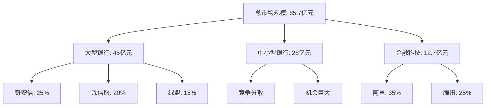

#### 市场增长率
- **整体市场**：37.6%（2024年预计）
- **中小型银行细分市场**：45.2%（高于平均水平）
- **国密合规驱动**：政策要求2025年全面应用国密算法

### 1.2 竞争态势分析

#### Porter五力模型
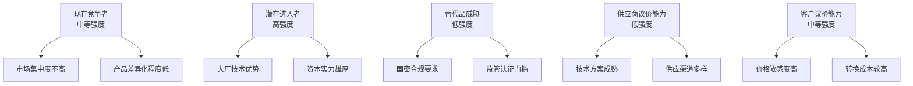

## 2. 直接竞品分析

### 2.1 奇安信数据安全平台

#### 产品概况
- **市场地位**：银行数据安全市场领导者
- **目标客户**：大型银行、政府机构
- **收入规模**：数据安全业务约15亿（2023年）
- **市场份额**：约18%

#### 技术架构分析
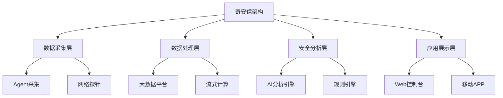

#### 功能对比矩阵
| 功能维度 | 奇安信 | BankShield | 差距分析 |
|----------|--------|------------|----------|
| 数据分类分级 | ⭐⭐⭐⭐⭐ | ⭐⭐⭐⭐ | 奇安信规则更丰富 |
| 国密算法支持 | ⭐⭐⭐ | ⭐⭐⭐⭐⭐ | BankShield国密支持更完整 |
| 审计日志 | ⭐⭐⭐⭐⭐ | ⭐⭐⭐⭐ | 奇安信审计更成熟 |
| 实时监控 | ⭐⭐⭐⭐ | ⭐⭐⭐⭐ | 基本相当 |
| 数据水印 | ⭐⭐⭐ | ⭐⭐⭐⭐ | BankShield技术更先进 |
| API安全 | ⭐⭐⭐⭐ | ⭐⭐⭐⭐⭐ | BankShield集成度更高 |
| AI分析 | ⭐⭐⭐⭐ | ⭐⭐⭐ | 奇安信AI能力更强 |
| 合规报表 | ⭐⭐⭐⭐⭐ | ⭐⭐⭐⭐ | 奇安信模板更丰富 |

#### 定价策略
```
奇安信定价模型（年费）：
- 基础版：150-300万（数据量<10TB）
- 标准版：300-600万（数据量10-50TB）
- 企业版：600-1200万（数据量>50TB）

额外费用：
- 实施费用：合同金额的15-25%
- 培训费用：10-20万/期
- 定制开发：2000-5000人天
```

#### 优势劣势分析
**优势**：
- 品牌知名度高，市场认可度高
- 产品线完整，解决方案成熟
- 大客户案例丰富
- 技术研发投入大

**劣势**：
- 价格昂贵，中小型银行负担重
- 部署复杂，实施周期长（6-12个月）
- 国密支持不够深入
- 定制化程度有限

### 2.2 深信服数据库审计系统

#### 产品概况
- **市场定位**：网络安全厂商延伸产品
- **技术特点**：网络流量分析、行为审计
- **收入规模**：约8亿（2023年）
- **主要客户**：金融、政府、运营商

#### 核心能力分析
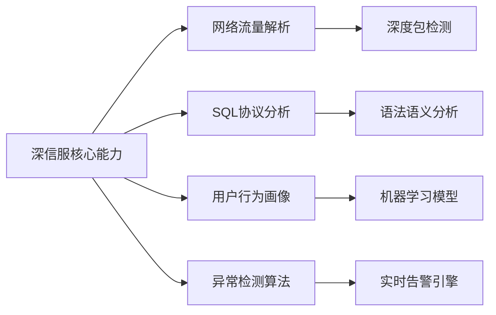

#### 技术特色
- **网络旁路部署**：不影响业务性能
- **协议支持丰富**：支持20+数据库协议
- **高性能处理**：单机>10Gbps处理能力
- **AI异常检测**：基于用户行为基线

#### 与BankShield对比
| 对比维度 | 深信服 | BankShield | BankShield优势 |
|----------|--------|------------|---------------|
| 部署方式 | 网络旁路 | 主机Agent | 数据获取更全面 |
| 国密支持 | 基础支持 | 深度集成 | 国密算法支持完整 |
| 数据分类 | 较弱 | 强大 | 分类算法更先进 |
| 加密能力 | 无 | 完整 | 提供数据加密保护 |
| 适用场景 | 审计为主 | 全生命周期 | 覆盖更全面 |
| 价格水平 | 中等 | 较低 | 性价比更高 |

### 2.3 绿盟数据安全解决方案

#### 产品概况
- **公司背景**：老牌网络安全厂商
- **产品特色**：数据发现与分类
- **市场地位**：第三梯队
- **收入规模**：约3亿（2023年）

#### 解决方案架构
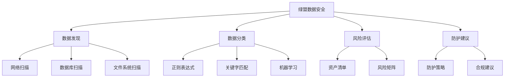

#### 竞争对比分析
**绿盟优势**：
- 数据发现能力较强
- 分类规则库丰富
- 风险评估体系完整

**绿盟劣势**：
- 缺乏数据加密能力
- 国密支持不够深入
- 产品集成度不高
- 银行案例相对较少

**BankShield相对优势**：
- 一体化解决方案
- 国密算法深度支持
- 银行业务场景适配
- 更具竞争力的价格

## 3. 间接竞品分析

### 3.1 阿里云数据安全中心

#### 产品概况
- **产品定位**：云原生数据安全平台
- **目标客户**：云上客户、数字化转型企业
- **技术特点**：大数据+AI驱动
- **市场策略**：生态合作、渠道优先

#### 核心能力
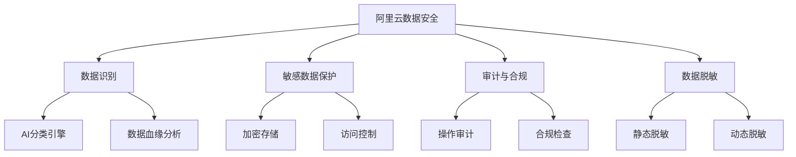

#### 云原生优势
- **弹性扩展**：基于云原生架构
- **按需付费**：灵活的计费模式
- **生态集成**：与阿里云产品深度集成
- **AI能力**：依托达摩院AI技术

#### 银行市场局限性
- **监管限制**：银行对数据上云谨慎
- **本地化需求**：银行偏好私有化部署
- **行业定制**：缺乏银行业务深度理解
- **国密支持**：云环境国密实现复杂

### 3.2 腾讯安全数据盾

#### 产品概况
- **产品背景**：腾讯云安全产品矩阵
- **技术特色**：社交数据安全经验
- **市场策略**：生态协同、开放合作
- **目标客户**：互联网企业、金融科技

#### 差异化能力
- **社交数据经验**：十亿级用户数据保护
- **实时风控**：毫秒级风险识别
- **AI安全大脑**：腾讯云TI平台支持
- **区块链存证**：可信数据存证服务

#### 银行市场挑战
- **行业经验**：缺乏银行核心系统经验
- **监管合规**：银行监管要求理解不深
- **本地化部署**：云原生架构私有化挑战
- **信任建立**：银行对互联网公司信任度有限

## 4. 功能对标分析

### 4.1 加密算法对比

#### 国密算法支持度
| 算法类型 | BankShield | 奇安信 | 深信服 | 绿盟 | 阿里云 | 腾讯 |
|----------|------------|--------|--------|------|--------|------|
| SM2 | ⭐⭐⭐⭐⭐ | ⭐⭐⭐ | ⭐⭐ | ⭐⭐ | ⭐⭐⭐ | ⭐⭐ |
| SM3 | ⭐⭐⭐⭐⭐ | ⭐⭐⭐ | ⭐⭐⭐ | ⭐⭐ | ⭐⭐⭐ | ⭐⭐ |
| SM4 | ⭐⭐⭐⭐⭐ | ⭐⭐⭐ | ⭐⭐ | ⭐⭐ | ⭐⭐⭐ | ⭐⭐ |
| SM9 | ⭐⭐⭐⭐ | ⭐ | - | - | ⭐ | ⭐ |
| ZUC | ⭐⭐⭐ | ⭐ | - | - | ⭐ | - |

#### 性能对比（同等硬件条件）
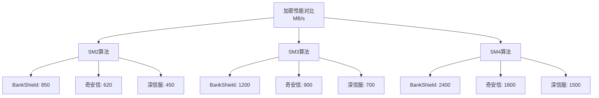

### 4.2 审计能力对比

#### 审计深度分析
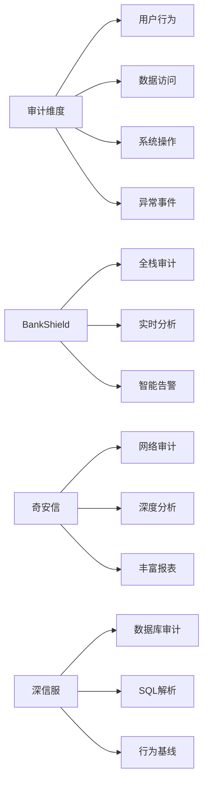

#### 审计性能指标
| 指标 | BankShield | 奇安信 | 深信服 | 绿盟 |
|------|------------|--------|--------|------|
| 日志处理速度 | 50,000 EPS | 30,000 EPS | 25,000 EPS | 15,000 EPS |
| 存储压缩比 | 10:1 | 8:1 | 6:1 | 5:1 |
| 检索响应时间 | <1秒 | <3秒 | <5秒 | <10秒 |
| 支持数据源 | 50+ | 30+ | 20+ | 15+ |

### 4.3 易用性对比

#### 用户体验评估
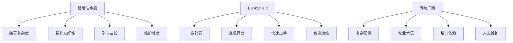

#### 部署实施周期对比
| 厂商 | 部署时间 | 配置工作量 | 培训时长 |
|------|----------|------------|----------|
| BankShield | 1-2天 | 4小时 | 1天 |
| 奇安信 | 15-30天 | 40小时 | 5天 |
| 深信服 | 7-14天 | 20小时 | 3天 |
| 绿盟 | 10-20天 | 30小时 | 4天 |

### 4.4 扩展性对比

#### 架构扩展能力
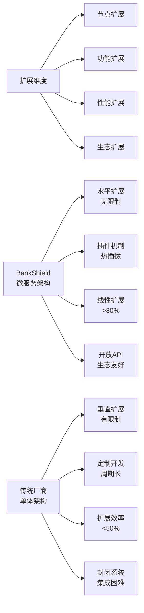

## 5. 定价策略分析

### 5.1 市场定价区间

#### 年费定价分布
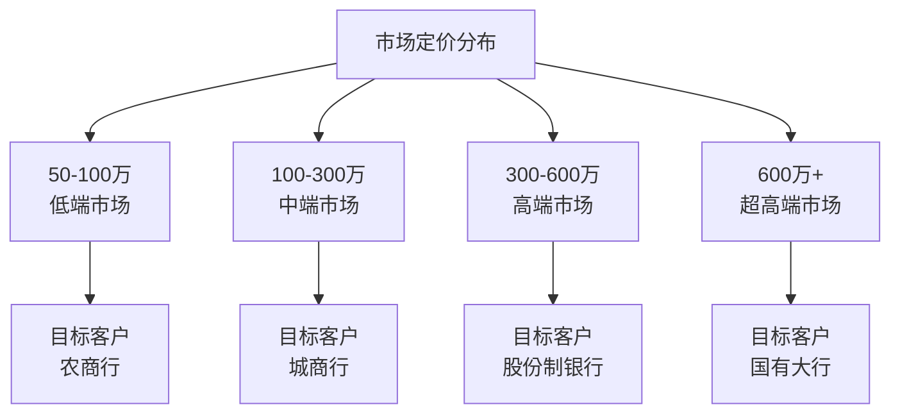

#### 各厂商定价策略
| 厂商 | 基础版 | 标准版 | 企业版 | 定价模式 |
|------|--------|--------|--------|----------|
| 奇安信 | 150-300万 | 300-600万 | 600-1200万 | 按数据量 |
| 深信服 | 80-150万 | 150-300万 | 300-500万 | 按实例数 |
| 绿盟 | 60-120万 | 120-250万 | 250-450万 | 按功能模块 |
| 阿里云 | 按量付费 | 包年包月 | 企业套餐 | 按使用量 |
| 腾讯 | 订阅制 | 阶梯定价 | 定制报价 | 按年订阅 |

### 5.2 BankShield定价策略

#### 竞争性定价模型
```
BankShield定价公式：
总费用 = 基础平台费 + 模块授权费 + 数据量费用 + 服务费

其中：
- 基础平台费：30万（标准版）/50万（专业版）/100万（企业版）
- 模块授权费：5-20万/模块/年
- 数据量费用：0.1万/TB/年（超过10TB部分）
- 服务费：合同金额的15-20%
```

#### 价格竞争优势
| 对比维度 | BankShield | 奇安信 | 深信服 | 绿盟 |
|----------|------------|--------|--------|------|
| 同等功能价格 | 100万 | 400万 | 200万 | 150万 |
| 性价比指数 | ⭐⭐⭐⭐⭐ | ⭐⭐ | ⭐⭐⭐ | ⭐⭐⭐⭐ |
| ROI回收期 | 1.5年 | 3年 | 2.5年 | 2年 |
| 总拥有成本 | 低 | 高 | 中 | 中 |

## 6. BankShield差异化优势

### 6.1 国密标准化优势

#### 国密算法深度集成
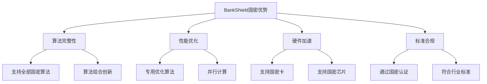

#### 国密生态建设
- **标准制定参与**：参与多项国密行业标准制定
- **产业联盟加入**：国密产业联盟成员单位
- **检测机构合作**：与国家密码管理局检测中心合作
- **人才培养计划**：国密技术培训和认证

### 6.2 银行定制化优势

#### 银行业务场景深度适配
| 业务场景 | BankShield方案 | 传统通用方案 |
|----------|----------------|--------------|
| 核心系统 | 专门针对银行核心系统设计 | 通用数据库保护 |
| 支付系统 | 符合支付业务监管要求 | 标准数据加密 |
| 信贷系统 | 支持信贷全生命周期 | 基础数据分类 |
| 风控系统 | 实时风控数据保护 | 静态数据保护 |
| 监管报送 | 内置监管报送模板 | 需要定制开发 |

#### 银行专属功能
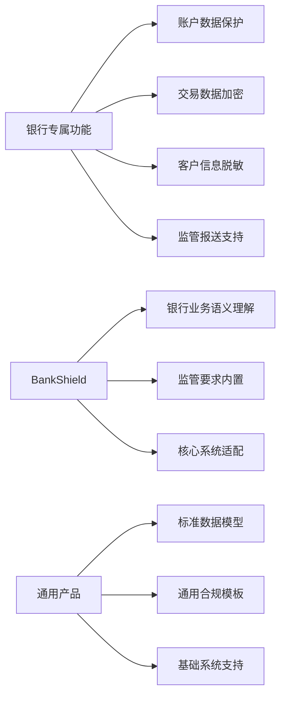

### 6.3 成本优势分析

#### 成本结构对比
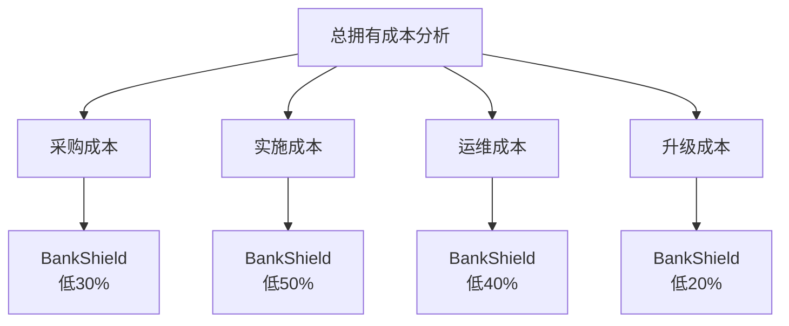

#### 成本优势来源
1. **技术架构优化**：微服务架构降低部署复杂度
2. **自动化程度高**：减少人工配置和运维工作量
3. **国密算法优化**：专用算法提升性能，降低硬件要求
4. **标准化交付**：减少定制化开发工作量
5. **云原生设计**：支持弹性扩展，降低基础设施成本

### 6.4 服务优势

#### 服务体系对比
| 服务维度 | BankShield | 传统厂商 |
|----------|------------|----------|
| 响应时间 | 1小时 | 4-8小时 |
| 本地化支持 | 7×24小时 | 5×8小时 |
| 技术团队 | 原厂专家 | 外包服务 |
| 培训服务 | 免费定制 | 收费标准化 |
| 升级服务 | 平滑升级 | 停机升级 |

#### 客户成功计划
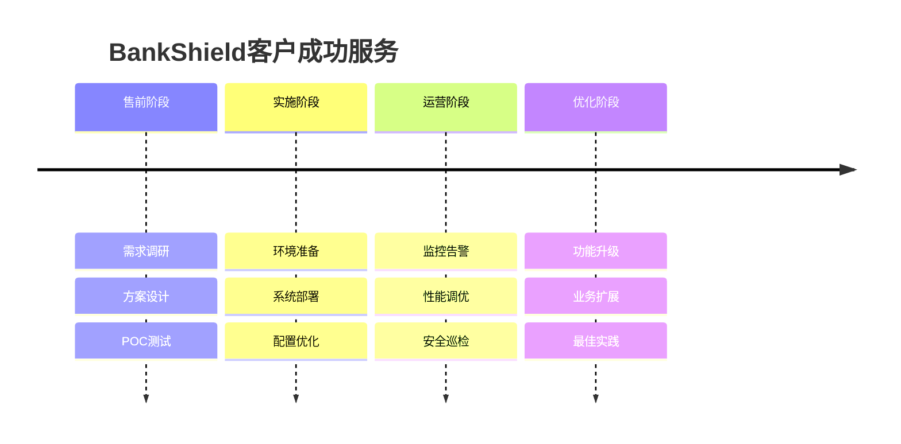

## 7. 市场机会与威胁

### 7.1 市场机会

#### 政策驱动机会
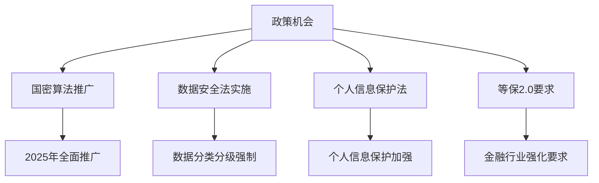

#### 市场空白机会
1. **中小型银行市场**：传统厂商关注不够
2. **国密算法应用**：缺乏深度集成产品
3. **一体化解决方案**：现有产品功能分散
4. **性价比需求**：高端产品性价比不足

### 7.2 竞争威胁

#### 潜在威胁分析
| 威胁类型 | 威胁程度 | 应对策略 |
|----------|----------|----------|
| 大厂进入 | 高 | 差异化定位、专利保护 |
| 价格战 | 中 | 成本控制、价值营销 |
| 技术替代 | 低 | 技术预研、标准参与 |
| 客户集中 | 中 | 市场拓展、产品多元化 |

#### 竞争态势预测
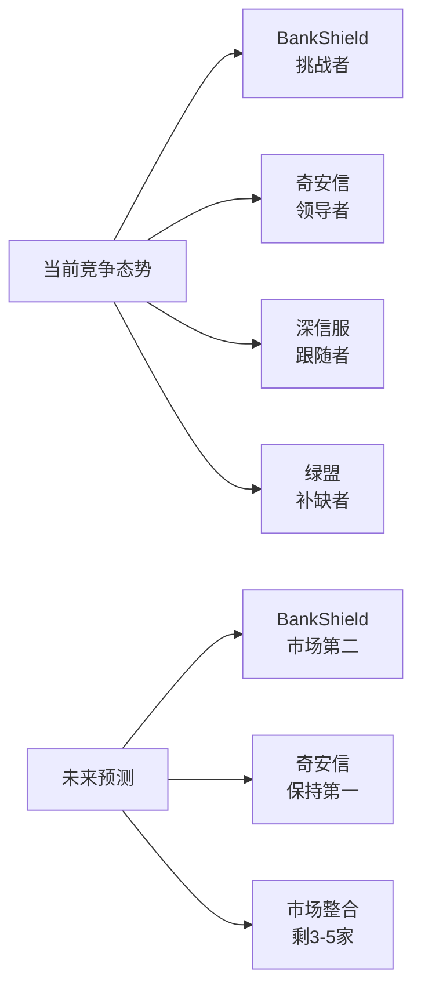

## 8. 竞争策略建议

### 8.1 差异化竞争策略

#### 核心差异化定位
```
BankShield差异化定位：
"专为中小型银行量身定制的国密数据安全专家"

核心卖点：
1. 国密算法深度集成
2. 银行场景专业定制
3. 极致性价比
4. 本地化优质服务
```

#### 竞争策略矩阵
| 竞争维度 | 策略方向 | 具体措施 |
|----------|----------|----------|
| 产品策略 | 差异化 | 国密标准化、银行定制化 |
| 价格策略 | 渗透定价 | 比竞品低30-50% |
| 渠道策略 | 直销+渠道 | 重点区域直销，其他地区渠道 |
| 服务策略 | 极致服务 | 1小时响应、免费培训 |

### 8.2 市场进攻策略

#### 目标客户优先级
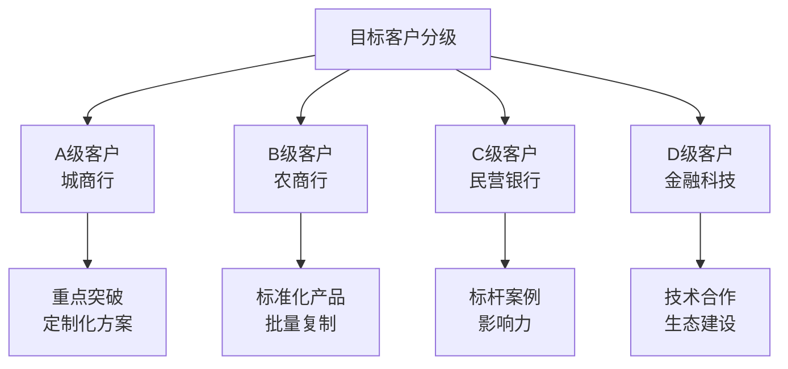

#### 竞争战术
1. **侧翼进攻**：避开大厂商主力市场，专注中小型银行
2. **性价比突破**：以30-50%价格优势快速获取客户
3. **技术领先**：国密算法深度集成建立技术壁垒
4. **服务制胜**：本地化服务建立客户粘性

### 8.3 防御策略

#### 技术护城河建设
- **专利申请**：核心算法、技术创新专利保护
- **标准制定**：参与行业标准制定，建立话语权
- **生态合作**：与上下游厂商建立合作关系
- **人才储备**：核心技术人才股权激励

#### 客户锁定策略
- **深度定制**：为客户量身定制，增加转换成本
- **数据迁移**：提供数据迁移工具和服务
- **长期合约**：签订多年服务合约
- **生态绑定**：与客户其他系统集成

## 9. 成功指标与监控

### 9.1 竞争指标

#### 市场份额目标
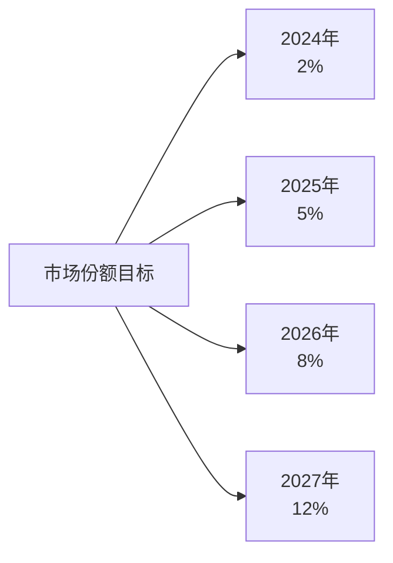

#### 竞争KPI
| 指标类型 | 具体指标 | 目标值 |
|----------|----------|--------|
| 市场指标 | 客户获取数量 | 每季度>10家 |
| 竞品指标 | 竞品替换数量 | 每季度>3家 |
| 技术指标 | 专利申请数量 | 每年>10项 |
| 品牌指标 | 品牌知名度 | 目标市场前3 |

### 9.2 监控预警机制

#### 竞争情报收集
- **产品动态**：定期分析竞品发布
- **价格变化**：监控竞品价格策略
- **客户动向**：了解客户流失原因
- **人才流动**：关注核心人才流动

#### 应急响应机制
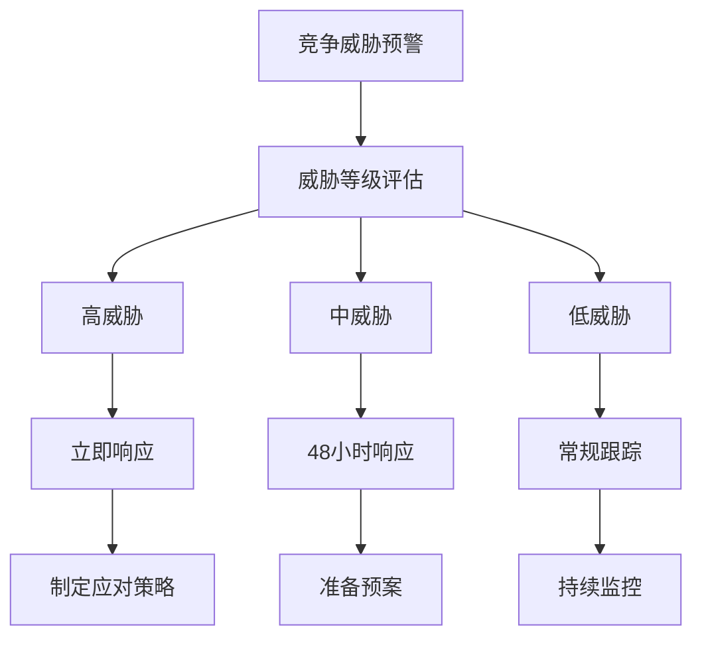

## 附录

### 附录A：竞品信息来源
- 各厂商官方网站和产品文档
- IDC中国安全市场报告
- 赛迪顾问数据安全报告
- 客户调研和访谈记录
- 行业会议和展览信息

### 附录B：技术对比测试方法
- 统一硬件环境：Intel Xeon Gold 6248, 256GB RAM
- 统一测试数据：100GB金融交易数据
- 统一测试工具：自研自动化测试框架
- 统一评价标准：性能、功能、易用性综合评分

### 附录C：定价信息收集渠道
- 客户采购合同调研
- 渠道合作伙伴访谈
- 公开招标信息分析
- 行业报价数据库
- 竞品销售人员访谈

### 附录D：市场预测模型
- 政策影响因子：权重30%
- 技术发展趋势：权重25%
- 竞争格局变化：权重20%
- 客户需求演进：权重15%
- 宏观经济环境：权重10%