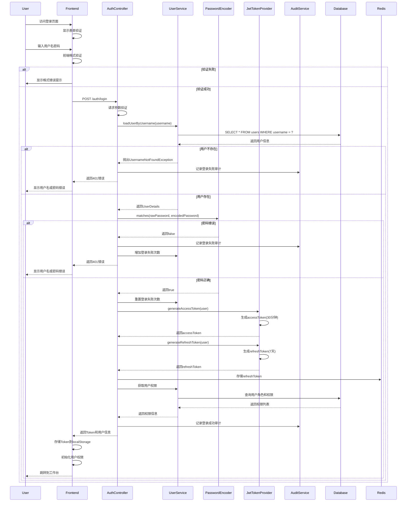
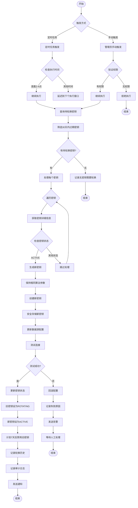
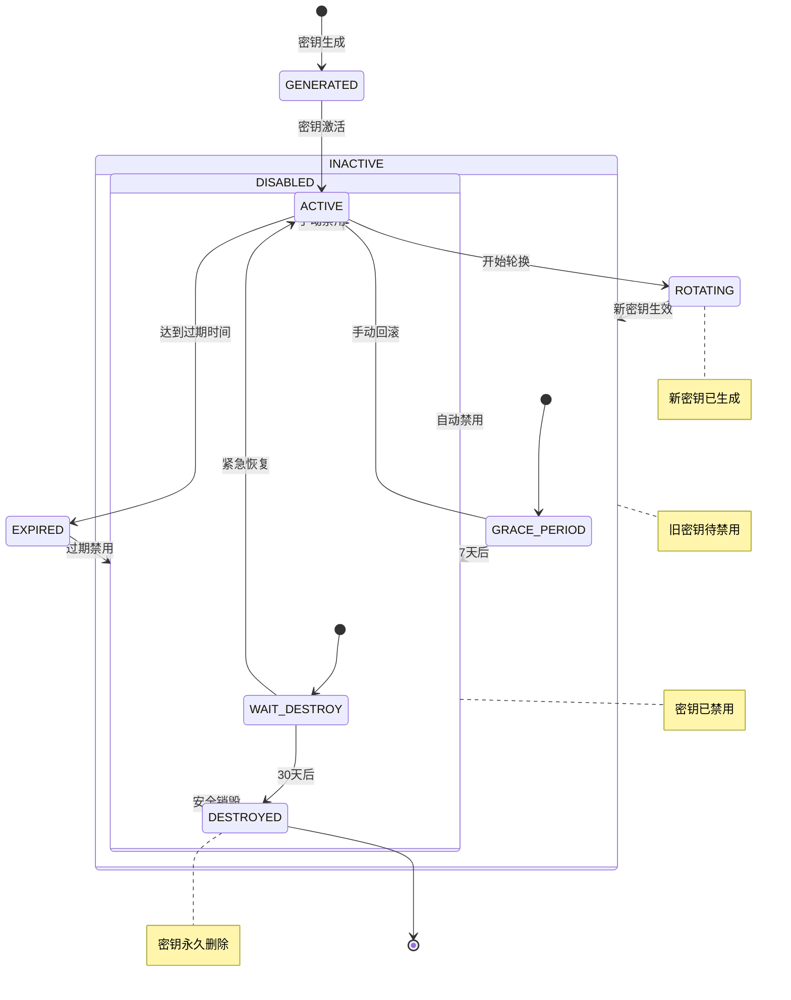
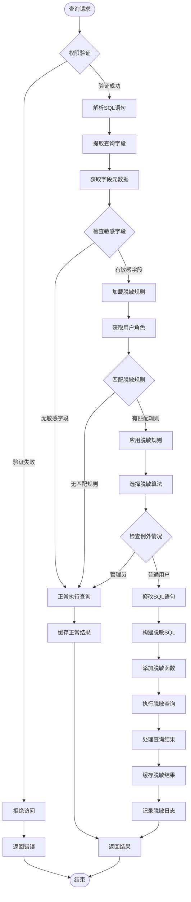
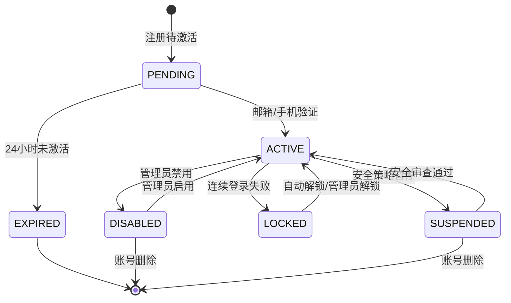
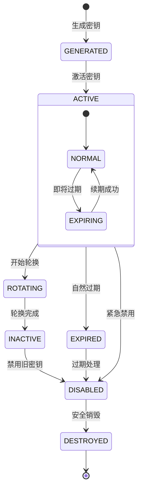
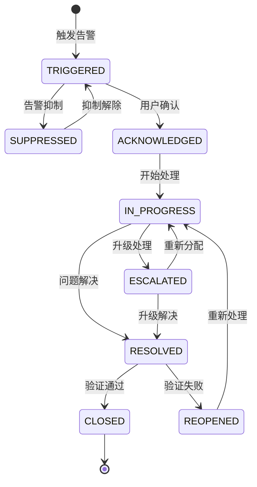

# 功能规格说明书（FSD）

**文档版本**: v1.0.0  
**作者**: BankShield技术团队  
**创建时间**: 2025-12-24  
**最后修订**: 2025-12-24  

## 修订历史

| 版本 | 修订日期 | 修订人 | 修订内容 |
|------|----------|--------|----------|
| v1.0.0 | 2025-12-24 | 技术团队 | 初始版本 |

## 目录

1. [详细功能流程](#详细功能流程)
2. [状态机设计](#状态机设计)
3. [数据字典](#数据字典)
4. [接口规范](#接口规范)
5. [算法说明](#算法说明)
6. [错误处理](#错误处理)
7. [性能优化](#性能优化)
8. [术语表](#术语表)

## 详细功能流程

### 1. 用户登录功能

#### 1.1 流程描述

**用户登录功能**是整个系统的入口，负责用户身份认证和权限初始化，采用JWT双Token机制确保安全性。

#### 1.2 详细流程步骤



#### 1.3 输入输出规范

**请求参数:**
```json
{
    "username": "string, required, 3-20位字母数字",
    "password": "string, required, 6-20位字符",
    "captcha": "string, optional, 验证码",
    "rememberMe": "boolean, optional, 记住我"
}
```

**响应数据:**
```json
{
    "code": 200,
    "message": "success",
    "data": {
        "accessToken": "eyJhbGciOiJIUzUxMiJ9...",
        "refreshToken": "eyJhbGciOiJIUzUxMiJ9...",
        "tokenType": "Bearer",
        "expiresIn": 1800,
        "user": {
            "id": 1,
            "username": "admin",
            "realName": "管理员",
            "email": "admin@bankshield.com",
            "roles": ["ROLE_ADMIN"],
            "permissions": ["user:create", "user:update", ...]
        }
    }
}
```

#### 1.4 安全机制

1. **密码安全**
   - 使用BCrypt算法加密存储
   - 密码强度要求：大小写字母+数字+特殊字符
   - 定期密码过期提醒（90天）

2. **防暴力破解**
   - 登录失败5次锁定账户15分钟
   - IP维度限制：每小时最多10次失败
   - 图形验证码验证（可选开启）

3. **Token安全**
   - accessToken有效期30分钟
   - refreshToken有效期7天
   - Token签名使用HS512算法
   - 支持Token黑名单机制

### 2. 密钥轮换功能

#### 2.1 流程描述

**密钥轮换功能**确保加密密钥的定期更新，降低密钥泄露风险，支持自动和手动两种触发方式。

#### 2.2 详细流程步骤



#### 2.3 密钥状态转换



#### 2.4 轮换策略配置

**自动轮换策略:**
```yaml
rotation:
  enabled: true
  schedule: "0 0 2 * * ?"  # 每天凌晨2点
  advance_days: 30         # 提前30天轮换
  grace_period: 7          # 7天宽限期
  destroy_delay: 30        # 30天后销毁
  max_retry: 3             # 最大重试次数
  notification:
    enabled: true
    channels: ["email", "webhook"]
    recipients: ["security@bankshield.com"]
```

**手动轮换参数:**
```json
{
    "keyId": 123,
    "reason": "安全事件响应轮换",
    "immediate": false,
    "notification": true,
    "approvalRequired": true
}
```

### 3. 数据脱敏功能

#### 3.1 流程描述

**数据脱敏功能**根据配置的脱敏规则，对敏感数据进行实时脱敏处理，确保不同角色的用户看到适当的数据内容。

#### 3.2 详细流程步骤



#### 3.3 脱敏算法实现

**1. 部分掩码算法 (PARTIAL_MASK)**
```sql
-- 手机号脱敏
SELECT CONCAT(LEFT(phone, 3), '****', RIGHT(phone, 4)) AS phone
FROM users;

-- 身份证号脱敏  
SELECT CONCAT(LEFT(id_card, 4), '**********', RIGHT(id_card, 4)) AS id_card
FROM users;

-- 姓名脱敏
SELECT CONCAT(LEFT(name, 1), '*', RIGHT(name, 1)) AS name
FROM users;
```

**2. 完全掩码算法 (FULL_MASK)**
```sql
-- 完全掩码
SELECT '******' AS sensitive_field
FROM users;
```

**3. 哈希算法 (HASH)**
```sql
-- SM3哈希
SELECT SM3(sensitive_data) AS hashed_value
FROM users;

-- 带盐哈希
SELECT SM3(CONCAT(sensitive_data, 'salt_key')) AS hashed_value
FROM users;
```

**4. 加密算法 (ENCRYPT)**
```sql
-- SM4加密
SELECT SM4_ENCRYPT(sensitive_data, 'encryption_key') AS encrypted_value
FROM users;

-- 解密（需要密钥）
SELECT SM4_DECRYPT(encrypted_value, 'encryption_key') AS original_value
FROM users;
```

#### 3.4 脱敏规则配置

**规则数据结构:**
```json
{
    "ruleId": 1001,
    "ruleName": "客户信息脱敏规则",
    "description": "适用于客户敏感信息的脱敏处理",
    "priority": 1,
    "conditions": {
        "database": "customer_db",
        "table": "customers",
        "columns": ["phone", "id_card", "email"],
        "userRoles": ["SALES", "CUSTOMER_SERVICE"]
    },
    "actions": {
        "phone": {
            "algorithm": "PARTIAL_MASK",
            "parameters": {
                "prefixLength": 3,
                "suffixLength": 4,
                "maskChar": "*"
            }
        },
        "id_card": {
            "algorithm": "PARTIAL_MASK", 
            "parameters": {
                "prefixLength": 4,
                "suffixLength": 4,
                "maskChar": "*"
            }
        },
        "email": {
            "algorithm": "PARTIAL_MASK",
            "parameters": {
                "prefixLength": 2,
                "suffixLength": 2,
                "maskChar": "*"
            }
        }
    },
    "exceptions": {
        "adminRoles": ["ADMIN", "SECURITY_ADMIN"],
        "specificUsers": ["manager1", "director1"]
    },
    "enabled": true,
    "createdAt": "2025-12-24T10:00:00Z",
    "updatedAt": "2025-12-24T10:00:00Z"
}
```

## 状态机设计

### 1. 用户状态机



**状态转换规则:**

| 当前状态 | 触发事件 | 下一状态 | 条件 | 操作 |
|----------|----------|----------|------|------|
| PENDING | 邮箱验证 | ACTIVE | 验证链接有效 | 发送欢迎邮件 |
| ACTIVE | 登录失败 | LOCKED | 连续失败5次 | 发送锁定通知 |
| LOCKED | 时间流逝 | ACTIVE | 15分钟后 | 自动解锁 |
| ACTIVE | 管理员操作 | DISABLED | 管理员权限 | 记录禁用原因 |
| DISABLED | 管理员操作 | ACTIVE | 管理员权限 | 发送恢复通知 |

### 2. 密钥状态机



### 3. 告警状态机



## 数据字典

### 1. 用户相关数据字典

#### 1.1 用户状态 (user_status)
| 代码 | 名称 | 描述 |
|------|------|------|
| 0 | DISABLED | 禁用 |
| 1 | ACTIVE | 启用 |
| 2 | LOCKED | 锁定 |
| 3 | PENDING | 待激活 |
| 4 | EXPIRED | 过期 |
| 5 | SUSPENDED | 暂停 |

#### 1.2 用户类型 (user_type)
| 代码 | 名称 | 描述 |
|------|------|------|
| 1 | LOCAL | 本地用户 |
| 2 | LDAP | LDAP用户 |
| 3 | OAUTH | OAuth用户 |
| 4 | SAML | SAML用户 |

### 2. 密钥相关数据字典

#### 2.1 密钥类型 (key_type)
| 代码 | 名称 | 描述 | 算法标准 |
|------|------|------|----------|
| SM2 | SM2 | 国密非对称加密 | GM/T 0003.2-2012 |
| SM3 | SM3 | 国密哈希算法 | GM/T 0004-2012 |
| SM4 | SM4 | 国密对称加密 | GM/T 0002-2012 |
| AES | AES | 高级加密标准 | FIPS PUB 197 |
| RSA | RSA | RSA加密算法 | PKCS#1 |
| ECC | ECC | 椭圆曲线加密 | SEC1 |

#### 2.2 密钥状态 (key_status)
| 代码 | 名称 | 描述 |
|------|------|------|
| 0 | GENERATED | 已生成 |
| 1 | ACTIVE | 活跃 |
| 2 | ROTATING | 轮换中 |
| 3 | INACTIVE | 非活跃 |
| 4 | DISABLED | 已禁用 |
| 5 | EXPIRED | 已过期 |
| 6 | DESTROYED | 已销毁 |

#### 2.3 密钥用途 (key_purpose)
| 代码 | 名称 | 描述 |
|------|------|------|
| ENCRYPT | 加密 | 数据加密 |
| DECRYPT | 解密 | 数据解密 |
| SIGN | 签名 | 数字签名 |
| VERIFY | 验证 | 签名验证 |
| WRAP | 包装 | 密钥包装 |
| UNWRAP | 解包 | 密钥解包 |

### 3. 数据分类数据字典

#### 3.1 数据级别 (data_level)
| 代码 | 名称 | 描述 | 保护要求 |
|------|------|------|----------|
| 1 | PUBLIC | 公开 | 无需特殊保护 |
| 2 | INTERNAL | 内部 | 基础保护 |
| 3 | CONFIDENTIAL | 机密 | 严格保护 |
| 4 | SECRET | 绝密 | 最高级别保护 |

#### 3.2 脱敏算法 (desens_algorithm)
| 代码 | 名称 | 描述 | 可逆性 |
|------|------|------|--------|
| NONE | 无脱敏 | 原始数据 | 可逆 |
| PARTIAL_MASK | 部分掩码 | 部分信息隐藏 | 不可逆 |
| FULL_MASK | 完全掩码 | 完全信息隐藏 | 不可逆 |
| HASH | 哈希处理 | 单向哈希 | 不可逆 |
| ENCRYPT | 加密处理 | 对称加密 | 可逆 |
| TOKENIZE | 令牌化 | 替换为令牌 | 可逆 |

### 4. 告警相关数据字典

#### 4.1 告警级别 (alert_level)
| 代码 | 名称 | 描述 | 响应时间 | 处理时间 |
|------|------|------|----------|----------|
| INFO | 信息 | 一般信息 | - | - |
| WARNING | 警告 | 需要注意 | 4小时 | 24小时 |
| CRITICAL | 严重 | 需要处理 | 1小时 | 4小时 |
| EMERGENCY | 紧急 | 立即处理 | 15分钟 | 1小时 |

#### 4.2 告警状态 (alert_status)
| 代码 | 名称 | 描述 |
|------|------|------|
| 0 | TRIGGERED | 已触发 |
| 1 | ACKNOWLEDGED | 已确认 |
| 2 | IN_PROGRESS | 处理中 |
| 3 | SUPPRESSED | 已抑制 |
| 4 | RESOLVED | 已解决 |
| 5 | CLOSED | 已关闭 |
| 6 | REOPENED | 重新打开 |
| 7 | ESCALATED | 已升级 |

### 5. 审计相关数据字典

#### 5.1 操作类型 (operation_type)
| 代码 | 名称 | 描述 |
|------|------|------|
| CREATE | 创建 | 新增操作 |
| UPDATE | 更新 | 修改操作 |
| DELETE | 删除 | 删除操作 |
| QUERY | 查询 | 查询操作 |
| LOGIN | 登录 | 用户登录 |
| LOGOUT | 登出 | 用户登出 |
| EXPORT | 导出 | 数据导出 |
| IMPORT | 导入 | 数据导入 |
| CONFIG | 配置 | 系统配置 |

#### 5.2 资源类型 (resource_type)
| 代码 | 名称 | 描述 |
|------|------|------|
| USER | 用户 | 用户管理 |
| ROLE | 角色 | 角色管理 |
| PERMISSION | 权限 | 权限管理 |
| KEY | 密钥 | 密钥管理 |
| DATA | 数据 | 数据管理 |
| SYSTEM | 系统 | 系统配置 |
| AUDIT | 审计 | 审计日志 |
| ALERT | 告警 | 告警管理 |

## 接口规范

### 1. RESTful API规范

#### 1.1 统一响应格式

```json
{
    "code": 200,
    "message": "success",
    "data": {},
    "timestamp": "2025-12-24T10:00:00Z",
    "requestId": "550e8400-e29b-41d4-a716-446655440000",
    "path": "/api/users",
    "method": "GET"
}
```

#### 1.2 分页参数规范

```json
{
    "page": 1,
    "size": 10,
    "sort": "createdAt,desc",
    "total": 100,
    "pages": 10,
    "list": []
}
```

#### 1.3 错误码定义

| 错误码 | 描述 | 说明 |
|--------|------|------|
| 200 | 成功 | 操作成功 |
| 400 | 参数错误 | 请求参数不合法 |
| 401 | 未认证 | 需要登录认证 |
| 403 | 无权限 | 没有操作权限 |
| 404 | 资源不存在 | 请求的资源不存在 |
| 409 | 冲突 | 资源冲突 |
| 429 | 请求过频 | 触发限流 |
| 500 | 系统错误 | 内部服务器错误 |
| 503 | 服务不可用 | 服务暂时不可用 |

### 2. 重要接口定义

#### 2.1 认证接口

**用户登录**
```
POST /auth/login
Content-Type: application/json

{
    "username": "admin",
    "password": "password123",
    "captcha": "abc123",
    "rememberMe": true
}
```

**Token刷新**
```
POST /auth/refresh
Authorization: Bearer {refresh_token}
Content-Type: application/json

{
    "refreshToken": "eyJhbGciOiJIUzUxMiJ9..."
}
```

#### 2.2 用户管理接口

**创建用户**
```
POST /api/users
Authorization: Bearer {access_token}
Content-Type: application/json

{
    "username": "newuser",
    "password": "password123",
    "realName": "新用户",
    "email": "newuser@bankshield.com",
    "phone": "13800138000",
    "roleIds": [1, 2],
    "departmentId": 1,
    "status": 1
}
```

**分页查询用户**
```
GET /api/users?page=1&size=10&sort=createdAt,desc&username=admin&status=1
Authorization: Bearer {access_token}
```

#### 2.3 密钥管理接口

**生成密钥**
```
POST /api/keys
Authorization: Bearer {access_token}
Content-Type: application/json

{
    "keyType": "SM4",
    "keySize": 128,
    "purpose": "ENCRYPT",
    "algorithm": "SM4/CBC/PKCS7Padding",
    "validityDays": 365,
    "description": "客户数据加密密钥"
}
```

**密钥轮换**
```
POST /api/keys/{keyId}/rotate
Authorization: Bearer {access_token}
Content-Type: application/json

{
    "reason": "定期轮换",
    "immediate": false,
    "notification": true
}
```

#### 2.4 脱敏接口

**应用脱敏规则**
```
POST /api/desens/apply
Authorization: Bearer {access_token}
Content-Type: application/json

{
    "sql": "SELECT name, phone, id_card FROM customers",
    "database": "customer_db",
    "userId": 123
}
```

**测试脱敏效果**
```
POST /api/desens/test
Authorization: Bearer {access_token}
Content-Type: application/json

{
    "algorithm": "PARTIAL_MASK",
    "data": "张三",
    "parameters": {
        "prefixLength": 1,
        "suffixLength": 1,
        "maskChar": "*"
    }
}
```

#### 2.5 审计接口

**查询审计日志**
```
GET /api/audit/logs?startTime=2025-12-01&endTime=2025-12-24&userId=123&operationType=LOGIN&page=1&size=20
Authorization: Bearer {access_token}
```

**导出审计报告**
```
POST /api/audit/export
Authorization: Bearer {access_token}
Content-Type: application/json

{
    "startTime": "2025-12-01T00:00:00Z",
    "endTime": "2025-12-24T23:59:59Z",
    "format": "PDF",
    "template": "compliance_report",
    "userIds": [123, 456],
    "operationTypes": ["CREATE", "UPDATE", "DELETE"]
}
```

### 3. 接口安全规范

#### 3.1 认证机制
- 使用JWT Bearer Token认证
- Token有效期：accessToken=30分钟，refreshToken=7天
- 支持Token刷新机制
- 支持Token撤销机制

#### 3.2 签名验证
```
POST /api/secure/data
Content-Type: application/json
X-Timestamp: 1640323200
X-Nonce: random_string
X-Signature: calculated_signature

{
    "data": "request_body"
}
```

**签名算法:**
```
signature = HMAC-SHA256(
    secret_key,
    timestamp + nonce + method + path + body
)
```

#### 3.3 速率限制

**默认限制:**
- IP维度：100次/分钟
- 用户维度：200次/分钟  
- 接口维度：50次/分钟

**响应头信息:**
```
X-RateLimit-Limit: 100
X-RateLimit-Remaining: 95
X-RateLimit-Reset: 1640323260
```

## 算法说明

### 1. 国密算法实现

#### 1.1 SM2非对称加密

**密钥生成:**
```java
public KeyPair generateSM2KeyPair() {
    ECGenParameterSpec sm2Spec = new ECGenParameterSpec("sm2p256v1");
    KeyPairGenerator keyPairGenerator = KeyPairGenerator.getInstance("EC", "BC");
    keyPairGenerator.initialize(sm2Spec, new SecureRandom());
    return keyPairGenerator.generateKeyPair();
}
```

**签名验签:**
```java
public byte[] signSM2(byte[] data, PrivateKey privateKey) {
    Signature signature = Signature.getInstance("SM3withSM2", "BC");
    signature.initSign(privateKey);
    signature.update(data);
    return signature.sign();
}

public boolean verifySM2(byte[] data, byte[] sign, PublicKey publicKey) {
    Signature signature = Signature.getInstance("SM3withSM2", "BC");
    signature.initVerify(publicKey);
    signature.update(data);
    return signature.verify(sign);
}
```

#### 1.2 SM3哈希算法

**哈希计算:**
```java
public byte[] hashSM3(byte[] data) {
    MessageDigest digest = MessageDigest.getInstance("SM3", "BC");
    digest.update(data);
    return digest.digest();
}
```

#### 1.3 SM4对称加密

**加密解密:**
```java
public byte[] encryptSM4(byte[] data, byte[] key) {
    Cipher cipher = Cipher.getInstance("SM4/CBC/PKCS7Padding", "BC");
    SecretKeySpec keySpec = new SecretKeySpec(key, "SM4");
    IvParameterSpec ivSpec = new IvParameterSpec(generateIV());
    cipher.init(Cipher.ENCRYPT_MODE, keySpec, ivSpec);
    return cipher.doFinal(data);
}

public byte[] decryptSM4(byte[] encryptedData, byte[] key, byte[] iv) {
    Cipher cipher = Cipher.getInstance("SM4/CBC/PKCS7Padding", "BC");
    SecretKeySpec keySpec = new SecretKeySpec(key, "SM4");
    IvParameterSpec ivSpec = new IvParameterSpec(iv);
    cipher.init(Cipher.DECRYPT_MODE, keySpec, ivSpec);
    return cipher.doFinal(encryptedData);
}
```

### 2. 脱敏算法实现

#### 2.1 部分掩码算法

```java
public String partialMask(String data, int prefixLength, int suffixLength, char maskChar) {
    if (data == null || data.length() <= prefixLength + suffixLength) {
        return repeatChar(maskChar, data == null ? 0 : data.length());
    }
    
    String prefix = data.substring(0, prefixLength);
    String suffix = data.substring(data.length() - suffixLength);
    int maskLength = data.length() - prefixLength - suffixLength;
    
    return prefix + repeatChar(maskChar, maskLength) + suffix;
}

private String repeatChar(char ch, int count) {
    return String.valueOf(ch).repeat(Math.max(0, count));
}
```

#### 2.2 格式保留加密 (FPE)

```java
public String formatPreservingEncrypt(String data, String key) {
    // 使用FF1模式进行格式保留加密
    Cipher cipher = Cipher.getInstance("AES/FF1/NoPadding", "BC");
    SecretKeySpec keySpec = new SecretKeySpec(key.getBytes(), "AES");
    
    // 设置FF1参数
    FPEParameterSpec paramSpec = new FPEParameterSpec(
        data.length(), // 输入长度
        "0123456789",  // 字符域
        new byte[0]    // 调整向量
    );
    
    cipher.init(Cipher.ENCRYPT_MODE, keySpec, paramSpec);
    byte[] encrypted = cipher.doFinal(data.getBytes());
    return new String(encrypted);
}
```

### 3. 密钥派生算法

#### 3.1 PBKDF2密钥派生

```java
public byte[] deriveKey(String password, byte[] salt, int iterations, int keyLength) {
    PBEKeySpec spec = new PBEKeySpec(
        password.toCharArray(),
        salt,
        iterations,
        keyLength * 8 // 转换为位数
    );
    
    SecretKeyFactory factory = SecretKeyFactory.getInstance("PBKDF2WithHmacSM3", "BC");
    SecretKey key = factory.generateSecret(spec);
    return key.getEncoded();
}
```

#### 3.2 密钥协商算法

```java
public byte[] generateSharedSecret(PrivateKey privateKey, PublicKey publicKey) {
    KeyAgreement keyAgreement = KeyAgreement.getInstance("SM2", "BC");
    keyAgreement.init(privateKey);
    keyAgreement.doPhase(publicKey, true);
    return keyAgreement.generateSecret();
}
```

## 错误处理

### 1. 错误分类

#### 1.1 业务错误

| 错误码 | 错误类型 | 描述 | 处理方式 |
|--------|----------|------|----------|
| B001 | 用户不存在 | 用户名不存在 | 返回通用错误信息 |
| B002 | 密码错误 | 密码验证失败 | 记录失败次数 |
| B003 | 权限不足 | 没有操作权限 | 返回403错误 |
| B004 | 数据不存在 | 请求的资源不存在 | 返回404错误 |
| B005 | 数据冲突 | 违反唯一约束 | 返回409错误 |

#### 1.2 系统错误

| 错误码 | 错误类型 | 描述 | 处理方式 |
|--------|----------|------|----------|
| S001 | 数据库错误 | 数据库连接/查询失败 | 重试机制 |
| S002 | 缓存错误 | Redis连接失败 | 降级处理 |
| S003 | 加密错误 | 加密算法异常 | 记录日志并告警 |
| S004 | 网络错误 | 网络连接超时 | 重试机制 |
| S005 | 文件系统错误 | 文件读写失败 | 备份方案 |

### 2. 异常处理机制

#### 2.1 全局异常处理

```java
@RestControllerAdvice
public class GlobalExceptionHandler {
    
    @ExceptionHandler(BusinessException.class)
    public ResponseEntity<Result<Void>> handleBusinessException(BusinessException e) {
        log.warn("业务异常: {}", e.getMessage(), e);
        return ResponseEntity.badRequest()
            .body(Result.fail(e.getCode(), e.getMessage()));
    }
    
    @ExceptionHandler(SystemException.class)
    public ResponseEntity<Result<Void>> handleSystemException(SystemException e) {
        log.error("系统异常: {}", e.getMessage(), e);
        // 发送告警通知
        alertService.sendAlert(e);
        return ResponseEntity.status(HttpStatus.INTERNAL_SERVER_ERROR)
            .body(Result.fail("S000", "系统繁忙，请稍后重试"));
    }
    
    @ExceptionHandler(Exception.class)
    public ResponseEntity<Result<Void>> handleUnknownException(Exception e) {
        log.error("未知异常: {}", e.getMessage(), e);
        return ResponseEntity.status(HttpStatus.INTERNAL_SERVER_ERROR)
            .body(Result.fail("S999", "未知错误，请联系管理员"));
    }
}
```

#### 2.2 重试机制

```java
@Retryable(
    value = {DataAccessException.class, ConnectException.class},
    maxAttempts = 3,
    backoff = @Backoff(delay = 1000, multiplier = 2)
)
public User getUserById(Long id) {
    return userRepository.findById(id)
        .orElseThrow(() -> new BusinessException("B004", "用户不存在"));
}

@Recover
public User recover(DataAccessException e, Long id) {
    log.error("数据库查询失败，从缓存获取用户: {}", id, e);
    return userCacheService.getUserFromCache(id)
        .orElseThrow(() -> new SystemException("S001", "数据库不可用"));
}
```

### 3. 错误日志规范

#### 3.1 日志格式

```
2025-12-24 10:00:00.123 [ERROR] [thread-name] [request-id] com.bankshield.service.UserService - 
用户登录失败: username=admin, ip=192.168.1.100, reason=密码错误, 
errorCode=B002, exception=BusinessException: 密码验证失败
at com.bankshield.service.UserService.login(UserService.java:45)
at com.bankshield.controller.AuthController.login(AuthController.java:32)
```

#### 3.2 日志级别

| 级别 | 使用场景 | 记录内容 |
|------|----------|----------|
| DEBUG | 开发调试 | 详细参数、返回值 |
| INFO | 业务流程 | 关键操作、状态变化 |
| WARN | 警告信息 | 业务异常、可恢复错误 |
| ERROR | 错误信息 | 系统异常、需要处理 |

## 性能优化

### 1. 数据库优化

#### 1.1 索引优化

```sql
-- 用户表索引
CREATE INDEX idx_users_username ON users(username);
CREATE INDEX idx_users_email ON users(email);
CREATE INDEX idx_users_status ON users(status);
CREATE INDEX idx_users_created_at ON users(created_at);

-- 审计日志表索引
CREATE INDEX idx_audit_logs_user_id ON audit_logs(user_id);
CREATE INDEX idx_audit_logs_operation_time ON audit_logs(operation_time);
CREATE INDEX idx_audit_logs_resource_type ON audit_logs(resource_type);
CREATE INDEX idx_audit_logs_operation_type ON audit_logs(operation_type);

-- 复合索引
CREATE INDEX idx_audit_logs_composite ON audit_logs(user_id, operation_time, resource_type);
```

#### 1.2 查询优化

```java
@Query("SELECT u FROM User u LEFT JOIN FETCH u.roles WHERE u.username = :username")
Optional<User> findByUsernameWithRoles(@Param("username") String username);

@Query(value = "SELECT * FROM users WHERE created_at >= :startTime AND status = :status",
       countQuery = "SELECT count(*) FROM users WHERE created_at >= :startTime AND status = :status",
       nativeQuery = true)
Page<User> findUsersByTimeRange(@Param("startTime") LocalDateTime startTime, 
                               @Param("status") Integer status, 
                               Pageable pageable);
```

### 2. 缓存优化

#### 2.1 Redis缓存策略

```java
@Configuration
@EnableCaching
public class CacheConfig {
    
    @Bean
    public CacheManager cacheManager(RedisConnectionFactory factory) {
        RedisCacheConfiguration config = RedisCacheConfiguration.defaultCacheConfig()
            .serializeKeysWith(RedisSerializationContext.SerializationPair.fromSerializer(new StringRedisSerializer()))
            .serializeValuesWith(RedisSerializationContext.SerializationPair.fromSerializer(new GenericJackson2JsonRedisSerializer()))
            .entryTtl(Duration.ofMinutes(30))
            .disableCachingNullValues();
        
        return RedisCacheManager.builder(factory)
            .cacheDefaults(config)
            .withCacheConfiguration("users", 
                config.entryTtl(Duration.ofMinutes(10)))
            .withCacheConfiguration("permissions", 
                config.entryTtl(Duration.ofHours(1)))
            .withCacheConfiguration("keys", 
                config.entryTtl(Duration.ofMinutes(5)))
            .build();
    }
}
```

#### 2.2 缓存注解使用

```java
@Service
public class UserService {
    
    @Cacheable(value = "users", key = "#username", unless = "#result == null")
    public User getUserByUsername(String username) {
        return userRepository.findByUsername(username)
            .orElseThrow(() -> new BusinessException("B001", "用户不存在"));
    }
    
    @CacheEvict(value = "users", key = "#user.username")
    public void updateUser(User user) {
        userRepository.save(user);
    }
    
    @CacheEvict(value = "users", allEntries = true)
    public void refreshAllUsers() {
        // 刷新所有用户缓存
    }
}
```

### 3. 并发优化

#### 3.1 连接池配置

```yaml
spring:
  datasource:
    hikari:
      maximum-pool-size: 50
      minimum-idle: 10
      idle-timeout: 300000
      max-lifetime: 1200000
      connection-timeout: 20000
      validation-timeout: 5000
      leak-detection-threshold: 60000
  
  redis:
    lettuce:
      pool:
        max-active: 100
        max-idle: 50
        min-idle: 10
        max-wait: 5000ms
```

#### 3.2 异步处理

```java
@Service
public class AsyncService {
    
    @Async("taskExecutor")
    public CompletableFuture<AuditLog> saveAuditLogAsync(AuditLog log) {
        AuditLog saved = auditLogRepository.save(log);
        return CompletableFuture.completedFuture(saved);
    }
    
    @Async("scheduledTaskExecutor")
    public void rotateKeysAsync() {
        List<Key> keys = keyService.getKeysNeedRotation();
        keys.parallelStream().forEach(key -> {
            try {
                keyService.rotateKey(key.getId());
            } catch (Exception e) {
                log.error("密钥轮换失败: {}", key.getId(), e);
            }
        });
    }
}
```

### 4. JVM优化

#### 4.1 GC调优参数

```bash
# JVM启动参数
-Xms8g -Xmx8g
-XX:NewRatio=2
-XX:SurvivorRatio=8
-XX:MaxGCPauseMillis=200
-XX:+UseG1GC
-XX:G1HeapRegionSize=16m
-XX:G1NewSizePercent=20
-XX:G1MaxNewSizePercent=30
-XX:G1HeapWastePercent=5
-XX:G1MixedGCCountTarget=8
-XX:G1OldCSetRegionThreshold=5
```

#### 4.2 内存配置

```yaml
server:
  tomcat:
    max-connections: 8000
    accept-count: 100
    max-threads: 400
    min-spare-threads: 50
    connection-timeout: 20000ms
```

## 术语表

| 术语 | 英文全称 | 中文解释 |
|------|----------|----------|
| FSD | Functional Specification Document | 功能规格说明书 |
| API | Application Programming Interface | 应用程序接口 |
| JWT | JSON Web Token | JSON网络令牌 |
| BCrypt | Blowfish Crypt | 密码哈希算法 |
| SM2/3/4 | ShangMi Algorithm | 国密算法 |
| RBAC | Role-Based Access Control | 基于角色的访问控制 |
| SQL | Structured Query Language | 结构化查询语言 |
| CBC | Cipher Block Chaining | 密码块链接模式 |
| PKCS | Public Key Cryptography Standards | 公钥密码学标准 |
| FPE | Format Preserving Encryption | 格式保留加密 |
| PBKDF2 | Password-Based Key Derivation Function 2 | 基于密码的密钥派生函数 |
| HSM | Hardware Security Module | 硬件安全模块 |
| GC | Garbage Collection | 垃圾回收 |
| G1 | Garbage First | 垃圾优先回收器 |
| JPA | Java Persistence API | Java持久化API |
| Redis | Remote Dictionary Server | 远程字典服务 |
| RPO | Recovery Point Objective | 恢复点目标 |
| RTO | Recovery Time Objective | 恢复时间目标 |