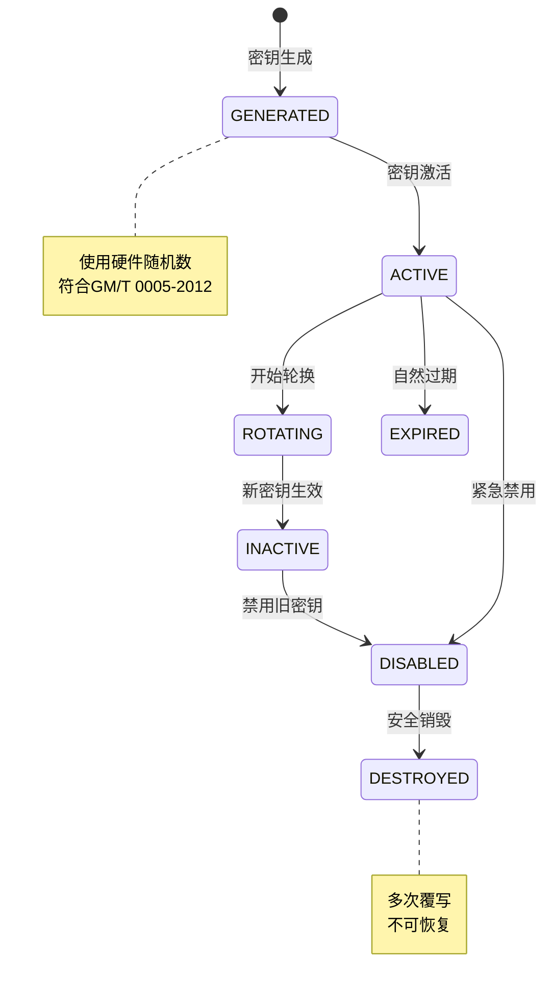
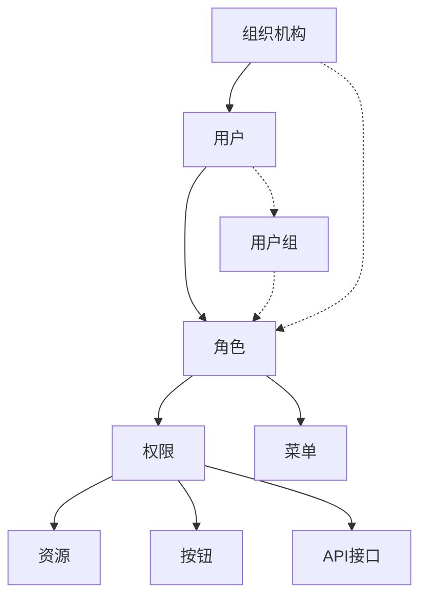
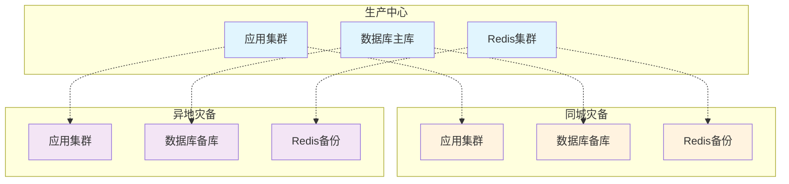
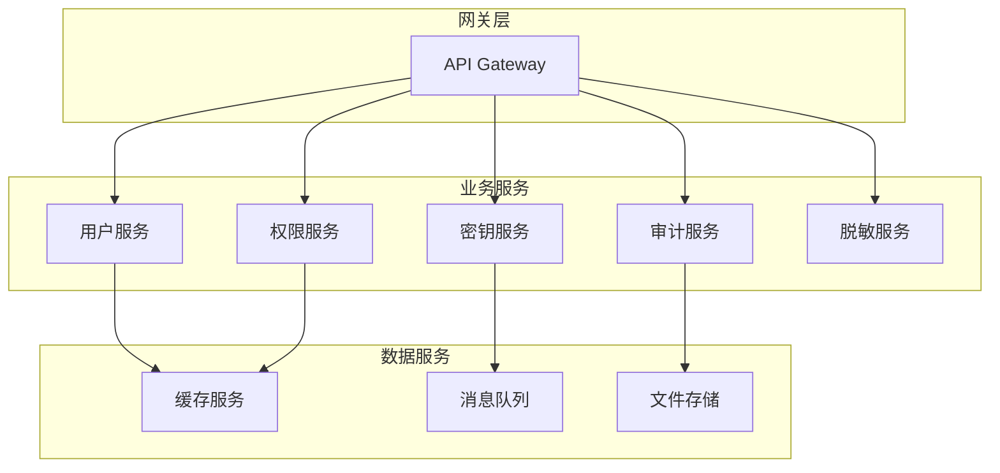
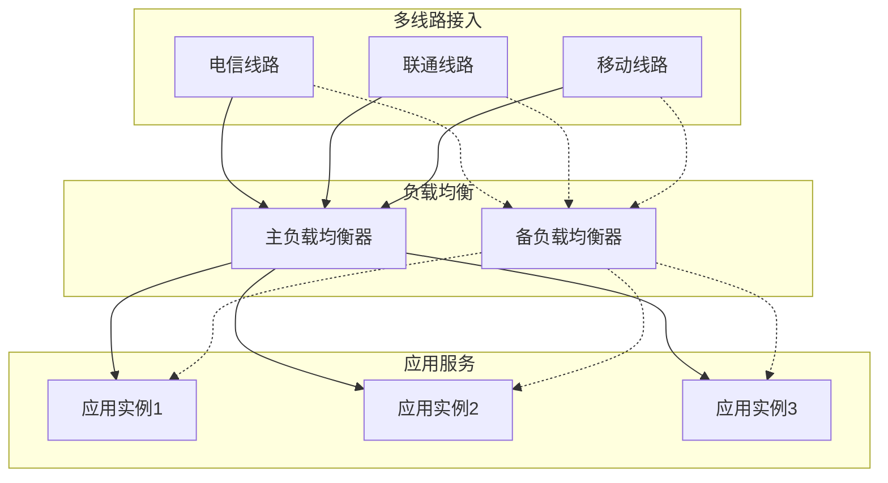
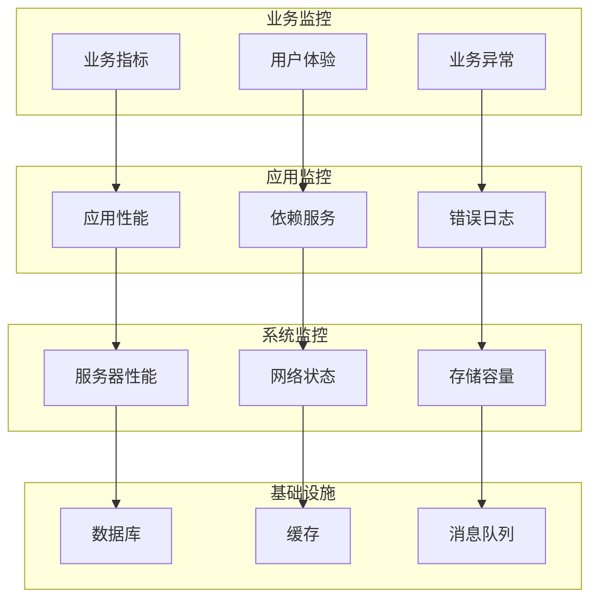

# 非功能性需求文档（NFR）

**文档版本**: v1.0.0  
**作者**: BankShield架构团队  
**创建时间**: 2025-12-24  
**最后修订**: 2025-12-24  

## 修订历史

| 版本 | 修订日期 | 修订人 | 修订内容 |
|------|----------|--------|----------|
| v1.0.0 | 2025-12-24 | 架构团队 | 初始版本 |

## 目录

1. [性能需求](#性能需求)
2. [安全性需求](#安全性需求)
3. [可用性需求](#可用性需求)
4. [可扩展性需求](#可扩展性需求)
5. [兼容性需求](#兼容性需求)
6. [可维护性需求](#可维护性需求)
7. [可靠性需求](#可靠性需求)
8. [测试标准](#测试标准)
9. [监控告警](#监控告警)
10. [术语表](#术语表)

## 性能需求

### 1.1 响应时间指标

| 指标类型 | 目标值 | 测量方法 | 测试条件 | 优先级 |
|----------|--------|----------|----------|--------|
| API响应时间 | <100ms | JMeter压测 | 95th percentile | P0 |
| 页面加载时间 | <2s | Lighthouse | 3G网络 | P0 |
| 数据库查询 | <50ms | 慢查询日志 | 单表查询 | P1 |
| 复杂报表生成 | <5s | 实际测试 | 10万条数据 | P1 |
| 文件上传 | <10s | 实际测试 | 10MB文件 | P2 |
| 批量导入 | <30s | 实际测试 | 1万条记录 | P2 |

### 1.2 吞吐量指标

| 指标类型 | 目标值 | 测量方法 | 测试场景 | 优先级 |
|----------|--------|----------|----------|--------|
| 并发用户数 | 1000+ | JMeter压测 | 登录+查询 | P0 |
| 每秒事务数(TPS) | 5000 | k6测试 | 混合业务场景 | P0 |
| 每秒查询数(QPS) | 10000 | 压测工具 | 只读查询 | P1 |
| 峰值处理能力 | 10000 TPS | 压力测试 | 5分钟持续 | P1 |
| 消息队列处理 | 5000 msg/s | 实际测试 | 异步处理 | P2 |

### 1.3 资源利用率

| 资源类型 | 目标值 | 监控工具 | 告警阈值 | 优先级 |
|----------|--------|----------|----------|--------|
| CPU使用率 | <70% | Prometheus | 80% | P0 |
| 内存使用率 | <80% | Prometheus | 90% | P0 |
| 磁盘使用率 | <85% | Prometheus | 90% | P1 |
| 网络带宽 | <70% | 系统监控 | 85% | P2 |
| 数据库连接 | <80% | 连接池监控 | 90% | P1 |
| Redis内存 | <80% | Redis监控 | 90% | P1 |

### 1.4 性能测试场景

#### 1.4.1 基准测试
```yaml
# 基准测试配置
test_scenario:
  name: "基准性能测试"
  duration: "30分钟"
  ramp_up: "5分钟"
  concurrent_users: 1000
  
  test_cases:
    - name: "用户登录"
      percentage: 20%
      api: "POST /auth/login"
      
    - name: "数据查询"
      percentage: 50%
      api: "GET /api/users"
      
    - name: "数据创建"
      percentage: 20%
      api: "POST /api/users"
      
    - name: "报表生成"
      percentage: 10%
      api: "POST /api/reports/generate"
```

#### 1.4.2 压力测试
```yaml
# 压力测试配置  
test_scenario:
  name: "压力测试"
  duration: "60分钟"
  load_pattern: "阶梯递增"
  
  stages:
    - duration: "10分钟"
      users: 500
      rps: 1000
      
    - duration: "10分钟"
      users: 1000
      rps: 2000
      
    - duration: "10分钟"
      users: 2000
      rps: 4000
      
    - duration: "30分钟"
      users: 3000
      rps: 6000
```

#### 1.4.3 稳定性测试
```yaml
# 稳定性测试配置
test_scenario:
  name: "稳定性测试"
  duration: "7天"
  concurrent_users: 1000
  target_rps: 2000
  
  monitoring:
    - memory_usage
    - cpu_usage
    - response_time
    - error_rate
    - garbage_collection
```

### 1.5 性能优化要求

#### 1.5.1 数据库优化
- 所有查询必须走索引
- 单表数据量超过100万必须分表
- 复杂查询响应时间<100ms
- 支持读写分离和分库分表

#### 1.5.2 缓存优化
- 热点数据缓存命中率>90%
- 缓存穿透率<5%
- 缓存雪崩恢复时间<30s
- 支持分布式缓存

#### 1.5.3 前端优化
- 首屏加载时间<2s
- 静态资源缓存时间>1天
- 支持CDN加速
- 图片懒加载

## 安全性需求

### 2.1 加密算法要求

#### 2.1.1 国密算法合规
| 算法类型 | 标准编号 | 密钥长度 | 用途 | 合规要求 |
|----------|----------|----------|------|----------|
| SM2 | GM/T 0003.2-2012 | 256位 | 非对称加密 | 必须使用 |
| SM3 | GM/T 0004-2012 | 256位 | 哈希算法 | 必须使用 |
| SM4 | GM/T 0002-2012 | 128位 | 对称加密 | 必须使用 |
| SM9 | GM/T 0044-2016 | 256位 | 标识加密 | 推荐使用 |

#### 2.1.2 国际算法兼容
| 算法类型 | 标准编号 | 密钥长度 | 用途 | 兼容性 |
|----------|----------|----------|------|--------|
| AES | FIPS PUB 197 | 128/192/256位 | 对称加密 | 可选 |
| RSA | PKCS#1 | 2048/4096位 | 非对称加密 | 可选 |
| SHA-256 | FIPS PUB 180-4 | 256位 | 哈希算法 | 可选 |
| ECC | SEC1 | 256位 | 椭圆曲线 | 可选 |

### 2.2 密钥管理要求

#### 2.2.1 密钥生命周期


#### 2.2.2 密钥存储要求
- 密钥必须加密存储
- 主密钥存储在HSM中
- 支持密钥分片存储
- 定期备份密钥材料

#### 2.2.3 密钥访问控制
```yaml
key_access_control:
  authentication: "双因子认证"
  authorization: "基于角色授权"
  auditing: "完整访问审计"
  
  roles:
    - name: "密钥管理员"
      permissions: ["生成", "激活", "禁用", "销毁"]
    - name: "密钥操作员"
      permissions: ["使用", "查询"]
    - name: "密钥审计员"
      permissions: ["查看", "审计"]
```

### 2.3 身份认证要求

#### 2.3.1 多因子认证
| 认证因子 | 实现方式 | 安全等级 | 使用场景 |
|----------|----------|----------|----------|
| 知识因子 | 用户名+密码 | 基础 | 所有用户 |
| 持有因子 | 手机验证码 | 增强 | 重要操作 |
| 持有因子 | 硬件令牌 | 高 | 管理员 |
| 生物因子 | 指纹识别 | 高 | 可选支持 |
| 生物因子 | 人脸识别 | 高 | 可选支持 |

#### 2.3.2 密码策略
```yaml
password_policy:
  min_length: 8
  max_length: 32
  complexity:
    - uppercase: 1
    - lowercase: 1
    - digit: 1
    - special: 1
  
  history: 5
  expiration: 90
  lockout:
    attempts: 5
    duration: 15
    
  encryption: "BCrypt"
  iterations: 12
```

### 2.4 访问控制要求

#### 2.4.1 RBAC权限模型


#### 2.4.2 三权分立模型
| 角色 | 权限范围 | 互斥检查 |
|------|----------|----------|
| 系统管理员 | 用户管理、系统配置 | 不能拥有安全/审计权限 |
| 安全管理员 | 密钥管理、安全策略 | 不能拥有系统/审计权限 |
| 审计管理员 | 日志审计、合规检查 | 不能拥有系统/安全权限 |

### 2.5 数据保护要求

#### 2.5.1 传输加密
- 强制使用TLS 1.3
- 禁用弱加密算法
- 证书有效期监控
- 支持证书自动续期

#### 2.5.2 存储加密
```yaml
data_encryption:
  algorithm: "SM4/CBC/PKCS7Padding"
  key_rotation: "90天"
  
  sensitive_fields:
    - "password"
    - "id_card"
    - "phone"
    - "email"
    - "bank_card"
    
  encryption_level:
    - database: "字段级加密"
    - file_system: "文件级加密"
    - backup: "备份加密"
    - log: "敏感信息脱敏"
```

#### 2.5.3 数据脱敏
| 数据类型 | 脱敏算法 | 示例 | 适用场景 |
|----------|----------|------|----------|
| 姓名 | 部分掩码 | 张** | 列表展示 |
| 手机号 | 部分掩码 | 138****5678 | 列表展示 |
| 身份证号 | 部分掩码 | 1101********1234 | 列表展示 |
| 银行卡号 | 部分掩码 | 6222********1234 | 列表展示 |
| 地址 | 部分掩码 | 北京市***** | 列表展示 |

### 2.6 安全审计要求

#### 2.6.1 审计日志内容
```json
{
    "timestamp": "2025-12-24T10:00:00Z",
    "userId": 123,
    "username": "admin",
    "operation": "UPDATE",
    "resourceType": "USER",
    "resourceId": 456,
    "resourceName": "testuser",
    "beforeData": "{\"status\": 1}",
    "afterData": "{\"status\": 0}",
    "ipAddress": "192.168.1.100",
    "userAgent": "Mozilla/5.0...",
    "result": "SUCCESS",
    "errorCode": null,
    "duration": 150,
    "requestId": "550e8400-e29b-41d4-a716-446655440000"
}
```

#### 2.6.2 审计覆盖范围
- 所有用户操作（CRUD）
- 登录/登出事件
- 权限变更操作
- 系统配置变更
- 密钥生命周期事件
- 异常访问行为

#### 2.6.3 审计日志保护
- 日志完整性校验（SM3）
- 日志不可篡改存储
- 定期备份和归档
- 保留期不少于6个月

### 2.7 漏洞防护要求

#### 2.7.1 OWASP Top 10防护
| 漏洞类型 | 防护措施 | 验证方法 |
|----------|----------|----------|
| SQL注入 | 参数化查询 | 代码审查 |
| XSS攻击 | 输入验证输出编码 | 自动化扫描 |
| CSRF攻击 | Token验证 | 渗透测试 |
| 弱加密 | 强加密算法 | 加密测试 |
| 安全 Misconfiguration | 安全配置基线 | 配置检查 |

#### 2.7.2 安全测试要求
```yaml
security_testing:
  static_analysis:
    tools: ["SonarQube", "Fortify"]
    frequency: "每次构建"
    
  dynamic_analysis:
    tools: ["OWASP ZAP", "Burp Suite"]
    frequency: "每月一次"
    
  dependency_check:
    tools: ["Dependency-Check", "Snyk"]
    frequency: "每周一次"
    
  penetration_test:
    scope: "全系统"
    frequency: "每季度一次"
    
  vulnerability_scan:
    tools: ["Nessus", "OpenVAS"]
    frequency: "每月一次"
```

## 可用性需求

### 3.1 系统可用性指标

#### 3.1.1 服务等级协议(SLA)
| 服务等级 | 可用性目标 | 停机时间 | 适用场景 |
|----------|------------|----------|----------|
| 核心服务 | 99.99% | <52.6分钟/年 | 认证、授权 |
| 重要服务 | 99.9% | <8.76小时/年 | 数据查询、审计 |
| 一般服务 | 99.5% | <43.8小时/年 | 报表、统计 |

#### 3.1.2 可用性计算公式
```
可用性 = (总时间 - 停机时间) / 总时间 × 100%

其中：
- 总时间 = 统计周期内的总时间
- 停机时间 = 服务不可用时间
- 计划维护时间不计入停机时间
```

### 3.2 故障恢复要求

#### 3.2.1 恢复目标
| 恢复类型 | 目标值 | 测量方法 | 备注 |
|----------|--------|----------|------|
| RPO | <1小时 | 备份策略 | 数据丢失量 |
| RTO | <15分钟 | 故障演练 | 恢复时间 |
| RCO | <30分钟 | 实际测试 | 完全恢复时间 |

#### 3.2.2 故障分类与处理
| 故障级别 | 描述 | 响应时间 | 解决时间 | 升级机制 |
|----------|------|----------|----------|----------|
| P1-紧急 | 系统不可用 | 5分钟 | 30分钟 | 立即升级 |
| P2-严重 | 核心功能异常 | 15分钟 | 2小时 | 1小时内升级 |
| P3-重要 | 一般功能异常 | 1小时 | 1天 | 4小时内升级 |
| P4-一般 | 非核心问题 | 4小时 | 1周 | 无需升级 |

### 3.3 容灾部署架构

#### 3.3.1 两地三中心架构


#### 3.3.2 容灾能力要求
| 容灾类型 | RPO目标 | RTO目标 | 容灾范围 | 切换方式 |
|----------|---------|---------|----------|----------|
| 本地高可用 | 0秒 | 30秒 | 单点故障 | 自动切换 |
| 同城灾备 | 1分钟 | 5分钟 | 机房级故障 | 自动/手动 |
| 异地灾备 | 1小时 | 30分钟 | 城市级故障 | 手动切换 |

### 3.4 备份恢复策略

#### 3.4.1 备份频率
| 数据类型 | 备份频率 | 保留期 | 存储位置 | 加密要求 |
|----------|----------|--------|----------|----------|
| 数据库 | 每日全量+实时增量 | 30天 | 本地+异地 | 必须加密 |
| 配置文件 | 每次变更 | 90天 | Git仓库 | 必须加密 |
| 日志文件 | 每日增量 | 180天 | 日志服务器 | 必须加密 |
| 密钥材料 | 每次变更 | 永久 | HSM+异地 | 多重加密 |

#### 3.4.2 备份验证
```yaml
backup_validation:
  frequency: "每周一次"
  scope: 
    - "全量备份恢复测试"
    - "增量备份恢复测试"
    - "点时间恢复测试"
    - "异地备份可用性"
  
  success_criteria:
    - "恢复时间 < RTO目标"
    - "数据完整性验证通过"
    - "应用功能正常"
    - "性能指标达标"
```

## 可扩展性需求

### 4.1 水平扩展能力

#### 4.1.1 应用层扩展
```yaml
scalability:
  horizontal_scaling:
    enabled: true
    max_instances: 100
    
    trigger_conditions:
      - "CPU > 70%"
      - "Memory > 80%"
      - "Response Time > 500ms"
      - "Queue Length > 100"
    
    scaling_policy:
      scale_up: "+50% instances"
      scale_down: "-25% instances"
      cooldown: "5 minutes"
```

#### 4.1.2 数据库扩展
| 扩展方式 | 最大容量 | 扩展时间 | 技术方案 |
|----------|----------|----------|----------|
| 读写分离 | 10倍读性能 | 在线扩展 | 主从复制 |
| 分库分表 | 100TB | 计划扩展 | ShardingSphere |
| 分布式数据库 | PB级 | 在线扩展 | TiDB/OceanBase |
| 缓存层扩展 | 100GB | 在线扩展 | Redis集群 |

### 4.2 垂直扩展能力

#### 4.2.1 单机性能扩展
| 资源类型 | 最大配置 | 扩展方式 | 热升级支持 |
|----------|----------|----------|------------|
| CPU | 64核 | 虚拟机扩容 | 支持 |
| 内存 | 256GB | 虚拟机扩容 | 支持 |
| 存储 | 10TB | 云盘扩容 | 支持 |
| 网络 | 10Gbps | 带宽升级 | 支持 |

### 4.3 微服务扩展性

#### 4.3.1 服务拆分原则


#### 4.3.2 服务扩展策略
| 服务类型 | 扩展粒度 | 最大实例 | 负载均衡 |
|----------|----------|----------|----------|
| 无状态服务 | 功能模块 | 100+ | 轮询/权重 |
| 有状态服务 | 数据分片 | 50+ | 一致性哈希 |
| 计算密集型 | CPU核心 | 200+ | 最少连接 |
| IO密集型 | 连接池 | 100+ | 响应时间 |

### 4.4 存储扩展性

#### 4.4.1 分布式存储
```yaml
distributed_storage:
  file_storage:
    type: "对象存储"
    capacity: "无限扩展"
    providers: ["阿里云OSS", "腾讯云COS", "MinIO"]
    
  database_storage:
    type: "分布式数据库"
    capacity: "PB级"
    solutions: ["TiDB", "OceanBase", "PolarDB"]
    
  cache_storage:
    type: "分布式缓存"
    capacity: "TB级"
    solutions: ["Redis Cluster", "Memcached"]
```

## 兼容性需求

### 5.1 浏览器兼容性

#### 5.1.1 支持浏览器列表
| 浏览器 | 最低版本 | 推荐版本 | 测试频率 | 支持级别 |
|--------|----------|----------|----------|----------|
| Chrome | 90 | 最新版 | 每版本 | 完全支持 |
| Firefox | 85 | 最新版 | 每版本 | 完全支持 |
| Safari | 14 | 最新版 | 每版本 | 完全支持 |
| Edge | 90 | 最新版 | 每版本 | 完全支持 |
| IE | 11 | 11 | 重大版本 | 基础支持 |

#### 5.1.2 移动端兼容性
| 平台 | 系统版本 | 浏览器 | 分辨率适配 | 触摸优化 |
|------|----------|--------|------------|----------|
| iOS | 12+ | Safari/Chrome | 完全适配 | 完全支持 |
| Android | 8+ | Chrome | 完全适配 | 完全支持 |
| iPad | iOS 12+ | Safari | 完全适配 | 完全支持 |
| Android Pad | Android 8+ | Chrome | 完全适配 | 完全支持 |

### 5.2 操作系统兼容性

#### 5.2.1 服务器操作系统
| 操作系统 | 版本范围 | 架构 | 支持级别 | 备注 |
|----------|----------|------|----------|------|
| CentOS | 7.x - 8.x | x86_64 | 完全支持 | 推荐 |
| Ubuntu | 18.04 - 22.04 | x86_64 | 完全支持 | 推荐 |
| RedHat | 7.x - 8.x | x86_64 | 完全支持 | 商业支持 |
| Windows Server | 2016 - 2022 | x86_64 | 基础支持 | 测试用 |

#### 5.2.2 客户端操作系统
| 操作系统 | 版本范围 | 支持级别 | 备注 |
|----------|----------|----------|------|
| Windows | 7 - 11 | 完全支持 | 主流版本 |
| macOS | 10.14 - 13 | 完全支持 | 主流版本 |
| Linux桌面 | Ubuntu/CentOS | 基础支持 | 主流发行版 |

### 5.3 数据库兼容性

#### 5.3.1 关系型数据库
| 数据库 | 版本范围 | 兼容性级别 | 特性支持 |
|--------|----------|------------|----------|
| MySQL | 5.7 - 8.0 | 完全兼容 | 所有特性 |
| PostgreSQL | 11 - 15 | 完全兼容 | 所有特性 |
| Oracle | 12c - 19c | 基础兼容 | 核心特性 |
| SQL Server | 2016 - 2022 | 基础兼容 | 核心特性 |

#### 5.3.2 缓存数据库
| 缓存系统 | 版本范围 | 兼容性级别 | 集群支持 |
|----------|----------|------------|----------|
| Redis | 5.0 - 7.0 | 完全兼容 | Cluster |
| Memcached | 1.5+ | 基础兼容 | 客户端分片 |

### 5.4 API兼容性

#### 5.4.1 版本管理策略
```yaml
api_versioning:
  strategy: "URL路径版本"
  format: "/api/v{version}/resource"
  
  supported_versions:
    - "v1.0": "基础功能"
    - "v1.1": "新增脱敏算法"
    - "v2.0": "重大功能升级"
  
  deprecation_policy:
    notice_period: "6个月"
    migration_support: true
    backward_compatibility: "1年"
```

#### 5.4.2 向后兼容性
- 新增字段必须有默认值
- 不能修改现有字段类型
- 不能删除现有API端点
- 错误码必须保持兼容
- 响应格式必须保持兼容

### 5.5 数据格式兼容性

#### 5.5.1 导入导出格式
| 格式类型 | 支持版本 | 编码格式 | 兼容性 |
|----------|----------|----------|--------|
| Excel | 2007 - 2021 | UTF-8 | 完全兼容 |
| CSV | 标准格式 | UTF-8 | 完全兼容 |
| JSON | RFC 7159 | UTF-8 | 完全兼容 |
| XML | 1.0 | UTF-8 | 完全兼容 |
| PDF | 1.4 - 1.7 | - | 完全兼容 |

## 可维护性需求

### 6.1 代码质量要求

#### 6.1.1 代码覆盖率
| 测试类型 | 覆盖率要求 | 测量工具 | 达标标准 |
|----------|------------|----------|----------|
| 单元测试 | >80% | JaCoCo | 必须达标 |
| 集成测试 | >70% | JaCoCo | 必须达标 |
| 接口测试 | >90% | Postman | 必须达标 |
| 整体覆盖 | >85% | SonarQube | 推荐达标 |

#### 6.1.2 代码质量指标
| 指标类型 | 目标值 | 测量工具 | 检查频率 |
|----------|--------|----------|----------|
| 技术债务 | <5% | SonarQube | 每次构建 |
| 代码重复率 | <3% | SonarQube | 每次构建 |
| 复杂度 | <10 | SonarQube | 每次构建 |
| Bug密度 | <0.1% | SonarQube | 每次构建 |

### 6.2 文档完整性

#### 6.2.1 文档类型要求
| 文档类型 | 完成标准 | 更新频率 | 存储位置 |
|----------|----------|----------|----------|
| 架构文档 | 100%覆盖 | 架构变更时 | Git/docs |
| 接口文档 | 100%覆盖 | 接口变更时 | Swagger |
| 部署文档 | 详细步骤 | 部署变更时 | Git/docs |
| 运维手册 | 操作指南 | 功能变更时 | Git/docs |
| 故障手册 | 解决方案 | 新问题出现时 | Git/docs |

### 6.3 监控可观测性

#### 6.3.1 日志规范
```yaml
logging_standard:
  format: "时间 [级别] [线程] [请求ID] 类名 - 消息"
  
  required_fields:
    - "timestamp": "ISO8601格式"
    - "level": "DEBUG/INFO/WARN/ERROR"
    - "thread": "线程名称"
    - "requestId": "请求唯一标识"
    - "class": "完整类名"
    - "message": "日志消息"
    
  retention_policy:
    - "DEBUG/INFO": "7天"
    - "WARN/ERROR": "30天"
    - "审计日志": "180天"
```

#### 6.3.2 监控指标
| 监控维度 | 关键指标 | 告警阈值 | 监控工具 |
|----------|----------|----------|----------|
| 应用性能 | 响应时间 | >500ms | APM |
| 系统资源 | CPU使用率 | >80% | Prometheus |
| 业务指标 | 错误率 | >5% | 自定义监控 |
| 安全指标 | 登录失败率 | >10% | SIEM |

### 6.4 配置管理

#### 6.4.1 配置分离
```yaml
configuration_management:
  environments:
    - local: "本地开发"
    - dev: "开发环境"
    - test: "测试环境"
    - staging: "预发布环境"
    - prod: "生产环境"
  
  config_categories:
    - application: "应用配置"
    - database: "数据库配置"
    - security: "安全配置"
    - external: "外部服务配置"
  
  security_requirements:
    - sensitive_data: "必须加密"
    - version_control: "Git管理"
    - change_approval: "变更审批"
    - audit_trail: "操作审计"
```

## 可靠性需求

### 7.1 数据可靠性

#### 7.1.1 数据一致性
| 一致性类型 | 实现方式 | 保证级别 | 性能影响 |
|------------|----------|----------|----------|
| 强一致性 | 分布式事务 | 最高 | 性能最低 |
| 最终一致性 | 消息队列 | 高 | 性能中等 |
| 因果一致性 | 时间戳排序 | 中 | 性能较高 |
| 弱一致性 | 异步复制 | 低 | 性能最高 |

#### 7.1.2 数据完整性
```yaml
data_integrity:
  validation_mechanisms:
    - "数据库约束": "主键、外键、唯一约束"
    - "业务校验": "应用层数据校验"
    - "哈希校验": "SM3哈希值验证"
    - "数字签名": "SM2签名验证"
  
  corruption_detection:
    - "定期校验": "每周全量校验"
    - "实时监测": "异常数据告警"
    - "备份验证": "备份完整性检查"
    - "恢复测试": "定期恢复演练"
```

### 7.2 服务可靠性

#### 7.2.1 服务降级策略
| 降级级别 | 触发条件 | 降级措施 | 恢复条件 |
|----------|----------|----------|----------|
| Level 1 | 响应时间>2s | 关闭非核心功能 | 响应时间<1s |
| Level 2 | 错误率>10% | 返回缓存数据 | 错误率<5% |
| Level 3 | 服务不可用 | 返回默认值 | 服务恢复 |

#### 7.2.2 熔断保护机制
```yaml
circuit_breaker:
  failure_threshold: 50%
  success_threshold: 80%
  timeout: 30s
  
  half_open_max_calls: 10
  half_open_interval: 60s
  
  excluded_exceptions:
    - "BusinessException"
    - "ValidationException"
```

### 7.3 网络可靠性

#### 7.3.1 网络冗余设计


#### 7.3.2 网络质量监控
| 监控指标 | 目标值 | 告警阈值 | 监控频率 |
|----------|--------|----------|----------|
| 网络延迟 | <50ms | >100ms | 实时 |
| 网络丢包率 | <0.1% | >1% | 实时 |
| 带宽利用率 | <70% | >85% | 实时 |
| DNS解析时间 | <100ms | >500ms | 1分钟 |

## 测试标准

### 8.1 功能测试标准

#### 8.1.1 测试覆盖率要求
```yaml
test_coverage:
  requirements:
    - "功能测试": "100%覆盖需求"
    - "边界测试": "所有边界条件"
    - "异常测试": "所有异常场景"
    - "性能测试": "所有性能指标"
    - "安全测试": "所有安全要求"
  
  test_types:
    - "单元测试": "开发者编写"
    - "集成测试": "测试团队编写"
    - "系统测试": "测试团队执行"
    - "验收测试": "业务方参与"
    - "回归测试": "自动化执行"
```

#### 8.1.2 测试通过标准
| 测试类型 | 通过率要求 | 缺陷密度 | 性能达标 |
|----------|------------|----------|----------|
| 单元测试 | 100% | 0 | 不适用 |
| 集成测试 | 95% | <2% | 不适用 |
| 系统测试 | 90% | <5% | 必须达标 |
| 性能测试 | 100% | 0 | 必须达标 |
| 安全测试 | 100% | 0 | 必须达标 |

### 8.2 性能测试标准

#### 8.2.1 基准测试场景
```yaml
performance_baseline:
  test_scenarios:
    - name: "用户登录"
      target_response: "<100ms"
      concurrent_users: 1000
      success_rate: ">99.9%"
      
    - name: "数据查询"
      target_response: "<200ms"
      concurrent_users: 2000
      success_rate: ">99.9%"
      
    - name: "报表生成"
      target_response: "<5s"
      data_volume: "10万条"
      success_rate: ">99%"
      
    - name: "批量导入"
      target_throughput: "1000条/秒"
      batch_size: 10000
      success_rate: ">99%"
```

#### 8.2.2 压力测试标准
| 测试指标 | 目标值 | 持续时间 | 可接受错误率 |
|----------|--------|----------|--------------|
| 并发用户 | 2000 | 30分钟 | <0.1% |
| TPS | 8000 | 30分钟 | <0.1% |
| 资源使用 | <90% | 持续 | 0% |
| 内存泄漏 | 0 | 4小时 | 0% |

### 8.3 安全测试标准

#### 8.3.1 漏洞扫描标准
| 漏洞等级 | 可接受数量 | 修复时限 | 验证方法 |
|----------|------------|----------|----------|
| 高危 | 0 | 立即修复 | 复测验证 |
| 中危 | <5 | 1周内 | 复测验证 |
| 低危 | <20 | 1月内 | 代码审查 |

#### 8.3.2 渗透测试标准
```yaml
penetration_test:
  scope:
    - "Web应用程序"
    - "API接口"
    - "移动应用"
    - "网络架构"
    - "物理安全"
  
  methodology:
    - "信息收集"
    - "漏洞扫描"
    - "手工测试"
    - "权限提升"
    - "持久化测试"
  
  success_criteria:
    - "无高危漏洞"
    - "中危漏洞<3个"
    - "报告完整详细"
    - "修复建议可行"
```

## 监控告警

### 9.1 监控体系架构

#### 9.1.1 监控层次结构


#### 9.1.2 监控指标体系
| 监控层级 | 关键指标 | 采集频率 | 存储时长 |
|----------|----------|----------|----------|
| 业务层 | 交易量、成功率 | 实时 | 1年 |
| 应用层 | 响应时间、错误率 | 实时 | 6个月 |
| 系统层 | CPU、内存、磁盘 | 1分钟 | 3个月 |
| 网络层 | 带宽、延迟、丢包 | 1分钟 | 3个月 |

### 9.2 告警规则配置

#### 9.2.1 告警级别定义
| 告警级别 | 严重程度 | 响应时间 | 处理时间 | 通知方式 |
|----------|----------|----------|----------|----------|
| P1-紧急 | 系统不可用 | 5分钟 | 30分钟 | 电话+短信+邮件 |
| P2-严重 | 核心功能异常 | 15分钟 | 2小时 | 短信+邮件 |
| P3-重要 | 一般功能异常 | 1小时 | 1天 | 邮件+IM |
| P4-一般 | 非核心问题 | 4小时 | 1周 | 邮件 |

#### 9.2.2 告警收敛规则
```yaml
alert_convergence:
  group_by:
    - "服务名称"
    - "告警类型"
    - "影响范围"
  
  convergence_rules:
    - "相同告警5分钟内只发送一次"
    - "关联告警合并发送"
    - "升级告警优先发送"
    - "维护期告警自动屏蔽"
  
  notification_channels:
    - "企业微信"
    - "短信"
    - "邮件"
    - "电话"
```

### 9.3 监控Dashboard

#### 9.3.1 业务监控Dashboard
- 实时交易量趋势图
- 系统成功率热力图
- 用户活跃度统计
- 关键业务指标告警

#### 9.3.2 技术监控Dashboard
- 系统性能指标
- 服务健康状态
- 资源使用趋势
- 错误日志统计

## 术语表

| 术语 | 英文全称 | 中文解释 |
|------|----------|----------|
| NFR | Non-Functional Requirements | 非功能性需求 |
| SLA | Service Level Agreement | 服务等级协议 |
| RPO | Recovery Point Objective | 恢复点目标 |
| RTO | Recovery Time Objective | 恢复时间目标 |
| RCO | Recovery Capacity Objective | 恢复容量目标 |
| TPS | Transactions Per Second | 每秒事务数 |
| QPS | Queries Per Second | 每秒查询数 |
| P0/P1/P2 | Priority Level | 优先级等级 |
| HSM | Hardware Security Module | 硬件安全模块 |
| SM2/3/4 | ShangMi Algorithm | 国密算法 |
| OWASP | Open Web Application Security Project | 开放式Web应用程序安全项目 |
| FIPS | Federal Information Processing Standards | 联邦信息处理标准 |
| PKCS | Public Key Cryptography Standards | 公钥密码学标准 |
| APM | Application Performance Monitoring | 应用性能监控 |
| SIEM | Security Information and Event Management | 安全信息和事件管理 |
| CDN | Content Delivery Network | 内容分发网络 |
| API | Application Programming Interface | 应用程序接口 |
| JWT | JSON Web Token | JSON网络令牌 |
| RBAC | Role-Based Access Control | 基于角色的访问控制 |
| FPE | Format Preserving Encryption | 格式保留加密 |
| GC | Garbage Collection | 垃圾回收 |