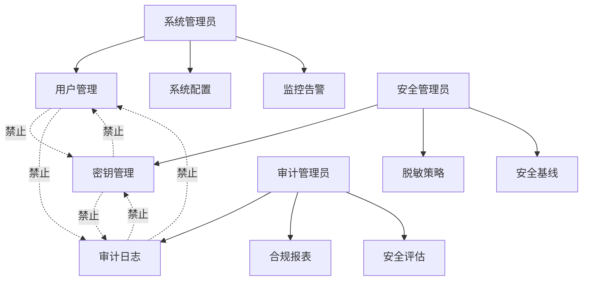
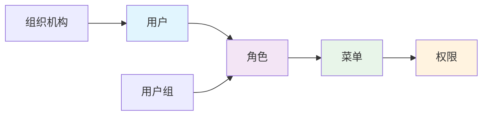
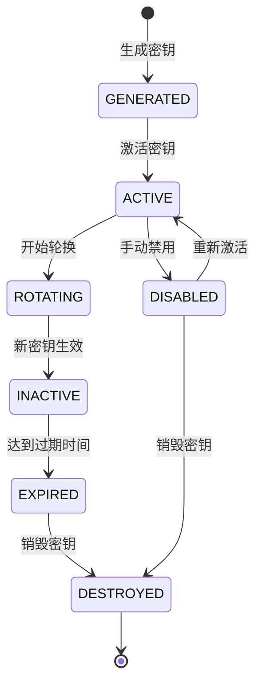
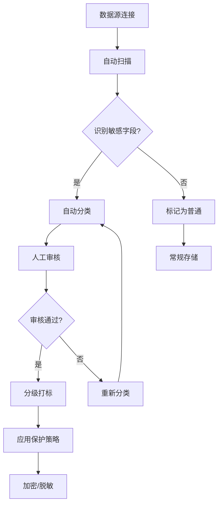
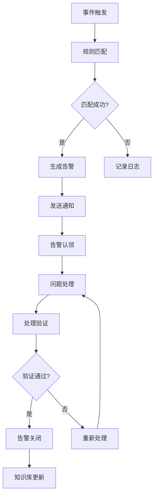

# 产品需求文档（PRD）

**文档版本**: v1.0.0  
**作者**: BankShield产品团队  
**创建时间**: 2025-12-24  
**最后修订**: 2025-12-24  

## 修订历史

| 版本 | 修订日期 | 修订人 | 修订内容 |
|------|----------|--------|----------|
| v1.0.0 | 2025-12-24 | 产品团队 | 初始版本 |

## 目录

1. [产品概述](#产品概述)
2. [功能清单](#功能清单)
3. [业务逻辑](#业务逻辑)
4. [验收标准](#验收标准)
5. [非功能需求](#非功能需求)
6. [术语表](#术语表)

## 产品概述

BankShield是一款面向金融行业的数据安全治理平台，专注于敏感数据识别、分类分级、加密脱敏和合规审计，帮助金融机构满足等保、PCI-DSS、GDPR等法规要求。

### 目标用户
- 信息安全主管
- 数据库管理员
- 合规审计员
- 系统管理员

### 核心价值
- **数据安全**: 国密算法加密，动态脱敏，数据水印
- **合规审计**: 完整审计链，支持等保三级、PCI-DSS、GDPR
- **三权分立**: 系统管理、安全管理、审计管理权限分离
- **智能监控**: 实时告警，多渠道通知，智能分析

## 功能清单

### 1. 核心模块

#### 1.1 用户管理
- 用户CRUD操作
- 用户状态管理（启用/禁用）
- 用户批量导入/导出
- 用户密码策略配置

#### 1.2 角色权限
- 角色CRUD操作
- 权限分配（菜单级、按钮级）
- 角色继承机制
- 权限变更审计

#### 1.3 部门组织
- 部门层级管理
- 部门与用户关联
- 部门数据权限
- 组织架构图展示

#### 1.4 菜单动态配置
- 菜单CRUD操作
- 菜单图标配置
- 路由权限控制
- 菜单排序和显示控制

### 2. 数据安全

#### 2.1 敏感数据识别
- 自动扫描数据库字段
- 正则表达式匹配
- 机器学习识别算法
- 识别结果人工审核

#### 2.2 分类分级
- 数据分类标准配置
- 四级分类（公开、内部、机密、绝密）
- 自动分级算法
- 分级结果审批流程

#### 2.3 国密加密
- 支持SM2/SM3/SM4算法
- 密钥生命周期管理
- 硬件安全模块（HSM）支持
- 加密性能优化

#### 2.4 动态脱敏
- 多种脱敏算法（部分掩码、完全掩码、哈希、加密）
- 基于角色的脱敏策略
- 实时脱敏处理
- 脱敏效果预览

#### 2.5 数据水印
- 透明水印技术
- 水印信息嵌入
- 水印溯源能力
- 抗攻击性能

### 3. 审计合规

#### 3.1 操作审计
- 用户操作日志记录
- 操作前后数据快照
- 审计日志查询
- 审计报表导出

#### 3.2 登录审计
- 登录失败记录
- 异常登录检测
- 登录统计分析
- 安全基线检查

#### 3.3 密钥审计
- 密钥生命周期审计
- 密钥使用记录
- 密钥轮换历史
- 密钥合规检查

#### 3.4 合规报表
- 等保三级报表模板
- PCI-DSS合规检查
- GDPR数据保护报表
- 自定义合规报表

### 4. 监控告警

#### 4.1 系统监控
- 服务器性能监控
- 数据库性能监控
- 应用性能监控
- 网络流量监控

#### 4.2 安全事件
- 异常行为检测
- 安全威胁识别
- 漏洞扫描集成
- 安全事件响应

#### 4.3 智能告警
- 告警规则配置
- 告警级别定义（INFO/WARNING/CRITICAL/EMERGENCY）
- 告警收敛机制
- 告警升级策略

#### 4.4 多渠道通知
- 邮件通知
- 短信通知
- 企业微信/钉钉
- Webhook接口

### 5. API安全

#### 5.1 限流控制
- 基于IP的限流
- 基于用户的限流
- 基于接口的限流
- 动态限流调整

#### 5.2 防刷机制
- 验证码验证
- 行为分析
- 设备指纹
- 风险评分

#### 5.3 签名验证
- 请求签名机制
- 时间戳验证
- 重放攻击防护
- 签名密钥管理

#### 5.4 IP黑名单
- 自动封禁机制
- 手动添加黑名单
- 黑名单同步
- 封禁记录审计

#### 5.5 API审计
- 请求响应日志
- 异常请求记录
- API性能统计
- 安全事件分析

## 业务逻辑

### 1. 三权分立模型

**互斥检查规则：**
- 同一用户不能同时拥有系统管理、安全管理、审计管理权限
- 权限变更需要审计记录
- 权限互斥需要实时检查

### 2. RBAC权限模型

**权限链路：**
1. 用户分配一个或多个角色
2. 角色配置菜单访问权限
3. 菜单关联具体操作权限
4. 权限控制到按钮级别

### 3. 密钥生命周期

**生命周期管理：**
- **生成**: 使用国密算法生成高质量随机密钥
- **激活**: 验证密钥质量，配置使用参数
- **使用**: 记录使用情况，监控异常访问
- **轮换**: 定期自动轮换，支持手动触发
- **禁用**: 发现风险时立即禁用
- **销毁**: 安全擦除，不可恢复

### 4. 数据分类流程

**分类标准：**
- **公开数据**: 可对外公开，无需特殊保护
- **内部数据**: 企业内部使用，需要基础保护
- **机密数据**: 敏感信息，需要严格保护
- **绝密数据**: 核心机密，需要最高级别保护

### 5. 告警处理流程

**处理时效：**
- **紧急告警**: 15分钟内响应，1小时内处理
- **重要告警**: 1小时内响应，4小时内处理
- **一般告警**: 4小时内响应，24小时内处理

## 验收标准

### 1. 功能验收

#### 1.1 API功能验收
- ✅ 所有API返回符合Result&lt;T&gt;规范
- ✅ 状态码使用正确（200/400/401/403/500）
- ✅ 错误信息清晰明确
- ✅ 分页参数正常工作
- ✅ 排序和筛选功能完整

#### 1.2 前端功能验收
- ✅ 所有页面完整无报错
- ✅ 表单验证机制完善
- ✅ 响应式布局适配
- ✅ 加载状态处理
- ✅ 错误提示友好

#### 1.3 业务功能验收
- ✅ 用户管理CRUD完整
- ✅ 权限分配准确
- ✅ 密钥生命周期正常
- ✅ 脱敏规则生效
- ✅ 审计日志记录

### 2. 性能验收

| 指标 | 目标值 | 测试方法 | 验收结果 |
|------|--------|----------|----------|
| API响应时间 | <100ms | JMeter压测 | 待测试 |
| 页面加载时间 | <2s | Lighthouse | 待测试 |
| 并发用户数 | 1000+ | 压力测试 | 待测试 |
| 数据库查询 | <50ms | 慢查询监控 | 待测试 |
| 内存使用 | <8GB | 监控工具 | 待测试 |

### 3. 安全验收

#### 3.1 国密算法验收
- ✅ SM2签名验签正确
- ✅ SM3哈希计算准确
- ✅ SM4加解密完整
- ✅ 密钥生成随机性
- ✅ 算法性能达标

#### 3.2 密钥管理验收
- ✅ 密钥材料加密存储
- ✅ 密钥访问权限控制
- ✅ 密钥轮换机制正常
- ✅ 密钥销毁不可恢复
- ✅ 密钥使用审计完整

#### 3.3 审计日志验收
- ✅ 操作日志完整记录
- ✅ 日志不可篡改
- ✅ 日志查询性能
- ✅ 日志备份机制
- ✅ 日志保留策略

### 4. 合规验收

#### 4.1 等保三级要求
- ✅ 身份鉴别机制
- ✅ 访问控制功能
- ✅ 安全审计功能
- ✅ 通信完整性
- ✅ 通信保密性
- ✅ 数据完整性
- ✅ 数据保密性
- ✅ 备份恢复功能
- ✅ 剩余信息保护
- ✅ 个人信息保护

#### 4.2 PCI-DSS合规
- ✅ 持卡人数据保护
- ✅ 加密传输
- ✅ 访问控制
- ✅ 网络安全
- ✅ 漏洞管理
- ✅ 监控审计

#### 4.3 GDPR合规
- ✅ 数据主体权利
- ✅ 数据处理记录
- ✅ 数据保护影响评估
- ✅ 数据泄露通知
- ✅ 隐私设计默认

## 非功能需求

### 1. 可用性
- **系统可用性**: 99.9%（全年停机时间<8.76小时）
- **服务可用性**: 99.95%（核心服务）
- **数据可用性**: 99.99%（数据不丢失）

### 2. 性能
- **并发用户数**: 支持1000+并发用户
- **吞吐量**: 5000 TPS（每秒事务数）
- **响应时间**: API响应<100ms，页面加载<2s
- **资源使用**: CPU<70%，内存<80%，磁盘<85%

### 3. 安全
- **加密算法**: 国密SM2/SM3/SM4，国际AES/RSA
- **密钥管理**: 硬件安全模块（HSM）支持
- **身份认证**: 双因子认证，生物识别支持
- **访问控制**: 基于属性的访问控制（ABAC）
- **审计日志**: 完整审计链，防篡改

### 4. 扩展性
- **微服务架构**: 服务独立部署，弹性伸缩
- **数据库扩展**: 读写分离，分库分表
- **缓存扩展**: Redis集群，自动分片
- **消息队列**: 支持Kafka/RocketMQ
- **容器化**: Docker/K8s支持

### 5. 兼容性
- **浏览器兼容**: Chrome/Firefox/Safari/Edge
- **移动设备**: iOS/Android适配
- **操作系统**: Windows/Linux/macOS
- **数据库**: MySQL/PostgreSQL/Oracle
- **中间件**: Tomcat/Jetty/WebLogic

## 术语表

| 术语 | 英文全称 | 中文解释 |
|------|----------|----------|
| RBAC | Role-Based Access Control | 基于角色的访问控制 |
| HSM | Hardware Security Module | 硬件安全模块 |
| SM2 | ShangMi 2 | 国密非对称加密算法 |
| SM3 | ShangMi 3 | 国密哈希算法 |
| SM4 | ShangMi 4 | 国密对称加密算法 |
| JWT | JSON Web Token | JSON网络令牌 |
| TLS | Transport Layer Security | 传输层安全协议 |
| PCI-DSS | Payment Card Industry Data Security Standard | 支付卡行业数据安全标准 |
| GDPR | General Data Protection Regulation | 通用数据保护条例 |
| RPO | Recovery Point Objective | 恢复点目标 |
| RTO | Recovery Time Objective | 恢复时间目标 |
| TPS | Transactions Per Second | 每秒事务数 |
| QPS | Queries Per Second | 每秒查询数 |
| SLA | Service Level Agreement | 服务级别协议 |
| API | Application Programming Interface | 应用程序接口 |
| UI | User Interface | 用户界面 |
| UX | User Experience | 用户体验 |
| CRUD | Create, Read, Update, Delete | 增删改查操作 |
| MFA | Multi-Factor Authentication | 多因子认证 |