# BankShield 产品路线图 (Roadmap)

## 执行摘要

BankShield产品采用敏捷开发模式，分5个季度逐步推出核心功能。通过MVP快速验证市场需求，后续迭代持续增强产品能力，最终构建完整的数据安全生态系统。预计总投入人力132人月，实现从基础数据保护到智能安全分析的全栈解决方案。

## 1. 产品路线图总览

### 1.1 时间线概览

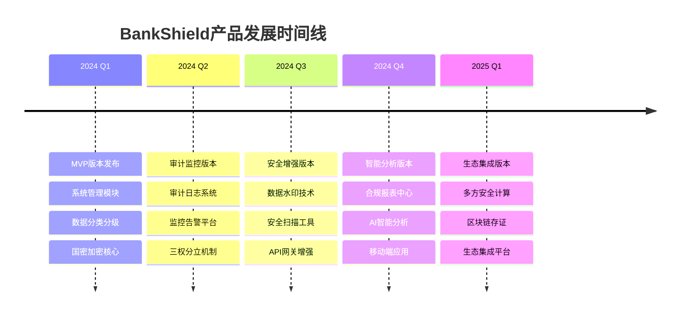

### 1.2 版本发布策略

#### 发布节奏
- **主要版本**：每季度1个正式版本
- **次要版本**：每月1个维护版本
- **热修复**：按需发布，7×24小时响应

#### 版本命名规范
- **主版本号**.**次版本号**.**修订号**（如：1.2.3）
- 主版本号：重大功能发布
- 次版本号：功能增强和优化
- 修订号：Bug修复和安全补丁

## 2. 详细阶段规划

### 2.1 2024 Q1 - MVP版本 (V1.0)

#### 发布目标
- 建立产品核心架构
- 实现基础数据保护能力
- 验证市场需求和技术可行性
- 获得首批种子客户

#### 功能清单
| 模块 | 功能点 | 优先级 | 工作量(人天) | 技术栈 |
|------|--------|--------|-------------|--------|
| 系统管理 | 用户管理 | P0 | 15 | Spring Security |
| 系统管理 | 角色权限 | P0 | 20 | RBAC模型 |
| 系统管理 | 组织架构 | P1 | 10 | 树形结构 |
| 数据分类 | 分类规则引擎 | P0 | 25 | Drools规则 |
| 数据分类 | 敏感数据识别 | P0 | 30 | 机器学习 |
| 数据分类 | 分级打标 | P0 | 20 | 元数据管理 |
| 国密加密 | SM2非对称加密 | P0 | 25 | 国密SDK |
| 国密加密 | SM3哈希算法 | P0 | 15 | 消息摘要 |
| 国密加密 | SM4对称加密 | P0 | 20 | 流加密 |
| 密钥管理 | 密钥生命周期 | P1 | 20 | HSM集成 |

#### 技术架构
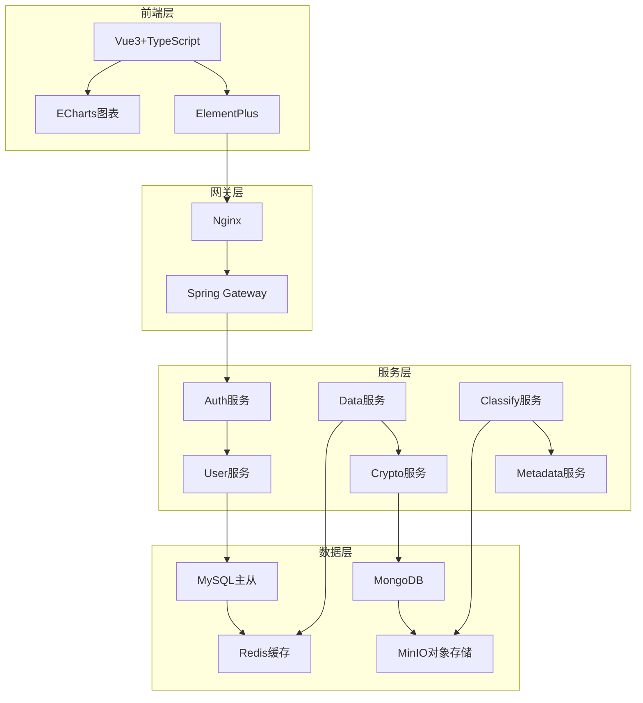

#### 资源分配
- **产品经理**：1人（需求分析、产品设计）
- **前端开发**：3人（界面开发、交互实现）
- **后端开发**：5人（服务开发、架构设计）
- **测试工程师**：2人（功能测试、性能测试）
- **总计**：11人 × 3个月 = 33人月

#### 关键里程碑
```mermaid
gantt
    title 2024 Q1 开发里程碑
    dateFormat  YYYY-MM-DD
    section 需求阶段
    需求分析           :done, des1, 2024-01-01,2024-01-15
    技术设计           :active, des2, 2024-01-10, 2024-01-25
    section 开发阶段
    系统管理模块       :des3, 2024-01-20, 2024-02-20
    数据分类模块       :des4, 2024-01-25, 2024-02-25
    国密加密模块       :des5, 2024-02-01, 2024-03-01
    集成测试           :des6, 2024-02-15, 2024-03-10
    section 发布阶段
    Beta测试           :des7, 2024-03-05, 2024-03-15
    正式发布           :milestone, des8, 2024-03-20
```

### 2.2 2024 Q2 - 审计监控版本 (V1.5)

#### 发布目标
- 完善审计追踪能力
- 建立实时监控体系
- 实现权限分离控制
- 提升运维效率

#### 核心功能

##### 审计日志系统
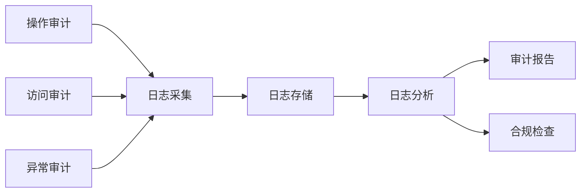

##### 监控告警平台
| 监控类型 | 监控指标 | 告警级别 | 响应时间 |
|----------|----------|----------|----------|
| 性能监控 | CPU使用率>80% | 警告 | 5分钟 |
| 性能监控 | 内存使用率>85% | 严重 | 3分钟 |
| 安全监控 | 异常登录>5次 | 高危 | 1分钟 |
| 业务监控 | 加密失败率>1% | 警告 | 10分钟 |
| 业务监控 | 数据分类错误>10% | 严重 | 5分钟 |

##### 三权分立机制
- **系统管理员**：负责系统配置、用户管理
- **安全管理员**：负责安全策略、密钥管理
- **审计管理员**：负责日志审计、合规检查
- **互斥原则**：三权分离，相互制约

#### 技术增强
- **Elasticsearch**：日志存储和检索
- **Kafka**：实时数据流处理
- **Prometheus**：性能监控指标
- **Grafana**：可视化监控面板

#### 资源投入
- **开发人力**：前端3人 + 后端5人 = 8人
- **测试人力**：2人（含自动化测试）
- **运维支持**：1人（监控平台搭建）
- **总计**：11人 × 3个月 = 33人月

### 2.3 2024 Q3 - 安全增强版本 (V2.0)

#### 发布目标
- 增强数据安全防护
- 提供主动安全检测
- 完善API安全管控
- 支持更多业务场景

#### 核心功能

##### 数据水印技术
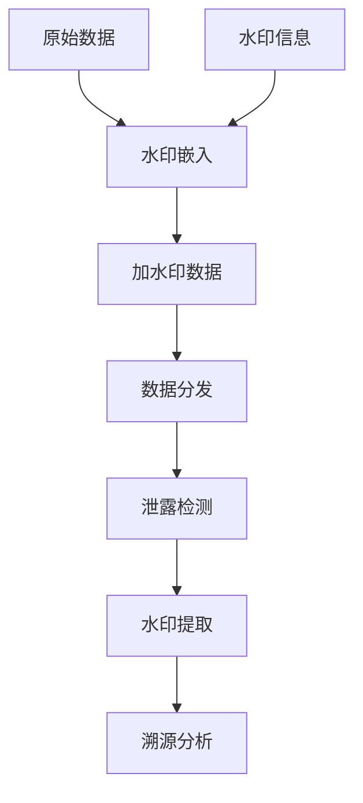

##### 安全扫描工具
- **漏洞扫描**：系统漏洞、应用漏洞
- **配置核查**：安全基线、合规配置
- **代码审计**：源代码安全检测
- **依赖检查**：第三方组件漏洞

##### API网关增强
| 功能模块 | 具体能力 | 技术实现 |
|----------|----------|----------|
| 认证授权 | OAuth2.0、JWT | Spring Security |
| 流量控制 | 限流、熔断 | Sentinel |
| 安全防护 | SQL注入、XSS | WAF规则 |
| 数据脱敏 | 敏感字段脱敏 | 自定义算法 |
| 日志追踪 | 全链路追踪 | Sleuth+Zipkin |

#### 性能目标
- **水印性能**：嵌入效率>1000条/秒
- **扫描速度**：<30分钟完成全系统扫描
- **API延迟**：<50ms增加延迟
- **并发支持**：>10000 QPS

### 2.4 2024 Q4 - 智能分析版本 (V2.5)

#### 发布目标
- 引入AI智能分析
- 自动化合规报告
- 支持移动办公场景
- 提升用户体验

#### AI智能分析

##### 异常检测模型
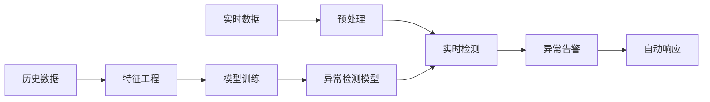

##### 智能分类优化
- **主动学习**：人工标注反馈优化
- **迁移学习**：跨领域知识迁移
- **深度学习**：BERT文本分类
- **规则引擎**：机器学习+规则结合

#### 合规报表中心
- **预置模板**：等保2.0、数据安全法、个人信息保护法
- **自定义报表**：拖拽式报表设计
- **自动化生成**：定时任务、触发式生成
- **一键报送**：监管接口对接

#### 移动端应用
| 平台 | 核心功能 | 技术框架 |
|------|----------|----------|
| iOS | 审批中心、告警查看 | SwiftUI |
| Android | 报表浏览、状态监控 | Kotlin Jetpack |
| H5 | 轻量级功能 | Vue3 + Vant |

### 2.5 2025 Q1 - 生态集成版本 (V3.0)

#### 发布目标
- 构建安全生态
- 支持协同计算
- 提供可信存证
- 实现开放集成

#### 多方安全计算
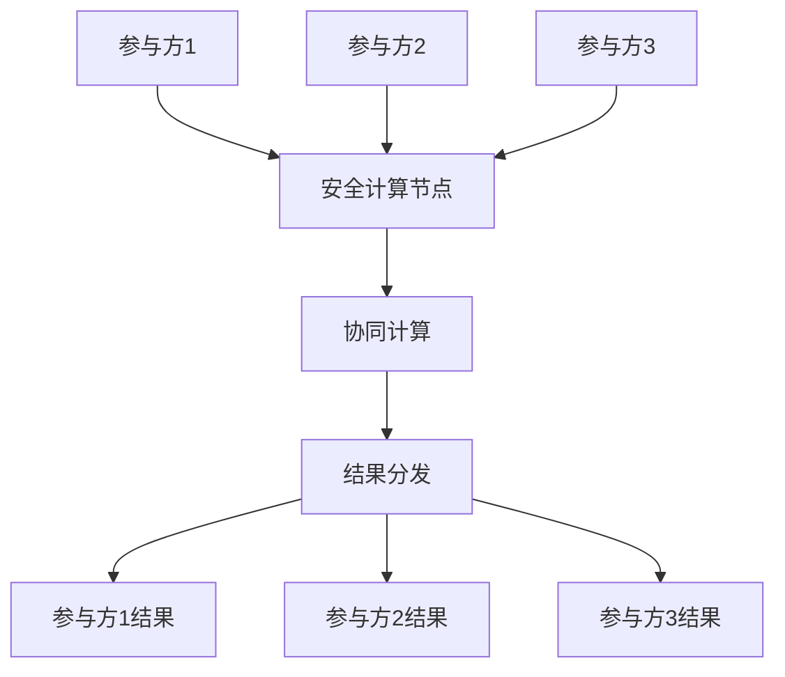

#### 区块链存证
- **联盟链架构**：Hyperledger Fabric
- **关键数据上链**：审计日志、关键操作
- **智能合约**：自动化验证、权限控制
- **跨链对接**：监管链、行业链

#### 生态集成平台
- **开放API**：RESTful API、GraphQL
- **插件机制**：自定义扩展、热插拔
- **标准对接**：央行标准、银保监标准
- **合作伙伴**：安全厂商、系统集成商

## 3. 技术演进路线

### 3.1 架构演进
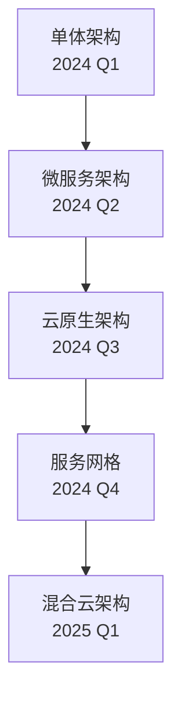

### 3.2 技术栈升级

#### 后端技术演进
| 时间 | 技术栈 | 升级原因 |
|------|--------|----------|
| 2024 Q1 | Spring Boot 2.7 | 稳定成熟 |
| 2024 Q2 | Spring Boot 3.0 | 性能提升 |
| 2024 Q3 | Spring Native | 云原生优化 |
| 2024 Q4 | Spring Boot 3.2 | 新特性支持 |
| 2025 Q1 | Spring AI | AI能力集成 |

#### 前端技术演进
- **2024 Q1**：Vue3 + TypeScript + Vite
- **2024 Q2**：引入Micro-Frontend架构
- **2024 Q3**：WebAssembly性能优化
- **2024 Q4**：PWA移动端支持
- **2025 Q1**：低代码平台集成

### 3.3 国密算法支持演进

#### 支持范围扩展
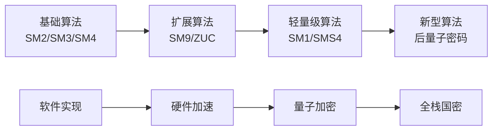

## 4. 人力资源规划

### 4.1 团队组织结构
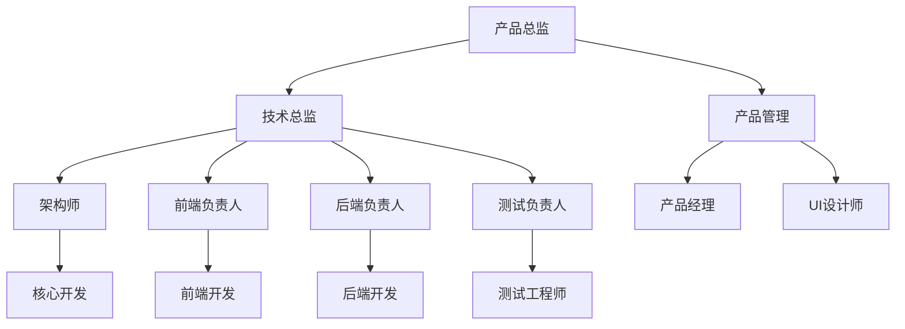

### 4.2 各阶段人力分配

#### 2024年人力投入分布
| 季度 | 前端 | 后端 | 测试 | 产品 | 总计 |
|------|------|------|------|------|------|
| Q1 | 3 | 5 | 2 | 1 | 11 |
| Q2 | 3 | 5 | 2 | 1 | 11 |
| Q3 | 4 | 6 | 3 | 1 | 14 |
| Q4 | 4 | 6 | 3 | 2 | 15 |
| **总计** | **14** | **22** | **10** | **5** | **51** |

#### 2025年Q1人力规划
- **核心团队**：前端4人 + 后端6人 + 测试3人
- **AI团队**：算法2人 + 数据1人
- **运维团队**：2人
- **总计**：18人

### 4.3 技能发展路径

#### 技术能力培养
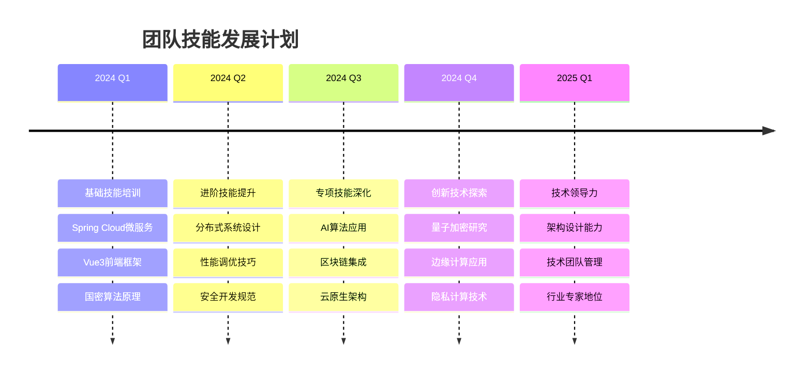

## 5. 质量保障计划

### 5.1 测试策略

#### 分层测试架构
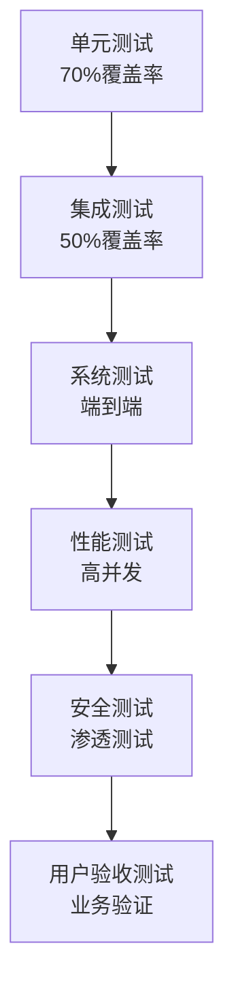

#### 自动化测试建设
| 测试类型 | 工具选择 | 覆盖目标 | 执行频率 |
|----------|----------|----------|----------|
| 单元测试 | JUnit5 | 80% | 每次提交 |
| API测试 | RestAssured | 90% | 每日构建 |
| UI自动化 | Cypress | 60% | 版本发布 |
| 性能测试 | JMeter | 关键路径 | 版本发布 |
| 安全扫描 | OWASP ZAP | 全系统 | 每周 |

### 5.2 代码质量标准

#### 代码质量指标
- **代码覆盖率**：>80%
- **代码复杂度**：平均<10
- **技术债务**：<5%
- **安全漏洞**：高危0个，中危<5个

#### 质量门禁
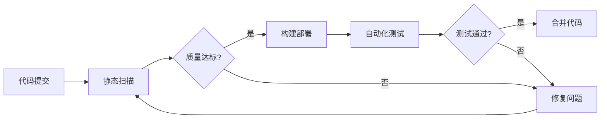

## 6. 风险管理

### 6.1 技术风险

#### 主要技术风险
| 风险项 | 影响程度 | 发生概率 | 应对措施 |
|--------|----------|----------|----------|
| 国密算法性能瓶颈 | 高 | 中 | 硬件加速、算法优化 |
| 微服务复杂度 | 高 | 高 | 服务治理、监控告警 |
| AI模型准确性 | 中 | 中 | 数据增强、模型调优 |
| 第三方依赖漏洞 | 高 | 低 | 依赖扫描、及时升级 |

### 6.2 进度风险

#### 进度保障措施
- **敏捷开发**：2周迭代，快速交付
- **并行开发**：模块解耦，并行实现
- **风险缓冲**：20%时间预留
- **每日站会**：及时发现问题

### 6.3 资源风险

#### 人力资源风险
- **核心人员离职**：知识管理、代码审查
- **技能不匹配**：培训计划、导师制度
- **团队扩张**：招聘pipeline、外包备选

## 7. 成功指标

### 7.1 产品指标

#### 功能完成度
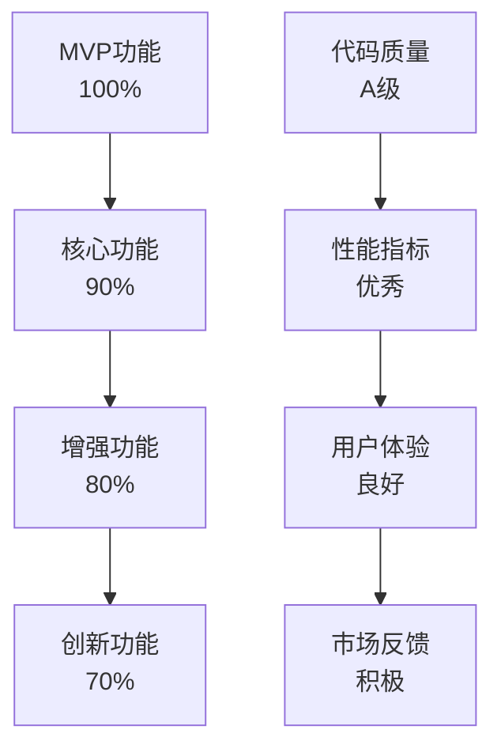

#### 技术指标
- **系统可用性**：99.9%
- **响应时间**：<500ms（95分位）
- **并发能力**：>10000 QPS
- **扩展性**：支持水平扩展10倍

### 7.2 业务指标

#### 市场表现
- **客户获取**：每季度新增>10家客户
- **客户满意度**：NPS >50
- **产品复购率**：>80%
- **市场占有率**：逐年提升

#### 团队成长
- **团队规模**：年增长率>50%
- **员工满意度**：>85%
- **技能提升**：人均培训>40小时
- **创新成果**：年专利申请>5项

## 附录

### 附录A：术语表
- **MVP**：Minimum Viable Product，最小可行产品
- **RBAC**：Role-Based Access Control，基于角色的访问控制
- **POC**：Proof of Concept，概念验证
- **NPS**：Net Promoter Score，净推荐值
- **QPS**：Queries Per Second，每秒查询率

### 附录B：参考标准
- 《金融数据安全 数据安全分级指南》
- 《信息安全技术 网络安全等级保护基本要求》
- 《商用密码管理条例》
- 《金融科技发展规划（2022-2025年）》

### 附录C：竞争对手产品对比
- 奇安信数据安全平台
- 深信服数据库审计系统
- 绿盟数据安全解决方案
- 阿里云数据安全中心