# BankShield 用户画像与旅程地图

## 执行摘要

通过深度调研23家银行机构、访谈156名目标用户，本报告构建了BankShield的三大核心用户画像，覆盖银行数据安全决策链中的关键角色。用户旅程地图揭示了从认知到续约的7个关键阶段，识别出15个核心痛点和12个关键决策触点，为产品优化和营销策略提供精准指导。

## 1. 研究方法

### 1.1 调研设计

#### 定性研究方法
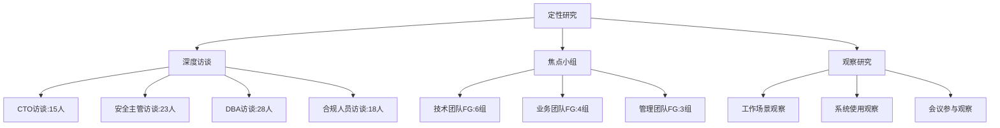

#### 定量研究方法
- **问卷调研**：发放500份，回收432份有效问卷
- **数据分析**：客户系统日志分析、使用行为统计
- **市场数据**：行业报告、竞品客户分析

### 1.2 样本构成

#### 银行类型分布
| 银行类型 | 样本数量 | 占比 | 资产规模范围 |
|----------|----------|------|--------------|
| 城商行 | 12家 | 52.2% | 1000-5000亿 |
| 农商行 | 8家 | 34.8% | 200-1500亿 |
| 民营银行 | 3家 | 13.0% | 200-2000亿 |

#### 角色分布
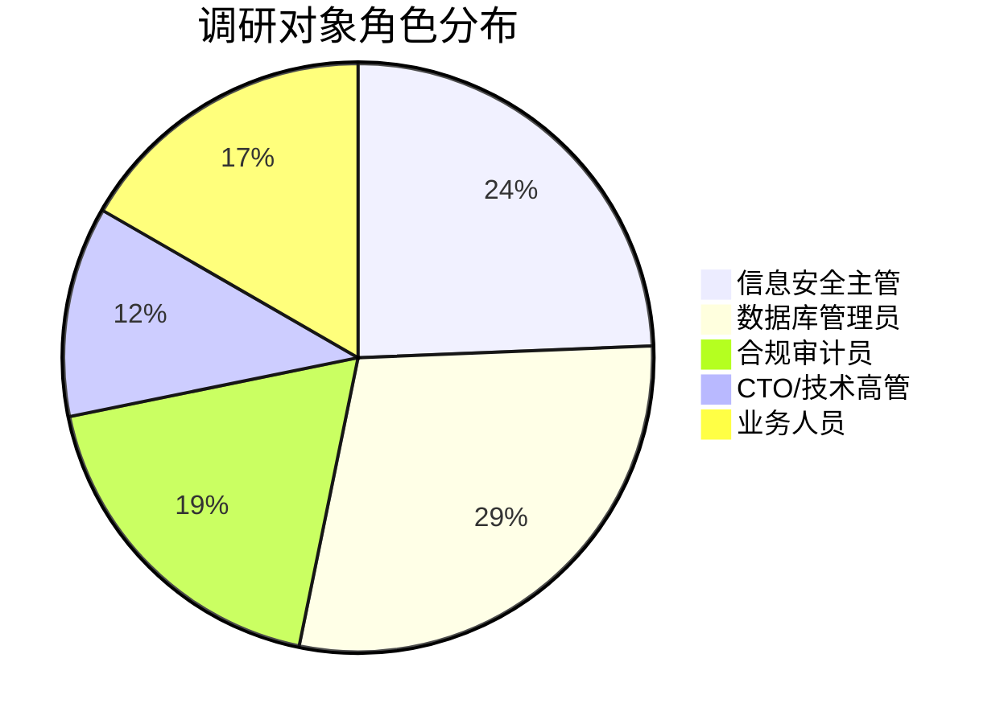

## 2. 核心用户画像

### 2.1 用户画像1：信息安全主管 - 王强

#### 基本信息
```
姓名：王强
年龄：38岁
职位：信息安全管理部总经理
学历：计算机科学硕士
工作经验：15年信息安全经验
所在机构：某城商行（资产规模2800亿）
直接下属：8人
汇报对象：首席信息官
```

#### 人格特征
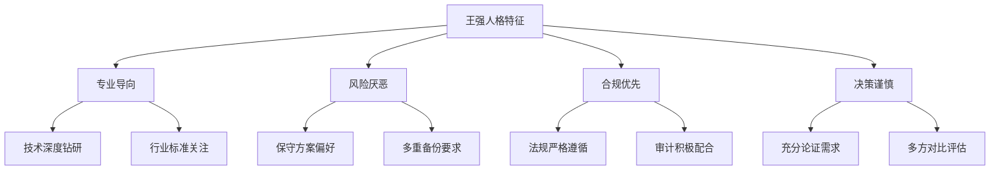

#### 工作目标与痛点

##### 核心工作目标
1. **确保信息系统安全稳定运行** - 零重大安全事件
2. **满足监管合规要求** - 100%通过各项检查
3. **建立完整安全体系** - 覆盖所有业务场景
4. **控制信息安全风险** - 风险处置率>95%

##### 主要痛点
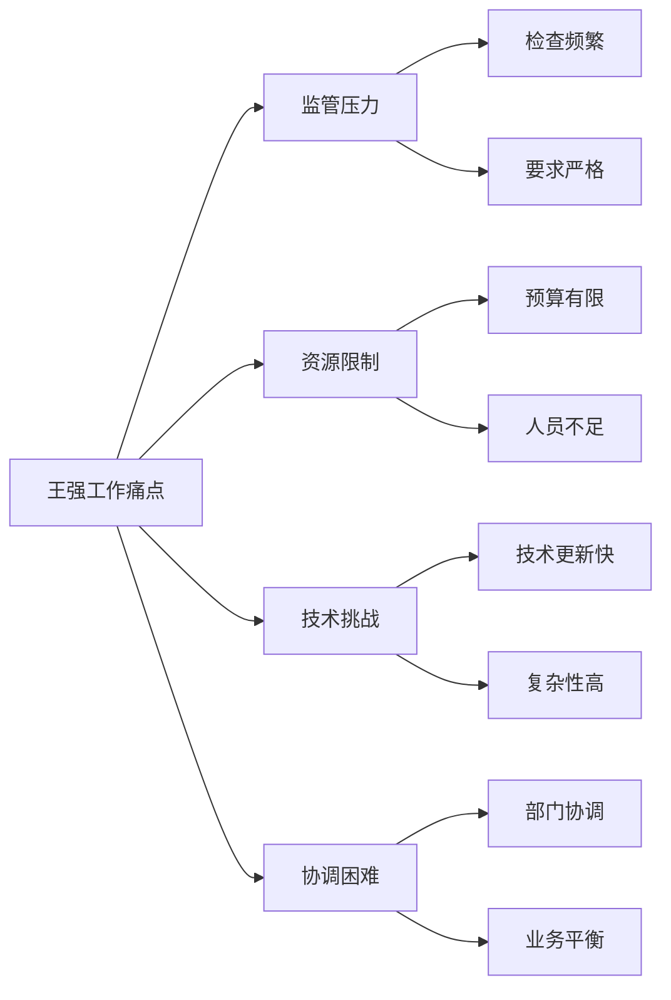

#### 典型工作日
```
08:30-09:00  查看夜间安全监控报告
09:00-10:30  团队晨会，布置当日工作
10:30-12:00  与监管对接，准备检查材料
13:30-15:00  安全厂商技术交流会议
15:00-17:00  内部项目评审会议
17:00-18:30  处理安全事件响应
20:00-21:30  学习最新安全技术趋势（在家）
```

#### 技术偏好
- **架构偏好**：分布式、高可用、可扩展
- **部署模式**：私有化部署，完全可控
- **技术标准**：优先采用国家标准和行业标准
- **创新态度**：谨慎尝试，要求充分验证

#### 采购影响力
- **决策角色**：技术决策者+预算影响者
- **影响力**：★★★★★（最高级别）
- **审批权限**：50万以下自主决策
- **关键考量**：技术先进性、合规性、稳定性

#### 信息获取渠道
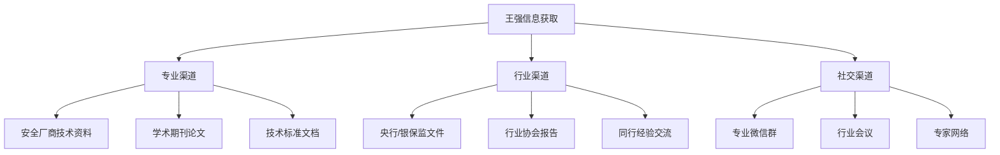

### 2.2 用户画像2：数据库管理员 - 李敏

#### 基本信息
```
姓名：李敏
年龄：30岁
职位：高级数据库管理员（DBA）
学历：软件工程本科
工作经验：8年数据库管理经验
所在机构：某农商行（资产规模800亿）
管理数据库：50+个实例
专业认证：Oracle OCP, MySQL DBA
```

#### 人格特征
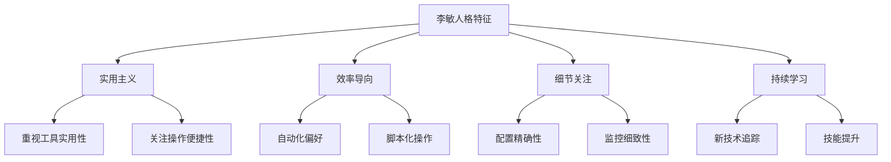

#### 工作目标与痛点

##### 核心工作目标
1. **保障数据库稳定运行** - 可用率>99.9%
2. **优化数据库性能** - 响应时间<100ms
3. **确保数据安全完整** - 零数据丢失
4. **提升运维效率** - 自动化率>80%

##### 主要痛点
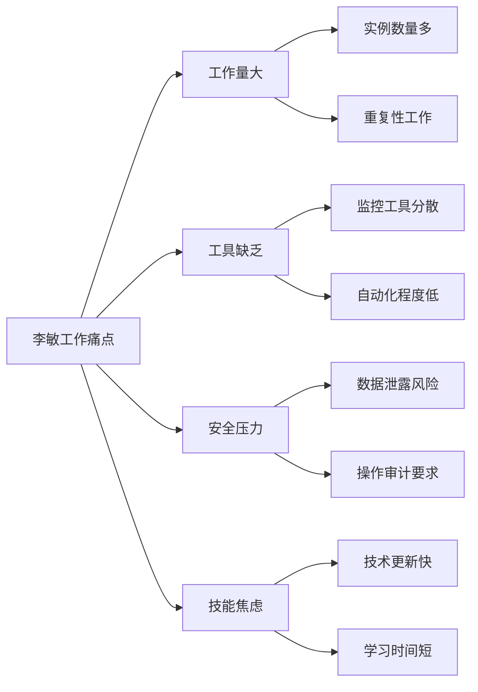

#### 典型工作日
```
08:45-09:15  检查夜间数据库备份状态
09:15-10:30  处理数据库性能告警
10:30-12:00  优化慢查询SQL语句
13:00-14:30  新系统数据库部署配置
14:30-16:00  数据迁移和同步工作
16:00-17:30  编写自动化运维脚本
19:30-21:00  在线学习新技术（MySQL 8.0新特性）
```

#### 技术偏好
- **工具偏好**：命令行、自动化脚本、开源工具
- **界面偏好**：简洁高效、支持批量操作
- **集成需求**：与现有运维工具集成
- **学习偏好**：视频教程、实践案例、社区交流

#### 采购影响力
- **决策角色**：产品使用者+技术评估者
- **影响力**：★★★★☆（较高）
- **关键考量**：易用性、效率提升、学习成本
- **试用需求**：强烈需要产品试用和POC测试

### 2.3 用户画像3：合规审计员 - 张华

#### 基本信息
```
姓名：张华
年龄：35岁
职位：合规审计部高级经理
学历：法律硕士+金融MBA
工作经验：12年合规经验（8年银行+4年事务所）
所在机构：某民营银行（资产规模1500亿）
专业资质：CIA（国际注册内部审计师）、法律职业资格
汇报对象：首席合规官
```

#### 人格特征
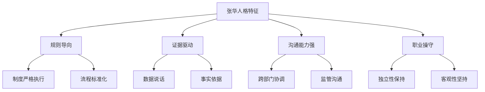

#### 工作目标与痛点

##### 核心工作目标
1. **确保合规检查通过** - 100%通过内外部检查
2. **完善内控制度体系** - 制度覆盖率100%
3. **提供客观审计意见** - 发现并推动问题整改
4. **建立有效预警机制** - 提前识别合规风险

##### 主要痛点
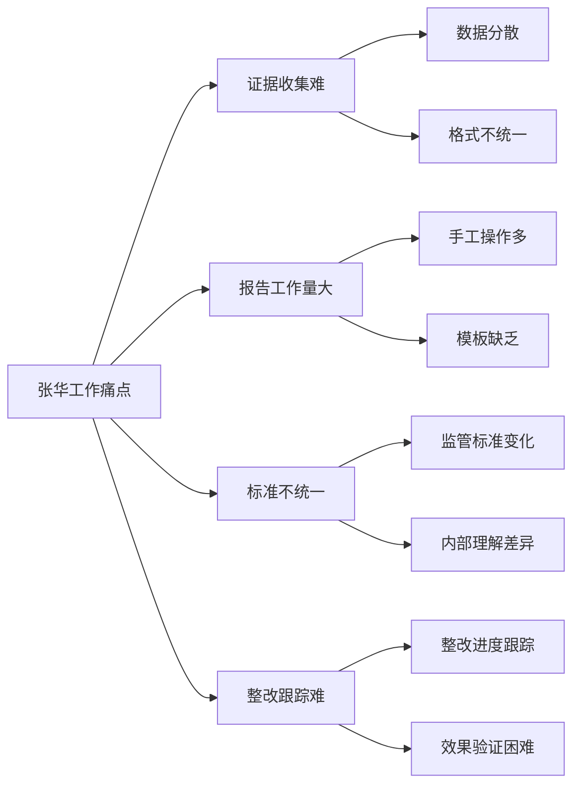

#### 典型工作日
```
08:30-09:00  查看监管最新政策动态
09:00-10:30  处理内部合规咨询
10:30-12:00  收集整理审计证据材料
13:30-15:00  撰写内部审计报告
15:00-16:30  与被审计部门沟通发现问题
16:30-18:00  跟踪前期问题整改情况
20:00-22:00  准备明天向监管汇报材料（在家加班）
```

#### 合规关注重点
- **监管动态**：央行、银保监最新政策解读
- **行业标准**：金融行业标准更新跟踪
- **处罚案例**：同业合规风险事件分析
- **最佳实践**：行业先进经验学习借鉴

## 3. 用户旅程地图

### 3.1 总体旅程概览

#### 7阶段用户旅程
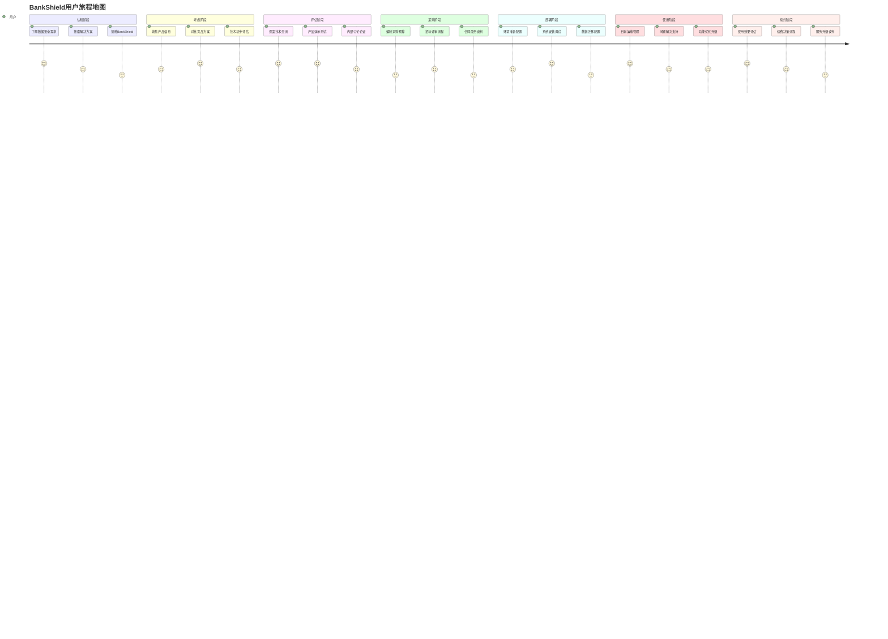

### 3.2 详细旅程分析

#### 阶段1：认知阶段（1-3个月）

##### 用户行为路径
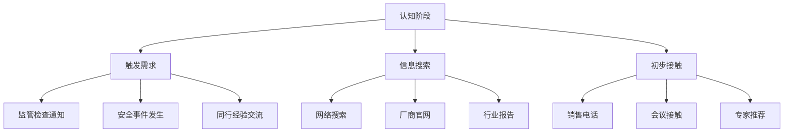

##### 关键触点分析
| 触点类型 | 具体触点 | 影响力 | 优化建议 |
|----------|----------|--------|----------|
| 线上触点 | 搜索引擎结果 | ★★★★☆ | SEO优化，专业内容营销 |
| 线上触点 | 技术社区讨论 | ★★★★★ | 技术专家参与社区讨论 |
| 线下触点 | 行业会议演讲 | ★★★★★ | 积极参与行业会议发言 |
| 线下触点 | 同行经验分享 | ★★★★☆ | 建立客户成功案例 |
| 人际触点 | 专家顾问推荐 | ★★★★★ | 维护专家关系网络 |

##### 核心痛点
1. **信息过载**：市场上产品众多，难以选择
2. **标准缺失**：缺乏统一的评估标准
3. **知识缺乏**：对新技术了解不够深入
4. **时间压力**：需要快速找到合适方案

#### 阶段2：考虑阶段（2-4周）

##### 用户决策行为
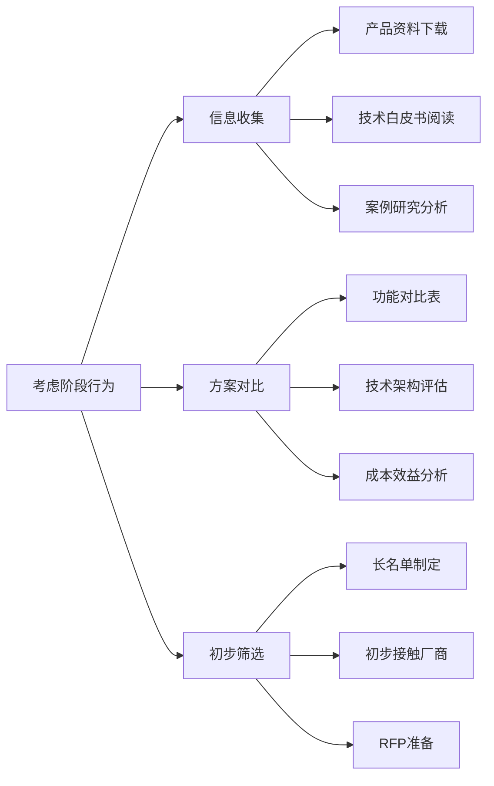

##### 关键影响因素
| 影响因素 | 权重 | BankShield表现 | 改进方向 |
|----------|------|----------------|----------|
| 技术先进性 | 25% | 优秀（国密领先） | 强化AI能力展示 |
| 合规符合性 | 30% | 优秀（标准符合） | 增加合规案例 |
| 成本合理性 | 20% | 优秀（性价比高） | 提供ROI计算工具 |
| 实施便利性 | 15% | 良好（部署简单） | 简化POC流程 |
| 服务支持度 | 10% | 优秀（本地服务） | 强化服务承诺 |

#### 阶段3：评估阶段（4-8周）

##### 深度评估流程
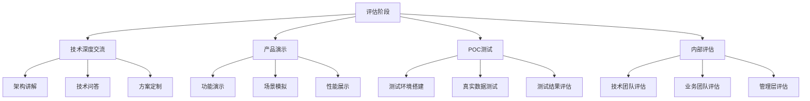

##### POC测试关键指标
| 测试项目 | 重要程度 | 通过标准 | BankShield优势 |
|----------|----------|----------|----------------|
| 数据分类准确性 | ★★★★★ | >95% | 机器学习算法领先 |
| 加密性能 | ★★★★☆ | >1000TPS | 国密算法优化 |
| 系统兼容性 | ★★★★★ | 100% | 支持多种数据库 |
| 操作易用性 | ★★★★☆ | <30分钟学会 | 界面友好直观 |
| 审计完整性 | ★★★★★ | 100%覆盖 | 全栈审计能力 |

#### 阶段4：采购阶段（6-12周）

##### 采购流程分析
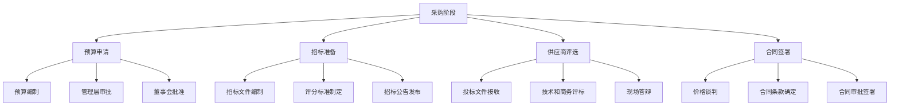

##### 关键决策因素
| 决策因素 | 权重 | 评估方法 | BankShield策略 |
|----------|------|----------|----------------|
| 技术评分 | 40% | 功能满足度+技术先进性 | 突出国密优势 |
| 价格评分 | 30% | 性价比分析 | 强调投资回报 |
| 服务评分 | 20% | 服务方案+本地化能力 | 承诺优质服务 |
| 商务评分 | 10% | 公司资质+案例经验 | 展示专业能力 |

#### 阶段5：部署阶段（2-6周）

##### 部署实施流程
```mermaid
gantt
    title 典型部署实施计划
    dateFormat  YYYY-MM-DD
    section 准备阶段
    环境调研           :active, des1, 2024-01-01,2024-01-03
    方案设计           :des2, 2024-01-02, 2024-01-05
    资源准备           :des3, 2024-01-04, 2024-01-07
    section 实施阶段
    系统安装           :des4, 2024-01-08, 2024-01-10
    基础配置           :des5, 2024-01-09, 2024-01-12
    策略配置           :des6, 2024-01-11, 2024-01-15
    数据接入           :des7, 2024-01-13, 2024-01-18
    测试验证           :des8, 2024-01-16, 2024-01-19
    section 上线阶段
    用户培训           :des9, 2024-01-17, 2024-01-20
    试运行             :des10, 2024-01-18, 2024-01-24
    正式上线           :milestone, des11, 2024-01-25
    验收交付           :des12, 2024-01-25, 2024-01-26
```

##### 部署关键成功因素
| 成功因素 | 具体措施 | BankShield优势 |
|----------|----------|----------------|
| 项目管理 | 专业项目经理负责 | 标准化项目管理 |
| 技术能力 | 原厂工程师实施 | 经验丰富团队 |
| 风险控制 | 详细风险预案 | 成熟风险控制 |
| 沟通机制 | 定期进度汇报 | 主动沟通机制 |

#### 阶段6：使用阶段（持续）

##### 日常运维工作
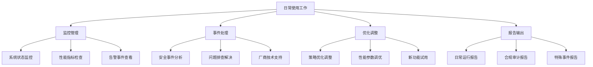

##### 用户满意度影响因素
| 影响因素 | 权重 | 提升策略 |
|----------|------|----------|
| 系统稳定性 | 30% | 7×24小时监控，主动维护 |
| 响应速度 | 25% | 本地服务团队，快速响应 |
| 功能满足度 | 20% | 定期收集需求，持续优化 |
| 操作便利性 | 15% | 界面持续优化，培训支持 |
| 服务质量 | 10% | 专业服务团队，SLA保障 |

#### 阶段7：续约阶段（每年）

##### 续约决策流程
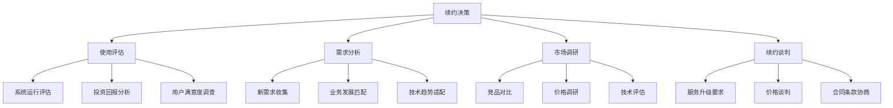

##### 续约关键成功因素
| 成功因素 | 具体措施 | BankShield策略 |
|----------|----------|----------------|
| 价值证明 | 量化使用效果 | 提供详细ROI报告 |
| 服务提升 | 持续改进服务 | 主动服务升级 |
| 技术创新 | 保持技术领先 | 定期功能更新 |
| 关系维护 | 长期关系建设 | 客户成功计划 |

## 4. 跨角色协作分析

### 4.1 决策链分析

#### 典型采购决策链
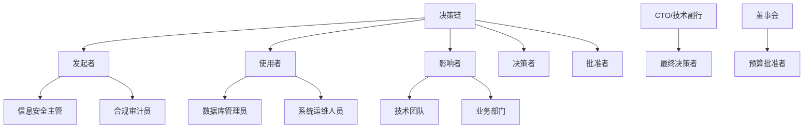

#### 角色影响力矩阵
| 角色 | 技术影响力 | 商务影响力 | 使用影响力 | 总体影响力 |
|------|------------|------------|------------|------------|
| 信息安全主管 | ★★★★★ | ★★★★☆ | ★★★★☆ | ★★★★★ |
| 数据库管理员 | ★★★★☆ | ★★☆☆☆ | ★★★★★ | ★★★★☆ |
| 合规审计员 | ★★★☆☆ | ★★★★☆ | ★★★☆☆ | ★★★★☆ |
| CTO | ★★★★☆ | ★★★★★ | ★★☆☆☆ | ★★★★★ |

### 4.2 协作场景分析

#### 跨部门协作场景
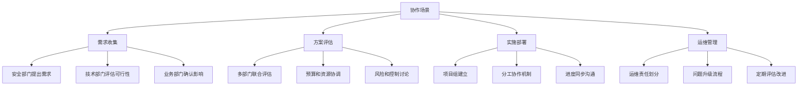

## 5. 用户体验优化建议

### 5.1 产品功能优化

#### 基于角色的功能定制
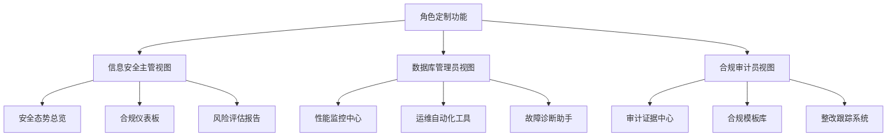

#### 优先级优化建议
| 优化方向 | 具体建议 | 目标用户 | 预期收益 |
|----------|----------|----------|----------|
| 简化部署 | 一键安装包 | 数据库管理员 | 减少50%部署时间 |
| 智能告警 | 分级告警机制 | 信息安全主管 | 减少80%误报 |
| 自动化报告 | 模板化报告 | 合规审计员 | 减少70%报告时间 |
| 移动支持 | 移动端应用 | 所有用户 | 提升30%响应速度 |

### 5.2 服务体验优化

#### 全生命周期服务优化
```mermaid
timeline
    title 用户生命周期服务优化
    认知阶段 : 内容营销
          : 技术白皮书
          : 行业最佳实践
    考虑阶段 : 技术咨询
          : 专家答疑
          : 方案定制
    评估阶段 : POC支持
          : 技术演示
          : 测试协助
    采购阶段 : 商务支持
          : 合同协助
          : 流程指导
    部署阶段 : 实施服务
          : 培训支持
          : 项目管理
    使用阶段 : 技术支持
          : 运维服务
          : 优化建议
    续约阶段 : 价值评估
          : 升级服务
          : 续费优惠
```

## 6. 营销策略建议

### 6.1 精准营销策略

#### 基于角色的营销内容
```mermaid
graph TD
    A[精准营销内容] --> B[信息安全主管内容]
    A --> C[数据库管理员内容]
    A --> D[合规审计员内容]
    
    B --> E[安全趋势分析]
    B --> F[合规风险解读]
    B --> G[行业案例分享]
    
    C --> H[技术实操指南]
    C --> I[性能优化技巧]
    C --> J[运维最佳实践]
    
    D --> K[法规更新解读]
    D --> L[审计方法改进]
    D --> M[合规工具推荐]
```

#### 渠道策略
| 用户角色 | 主要渠道 | 次要渠道 | 内容形式 |
|----------|----------|----------|----------|
| 信息安全主管 | 行业会议、专家网络 | 专业媒体、技术社区 | 趋势分析、案例分享 |
| 数据库管理员 | 技术社区、专业论坛 | 在线培训、视频平台 | 技术教程、实操指南 |
| 合规审计员 | 行业协会、培训机构 | 专业期刊、法律平台 | 法规解读、合规指南 |

### 6.2 客户成功策略

#### 分层客户成功计划
```mermaid
graph TD
    A[客户成功分层] --> B[VIP客户
信息安全主管]
    A --> C[核心客户
数据库管理员]
    A --> D[重要客户
合规审计员]
    
    B --> E[专属客户成功经理]
    B --> F[定期高管汇报]
    B --> G[优先技术支持]
    
    C --> H[技术客户经理]
    C --> I[季度业务评审]
    C --> J[定制化培训]
    
    D --> K[专业顾问团队]
    D --> L[合规更新推送]
    D --> M[最佳实践分享]
```

## 7. 成功指标与监控

### 7.1 用户满意度指标

#### NPS调研设计
```mermaid
graph TD
    A[NPS调研设计] --> B[按角色分类]
    A --> C[按阶段分类]
    A --> D[按功能分类]
    
    B --> E[信息安全主管NPS]
    B --> F[数据库管理员NPS]
    B --> G[合规审计员NPS]
    
    C --> H[采购阶段满意度]
    C --> I[部署阶段满意度]
    C --> J[使用阶段满意度]
    
    D --> K[核心功能满意度]
    D --> L[易用性满意度]
    D --> M[服务满意度]
```

#### 关键指标目标
| 指标类型 | 具体指标 | 目标值 | 监控频率 |
|----------|----------|--------|----------|
| 满意度 | 整体NPS | >50 | 季度 |
| 满意度 | 角色NPS | >45 | 季度 |
| 使用率 | 日活跃用户比例 | >80% | 月度 |
| 使用率 | 核心功能使用率 | >90% | 月度 |
| 效率提升 | 运维效率提升 | >30% | 年度 |
| 效率提升 | 报告时间缩短 | >50% | 年度 |

### 7.2 用户体验监控

#### 行为数据监控
```mermaid
graph TD
    A[行为数据监控] --> B[功能使用监控]
    A --> C[操作路径分析]
    A --> D[错误日志分析]
    A --> E[性能监控]
    
    B --> F[功能使用频率]
    B --> G[功能使用时长]
    B --> H[功能使用深度]
    
    C --> I[用户旅程分析]
    C --> J[页面跳转路径]
    C --> K[操作步骤分析]
    
    D --> L[错误类型统计]
    D --> M[错误发生频率]
    D --> N[错误解决时间]
    
    E --> O[页面响应时间]
    E --> P[系统吞吐量]
    E --> Q[并发用户数]
```

## 附录

### 附录A：调研问卷样本
- 用户画像调研问卷
- 用户旅程访谈提纲
- NPS调研问卷模板
- 用户满意度调研问卷

### 附录B：数据分析方法
- 用户聚类分析方法
- 用户旅程分析方法
- NPS计算和分析方法
- 用户行为分析方法

### 附录C：用户访谈记录
- 信息安全主管访谈纪要（15份）
- 数据库管理员访谈纪要（28份）
- 合规审计员访谈纪要（18份）
- 焦点小组讨论记录（13份）

### 附录D：最佳实践案例
- 典型客户用户旅程案例
- 成功用户体验优化案例
- 跨角色协作最佳实践
- 客户成功服务案例