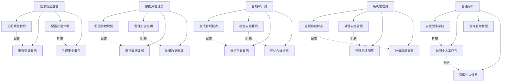
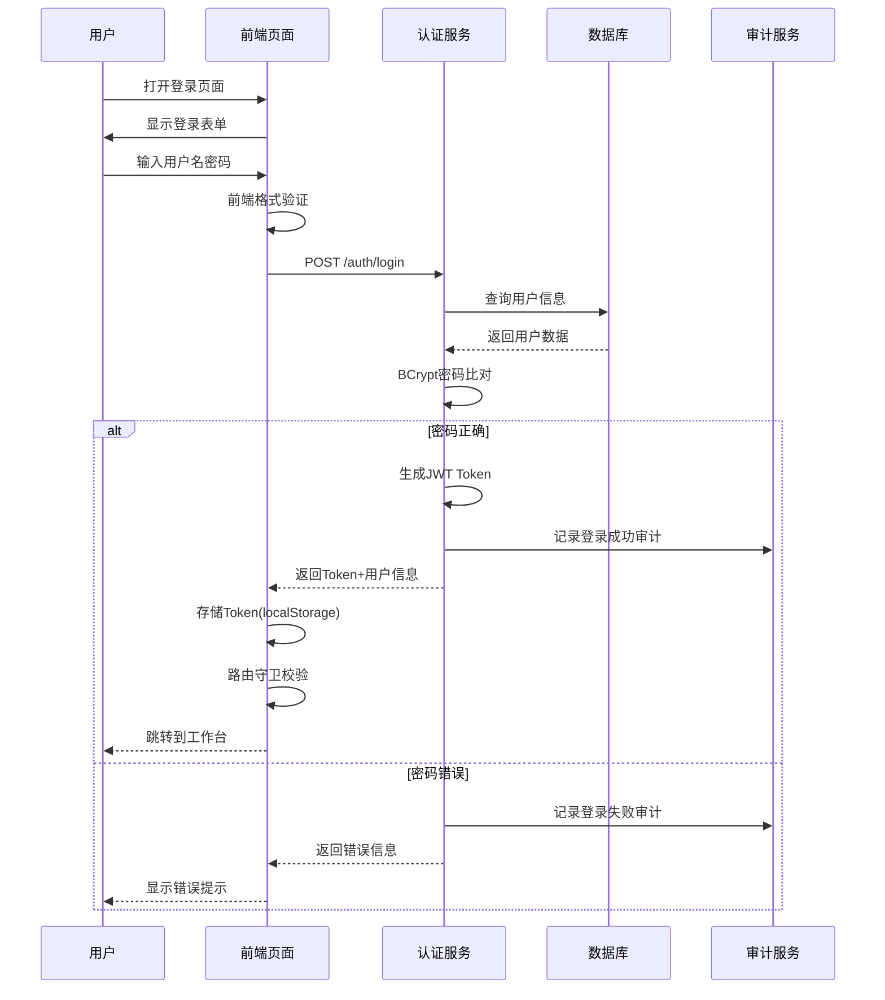
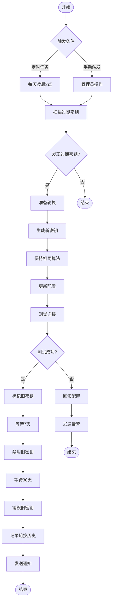
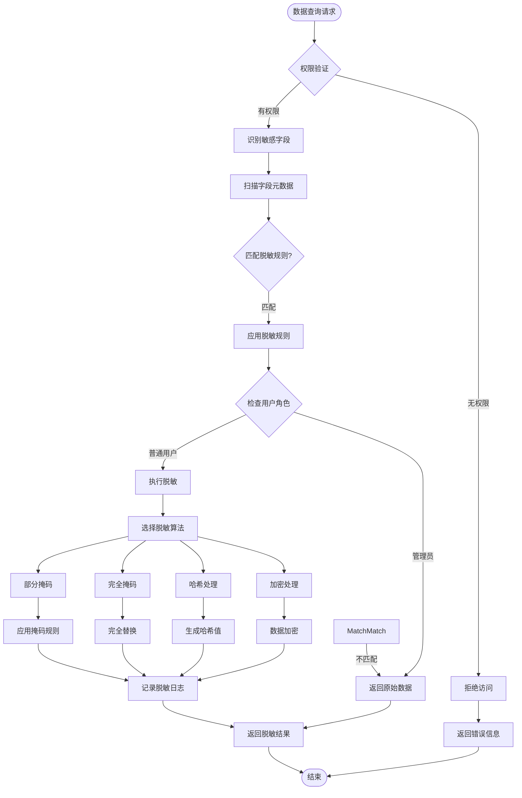
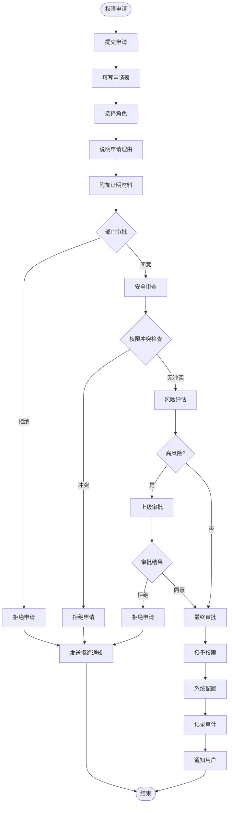

# 用户需求规格书（URS）

**文档版本**: v1.0.0  
**作者**: BankShield产品团队  
**创建时间**: 2025-12-24  
**最后修订**: 2025-12-24  

## 修订历史

| 版本 | 修订日期 | 修订人 | 修订内容 |
|------|----------|--------|----------|
| v1.0.0 | 2025-12-24 | 产品团队 | 初始版本 |

## 目录

1. [用户角色定义](#用户角色定义)
2. [用户故事](#用户故事)
3. [用例图](#用例图)
4. [功能流程](#功能流程)
5. [用户界面需求](#用户界面需求)
6. [用户交互需求](#用户交互需求)
7. [术语表](#术语表)

## 用户角色定义

### 1. 信息安全主管 (Security Manager)
- **职责**: 制定安全策略，分配用户权限，审查安全状态
- **权限**: 用户管理、角色权限配置、安全策略制定
- **目标**: 确保系统安全，防止越权访问
- **使用频率**: 每日使用

### 2. 数据库管理员 (Database Administrator)
- **职责**: 管理数据库，配置脱敏规则，维护数据安全
- **权限**: 数据源管理、脱敏配置、密钥管理
- **目标**: 保护敏感数据，满足监管要求
- **使用频率**: 每日使用

### 3. 合规审计员 (Compliance Auditor)
- **职责**: 合规检查，审计分析，生成报表
- **权限**: 审计日志查看、合规报表生成、安全评估
- **目标**: 确保合规性，提供审计证据
- **使用频率**: 每周使用

### 4. 系统管理员 (System Administrator)
- **职责**: 系统运维，监控管理，故障处理
- **权限**: 系统配置、监控告警、日志管理
- **目标**: 保障系统稳定运行
- **使用频率**: 每日使用

### 5. 普通用户 (End User)
- **职责**: 日常业务操作
- **权限**: 基于角色的业务功能访问
- **目标**: 完成业务工作
- **使用频率**: 每日使用

## 用户故事

### 1. 信息安全主管用户故事

#### US001: 权限分配管理
**作为** 信息安全主管  
**我希望** 能够为用户分配和管理角色权限  
**以便** 避免越权访问，确保系统安全

**验收标准:**
- 可以创建、编辑、删除角色
- 可以为角色分配菜单和按钮权限
- 可以为用户分配一个或多个角色
- 权限变更需要审计记录
- 支持权限变更通知

**优先级**: 高  
**估算工作量**: 8 story points

#### US002: 安全策略配置
**作为** 信息安全主管  
**我希望** 能够配置和调整安全策略  
**以便** 适应不同安全要求和合规标准

**验收标准:**
- 可以配置密码复杂度策略
- 可以设置登录失败锁定规则
- 可以配置会话超时时间
- 可以设置数据分类标准
- 策略变更需要审批流程

**优先级**: 高  
**估算工作量**: 5 story points

#### US003: 安全状态监控
**作为** 信息安全主管  
**我希望** 能够实时查看系统安全状态  
**以便** 及时发现和处理安全风险

**验收标准:**
- 显示当前在线用户数
- 显示异常登录统计
- 显示权限变更记录
- 显示安全事件趋势
- 支持自定义时间范围查询

**优先级**: 中  
**估算工作量**: 3 story points

#### US004: 安全审查报告
**作为** 信息安全主管  
**我希望** 能够生成安全审查报告  
**以便** 向上级汇报安全状况

**验收标准:**
- 包含用户权限分析
- 包含安全事件统计
- 包含合规检查结果
- 支持PDF/Excel导出
- 支持自定义报告模板

**优先级**: 中  
**估算工作量**: 5 story points

### 2. 数据库管理员用户故事

#### US005: 敏感数据识别
**作为** 数据库管理员  
**我希望** 能够自动识别数据库中的敏感字段  
**以便** 对敏感数据进行重点保护

**验收标准:**
- 支持多种数据库类型扫描
- 提供敏感字段识别规则
- 支持自定义识别模式
- 识别结果可人工调整
- 支持批量标记操作

**优先级**: 高  
**估算工作量**: 8 story points

#### US006: 脱敏规则配置
**作为** 数据库管理员  
**我希望** 能够为敏感数据配置脱敏规则  
**以便** 满足不同场景的数据保护需求

**验收标准:**
- 支持多种脱敏算法
- 可以按字段类型配置规则
- 支持角色-based脱敏策略
- 提供脱敏效果预览
- 支持规则版本管理

**优先级**: 高  
**估算工作量**: 13 story points

#### US007: 批量脱敏处理
**作为** 数据库管理员  
**我希望** 能够对大量数据进行批量脱敏  
**以便** 满足监管要求的数据保护

**验收标准:**
- 支持大批量数据处理
- 提供处理进度显示
- 支持断点续处理
- 处理结果可审计
- 支持处理失败重试

**优先级**: 高  
**估算工作量**: 8 story points

#### US008: 密钥生命周期管理
**作为** 数据库管理员  
**我希望** 能够管理加密密钥的整个生命周期  
**以便** 确保密钥安全和合规使用

**验收标准:**
- 支持密钥生成和激活
- 支持密钥自动轮换
- 支持密钥禁用和销毁
- 完整的密钥使用审计
- 支持密钥备份恢复

**优先级**: 高  
**估算工作量**: 13 story points

### 3. 合规审计员用户故事

#### US009: 等保报表生成
**作为** 合规审计员  
**我希望** 能够自动生成等保三级合规报表  
**以便** 提供合规审计证据

**验收标准:**
- 包含等保三级40+检查项
- 自动收集合规证据
- 支持合规差距分析
- 提供整改建议
- 支持历史报表对比

**优先级**: 高  
**估算工作量**: 13 story points

#### US010: 审计日志分析
**作为** 合规审计员  
**我希望** 能够分析系统审计日志  
**以便** 发现潜在的安全问题

**验收标准:**
- 支持多维度日志查询
- 提供异常行为检测
- 支持日志关联分析
- 可以生成分析图表
- 支持分析结果导出

**优先级**: 高  
**估算工作量**: 8 story points

#### US011: PCI-DSS合规检查
**作为** 合规审计员  
**我希望** 能够进行PCI-DSS合规检查  
**以便** 满足支付卡行业安全标准

**验收标准:**
- 覆盖PCI-DSS核心要求
- 提供合规评分
- 支持不合规项跟踪
- 提供合规证书模板
- 支持定期检查提醒

**优先级**: 中  
**估算工作量**: 8 story points

#### US012: GDPR数据保护报告
**作为** 合规审计员  
**我希望** 能够生成GDPR数据保护报告  
**以便** 满足欧盟数据保护法规

**验收标准:**
- 包含数据处理活动记录
- 支持数据主体权利跟踪
- 提供数据泄露评估
- 包含隐私影响评估
- 支持多语言报告

**优先级**: 中  
**估算工作量**: 5 story points

### 4. 系统管理员用户故事

#### US013: 系统状态监控
**作为** 系统管理员  
**我希望** 能够实时监控系统运行状态  
**以便** 及时发现和处理系统问题

**验收标准:**
- 显示服务器性能指标
- 显示数据库运行状态
- 显示应用服务健康度
- 提供实时告警通知
- 支持历史性能查询

**优先级**: 高  
**估算工作量**: 8 story points

#### US014: 智能告警处理
**作为** 系统管理员  
**我希望** 能够接收和处理系统告警  
**以便** 快速响应系统异常

**验收标准:**
- 支持多渠道告警通知
- 提供告警级别分类
- 支持告警自动恢复
- 可以设置告警规则
- 提供告警统计分析

**优先级**: 高  
**估算工作量**: 5 story points

#### US015: 系统配置管理
**作为** 系统管理员  
**我希望** 能够管理系统配置参数  
**以便** 优化系统性能和功能

**验收标准:**
- 支持配置参数分组
- 提供配置变更历史
- 支持配置版本控制
- 可以批量导入配置
- 提供配置验证机制

**优先级**: 中  
**估算工作量**: 3 story points

#### US016: 日志管理和分析
**作为** 系统管理员  
**我希望** 能够管理和分析系统日志  
**以便** 排查系统问题和优化性能

**验收标准:**
- 支持日志收集和存储
- 提供日志搜索功能
- 支持日志级别筛选
- 可以设置日志轮转
- 提供日志分析图表

**优先级**: 中  
**估算工作量**: 5 story points

### 5. 普通用户用户故事

#### US017: 安全登录
**作为** 普通用户  
**我希望** 能够安全便捷地登录系统  
**以便** 访问我的工作功能

**验收标准:**
- 支持用户名密码登录
- 提供忘记密码功能
- 支持双因子认证
- 可以记住登录状态
- 提供登录安全提示

**优先级**: 高  
**估算工作量**: 3 story points

#### US018: 个人工作台
**作为** 普通用户  
**我希望** 能够查看个人工作台  
**以便** 快速了解待办事项

**验收标准:**
- 显示个人基本信息
- 显示权限范围内的功能
- 提供快捷操作入口
- 支持个性化配置
- 可以查看操作历史

**优先级**: 中  
**估算工作量**: 5 story points

#### US019: 数据查询访问
**作为** 普通用户  
**我希望** 能够查询和访问授权的数据  
**以便** 完成业务工作

**验收标准:**
- 支持多条件查询
- 提供数据导出功能
- 显示数据访问权限
- 记录数据访问日志
- 支持查询历史保存

**优先级**: 高  
**估算工作量**: 8 story points

#### US020: 个人信息管理
**作为** 普通用户  
**我希望** 能够管理个人信息  
**以便** 保持信息准确性

**验收标准:**
- 可以修改个人资料
- 支持头像上传
- 可以更改密码
- 支持联系方式更新
- 提供修改历史查看

**优先级**: 低  
**估算工作量**: 3 story points

## 用例图

## 功能流程

### 1. 用户登录流程

**流程说明:**
1. 用户访问登录页面，前端进行基础表单验证
2. 前端发送登录请求到认证服务
3. 认证服务查询用户信息进行密码比对
4. 验证成功生成双Token（accessToken+refreshToken）
5. 记录登录审计日志，包含IP、时间、结果等信息
6. 前端存储Token并跳转到主页
7. 路由守卫拦截未授权访问

### 2. 密钥轮换流程

**流程说明:**
1. 轮换触发：定时任务（每天凌晨2点）或管理员手动触发
2. 过期检测：查询30天内即将过期的活跃密钥
3. 新密钥生成：使用相同算法和参数生成新密钥
4. 配置更新：更新关联数据源的密钥配置
5. 连接测试：验证新密钥可以正常工作
6. 状态转换：旧密钥状态从ACTIVE->ROTATING->INACTIVE
7. 安全销毁：30天后彻底销毁旧密钥，确保不可恢复
8. 审计记录：完整记录轮换过程和操作人员

### 3. 数据脱敏流程

**脱敏算法说明:**

| 算法类型 | 描述 | 示例 | 适用场景 |
|----------|------|------|----------|
| 部分掩码 | 保留部分信息，其余掩码 | 张**
| 138****5678 | 姓名、手机号 |
| 完全掩码 | 完全替换为固定字符 | ****** | 高度敏感信息 |
| 哈希处理 | 生成不可逆哈希值 | 5d41402abc4b2a76b9719d911017c592 | 密码、身份证号 |
| 加密处理 | 使用密钥加密 | U2FsdGVkX1+... | 需要恢复的敏感数据 |

### 4. 权限分配流程

**审批时效:**
- **普通权限**: 2个工作日内完成审批
- **敏感权限**: 5个工作日内完成审批
- **紧急权限**: 当日完成审批（需特殊理由）

## 用户界面需求

### 1. 通用界面需求

#### 1.1 响应式设计
- 支持1920×1080及以上分辨率
- 适配1366×768标准分辨率
- 支持平板设备（768px-1024px）
- 支持手机设备（<768px）基础功能

#### 1.2 浏览器兼容
- Chrome 90+（推荐）
- Firefox 85+
- Safari 14+
- Edge 90+
- IE 11（基础功能）

#### 1.3 性能要求
- 首屏加载时间 < 2秒
- 页面切换响应 < 500ms
- 数据加载响应 < 1秒
- 支持懒加载和分页

### 2. 角色专用界面

#### 2.1 信息安全主管界面
- **仪表板**: 安全概览、风险指标、待办事项
- **用户管理**: 用户列表、角色分配、权限矩阵
- **策略配置**: 安全策略、合规配置、审计设置
- **报告中心**: 安全报告、合规报告、趋势分析

#### 2.2 数据库管理员界面
- **数据源**: 连接管理、Schema展示、元数据信息
- **敏感数据**: 识别结果、分类分级、保护状态
- **脱敏配置**: 规则管理、算法选择、效果预览
- **密钥管理**: 密钥列表、生命周期、使用统计

#### 2.3 合规审计员界面
- **审计日志**: 操作记录、登录历史、异常检测
- **合规检查**: 检查项列表、合规评分、整改建议
- **报表中心**: 模板管理、报表生成、历史记录
- **知识库**: 法规标准、最佳实践、案例分析

#### 2.4 系统管理员界面
- **系统监控**: 性能指标、资源使用、服务状态
- **告警中心**: 告警列表、处理流程、统计分析
- **配置管理**: 系统参数、环境配置、版本信息
- **日志分析**: 日志搜索、异常分析、性能诊断

### 3. 界面元素规范

#### 3.1 色彩规范
- **主色调**: #1890ff（蓝色）
- **成功色**: #52c41a（绿色）
- **警告色**: #faad14（橙色）
- **错误色**: #f5222d（红色）
- **中性色**: #8c8c8c（灰色）

#### 3.2 字体规范
- **标题**: 18px，加粗
- **正文**: 14px，常规
- **辅助文字**: 12px，常规
- **代码字体**: Consolas, Monaco

#### 3.3 间距规范
- **组件间距**: 16px
- **内容间距**: 8px
- **边距**: 24px
- **行高**: 1.5倍字体大小

## 用户交互需求

### 1. 交互原则

#### 1.1 易用性
- 操作简单直观，减少学习成本
- 提供清晰的操作指引和帮助信息
- 支持快捷键和批量操作
- 重要操作需要确认提示

#### 1.2 一致性
- 相同功能的操作方式保持一致
- 界面元素的风格和位置统一
- 错误提示和处理方式统一
- 术语和命名规范统一

#### 1.3 反馈性
- 每个操作都需要明确的反馈
- 长时间操作显示进度条
- 成功/失败操作有相应提示
- 提供操作结果预览

#### 1.4 容错性
- 支持操作撤销和重做
- 重要数据删除需要确认
- 提供数据恢复机制
- 防止误操作的防护机制

### 2. 具体交互需求

#### 2.1 表单交互
- 实时验证输入格式
- 提供输入提示和示例
- 支持自动完成和联想
- 显示必填项标识

#### 2.2 列表交互
- 支持排序、筛选、搜索
- 提供分页和批量操作
- 显示数据加载状态
- 支持数据导出功能

#### 2.3 图表交互
- 支持图表缩放和拖拽
- 提供数据点详细信息
- 支持图表类型切换
- 可以保存和分享图表

#### 2.4 弹窗交互
- 模态弹窗阻止背景操作
- 提供明确的操作按钮
- 支持键盘快捷键操作
- 可以拖拽和调整大小

### 3. 移动端交互

#### 3.1 触摸优化
- 按钮大小适合触摸（>44px）
- 支持手势操作（滑动、缩放）
- 避免hover状态依赖
- 优化输入体验

#### 3.2 性能优化
- 减少页面加载时间
- 支持离线缓存
- 优化图片加载
- 减少网络请求

#### 3.3 设备适配
- 适配不同屏幕尺寸
- 支持横竖屏切换
- 优化电池使用
- 适配系统主题

## 术语表

| 术语 | 英文全称 | 中文解释 |
|------|----------|----------|
| URS | User Requirements Specification | 用户需求规格书 |
| US | User Story | 用户故事 |
| UI | User Interface | 用户界面 |
| UX | User Experience | 用户体验 |
| CRUD | Create, Read, Update, Delete | 增删改查 |
| RBAC | Role-Based Access Control | 基于角色的访问控制 |
| JWT | JSON Web Token | JSON网络令牌 |
| MFA | Multi-Factor Authentication | 多因子认证 |
| PCI-DSS | Payment Card Industry Data Security Standard | 支付卡行业数据安全标准 |
| GDPR | General Data Protection Regulation | 通用数据保护条例 |
| SLA | Service Level Agreement | 服务级别协议 |
| HSM | Hardware Security Module | 硬件安全模块 |
| SM2/3/4 | ShangMi Algorithm | 国密算法 |
| API | Application Programming Interface | 应用程序接口 |
| TPS | Transactions Per Second | 每秒事务数 |
| QPS | Queries Per Second | 每秒查询数 |
| RPO | Recovery Point Objective | 恢复点目标 |
| RTO | Recovery Time Objective | 恢复时间目标 |